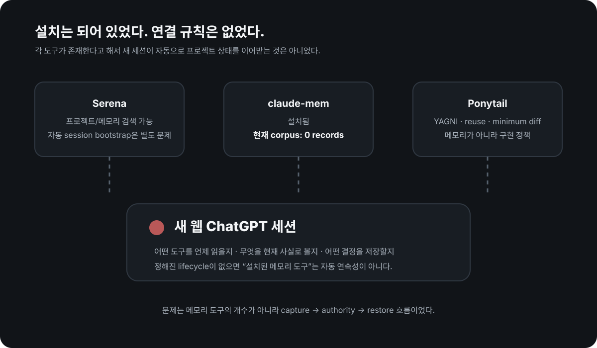
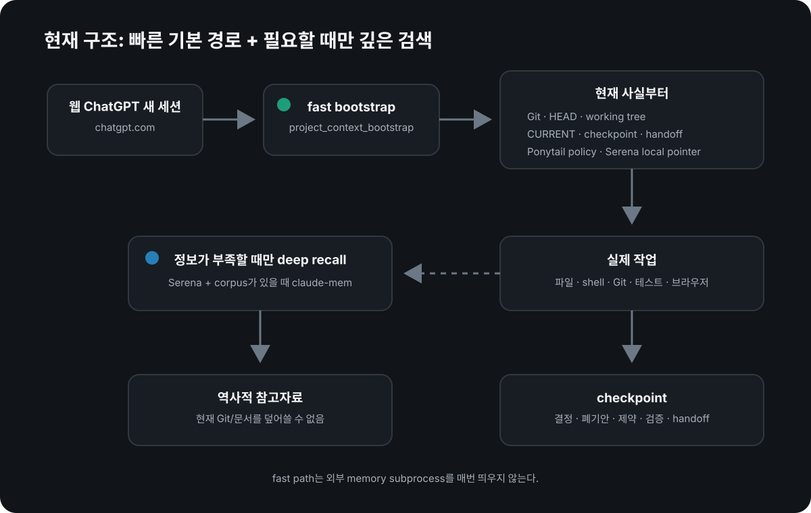
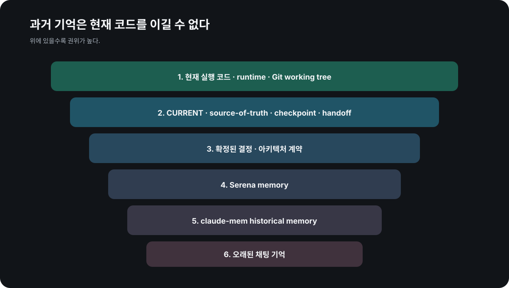

# AI 코딩 에이전트가 새 세션에서 컨텍스트를 잊는 이유와 유지 방법

**핵심은 메모리 도구를 많이 설치하는 게 아니라, 새 세션이 무엇을 다시 읽고 어떤 상태를 저장하며 과거 메모리와 현재 Git이 충돌할 때 무엇을 믿을지 정하는 것입니다. Serena·Ponytail·claude-mem을 설치해 놓고도 실패했던 이유를 실제 구현으로 정리했습니다.**

<p style="background: rgba(0, 120, 212, 0.08); border-left: 4px solid #0078d4; padding: 10px 14px; margin-bottom: 22px; border-radius: 4px; font-size: 0.95rem;">
  🌐 <strong>English version:</strong> <a href="/en-ai-coding-context-continuity-cokacremote/">How to Keep AI Coding Agent Context Across Sessions</a>
</p>

`AI 코딩 에이전트 메모리`, `세션 컨텍스트 유지`, `persistent memory`, `context engineering`을 검색할 때 먼저 구분해야 할 것은 세 가지입니다.

| 개념 | 무엇을 저장/제공하나 | 세션을 넘나드나 |
|---|---|---|
| **Context window** | 지금 모델이 한 번에 볼 수 있는 대화·파일·도구 결과 | 기본적으로 현재 세션 중심 |
| **Instruction file** | `AGENTS.md`, `CLAUDE.md` 같은 반복 규칙·명령 | 파일이 다시 로드되면 유지 가능 |
| **Persistent project memory** | 결정, 폐기안, blocker, 검증 결과, 다음 작업처럼 이어져야 할 의미 상태 | 별도 저장·복구 lifecycle이 있어야 함 |

즉 **큰 컨텍스트 윈도우가 persistent memory를 대신하지 않고, instruction file도 진행 중인 프로젝트 상태 전체를 대신하지 않습니다.** 검색 상위 결과들도 이 차이를 중심으로 설명하고 있었고, 제 경우 실제 실패 지점도 정확히 여기였습니다.

[웹 ChatGPT를 MCP로 제 Mac에 붙여 로컬 프로젝트를 직접 다루게 만든 뒤](/chatgpt-mcp-local-development-setup/), 이 문제는 더 위험해졌습니다. 도구가 프로젝트 파일을 볼 수 있어도 새 채팅이 이전 세션의 의도·금지사항·폐기안·검증 결과를 정확히 이어받는 것은 별개이기 때문입니다.

저는 그 전에 Serena, Ponytail, claude-mem을 설치해 둔 상태였습니다. 하지만 **설치된 도구가 있다는 사실만으로는 새 세션에 올바른 프로젝트 상태가 자동 복구되지 않았습니다.**

<picture>
  <source media="(max-width: 600px)" srcset="before-context-mobile.svg">
  
</picture>

## 왜 AI 코딩 에이전트는 새 세션에서 프로젝트를 잊는가

문제는 각 도구의 역할부터 달랐습니다.

### Serena

Serena는 프로젝트 구조를 이해하고 메모리를 저장·검색하는 데 활용할 수 있습니다. 하지만 **설치돼 있다는 사실 자체가 모든 새 ChatGPT 세션이 Serena 메모리를 자동으로 읽는다는 뜻은 아닙니다.**

어떤 세션에서 언제 조회할지, 무엇을 읽을지, 현재 코드와 충돌하면 어떻게 할지까지 따로 결정해야 합니다.

### claude-mem

claude-mem 역시 과거 세션 맥락을 저장하고 검색하기 위한 도구로 기대했습니다.

그런데 현재 제 로컬 상태를 실제로 검사해 보니 claude-mem은 설치되어 있지만 SQLite corpus의 `observations`, `session_summaries`, `user_prompts`, `tool_uses`가 모두 **0건**이었습니다.

즉 **설치했다는 것과 실제로 내 워크플로우에서 기록이 쌓이고 있다는 것은 전혀 다른 이야기**였습니다.

### Ponytail

이건 더 근본적인 착각이었습니다.

제가 설치해 둔 Ponytail의 실제 역할은 YAGNI, 기존 코드 재사용, 표준 라이브러리 우선, 최소 diff 같은 **구현 정책**입니다.

프로젝트의 과거 결정을 기억하는 메모리 저장소가 아닙니다.

그래서 지금은 Ponytail을 아예 다음처럼 분류합니다.

> 구현 규율은 제공하지만, 프로젝트 메모리의 source of truth는 아니다.

## cokacremote를 쓰면서 세션 문제가 더 선명해졌다

MCP를 통해 웹 ChatGPT가 로컬 파일과 터미널을 직접 다루기 시작하니 오히려 이 문제가 위험해졌습니다.

새 채팅에서 모델이 과거 상태를 잘못 기억하면 단순히 답변을 틀리는 데서 끝나지 않습니다. **실제 파일을 수정하고 명령을 실행할 수 있기 때문입니다.**

예를 들어 이전 세션에서 이미 폐기한 접근을 새 세션이 다시 구현하거나, 오래된 메모리가 현재 Git보다 우선하면 문제가 생깁니다.

제가 필요했던 건 "기억을 많이 넣는 시스템"이 아니라 다음 질문에 답하는 시스템이었습니다.

1. 새 세션은 어디서 현재 상태를 시작해야 하는가?
2. 과거 기억과 현재 코드가 충돌하면 무엇이 이기는가?
3. 중요한 결정은 언제 저장하는가?
4. 과거 이유가 정말 필요할 때만 느린 검색을 할 수 있는가?
5. 매번 Serena·claude-mem을 다 돌리지 않고도 빠르게 시작할 수 있는가?

## 세션 간 컨텍스트 유지의 핵심은 capture → authority → restore였다

결국 cokacremote 안에 별도의 **project context lifecycle**을 넣었습니다.

<picture>
  <source media="(max-width: 600px)" srcset="final-context-flow-mobile.svg">
  
</picture>

기본 흐름은 단순합니다.

```text
새 세션 / 프로젝트 재개
        ↓
project_context_bootstrap
        ↓
Git + 현재 상태 문서 + checkpoint + 로컬 정책
        ↓
현재 작업
        ↓
중요한 결정/변경 발생
        ↓
project_context_checkpoint
        ↓
다음 세션이 다시 bootstrap
```

과거의 세부 이유가 부족할 때만:

```text
project_context_recall
        ↓
Serena semantic retrieval
+ claude-mem (실제 corpus가 있을 때만)
```

즉 **빠른 길과 느린 길을 분리**했습니다.

## 실제 코드에서 핵심만 남기면

현재 구현의 핵심 흐름을 개인 경로·인증·운영 설정을 빼고 단순화하면 대략 이렇습니다.

```ts
server.registerTool("project_context_bootstrap", schema, async ({ path, query }) => {
  const root = await resolveProjectRoot(path);
  const checkpoint = await inspectCheckpoint(root);

  const [docs, serena, ponytail, continuity] = await Promise.all([
    collectDocs(root),
    collectSerenaLocalMemories(root, query),
    ponytailLocalPolicy(),
    continuityStatus(root),
  ]);

  const snapshot = projectSnapshot(root);
  const contextHandle = guard.issue(root, snapshot);

  return boundedBootstrap({
    contextHandle,
    checkpoint: checkpoint.snapshot?.data ?? null,
    project: snapshot,
    documents: docs,
    serena,
    ponytail,
    continuity,
  });
});
```

쓰기나 쉘 실행 계열은 bootstrap 없이 바로 실행하지 못하게 했습니다.

```ts
async function mutate(projectPaths, contextHandle, operation) {
  await guard.require(projectPaths, contextHandle);
  return operation();
}
```

그리고 과거 검색은 기본 bootstrap과 분리합니다.

```ts
server.registerTool("project_context_recall", recallSchema, async ({ path, query }) => {
  const root = await resolveProjectRoot(path);

  const [serena, claudeMem] = await Promise.all([
    serenaDeepContext(root, query),
    claudeMemDeepContext(root, query),
  ]);

  return { serena, claudeMem };
});
```

실제 구현은 journal 복구, revision/CAS, working-tree fingerprint, output budget 같은 처리가 더 들어갑니다. 여기서는 **세션 연속성 설계에 필요한 골격만** 남겼습니다.

## 1. Fast bootstrap: 매 세션 시작에서 필요한 것만

`project_context_bootstrap`은 프로젝트 경계나 새 세션에서 먼저 호출합니다.

현재 구현은 기본적으로 다음을 봅니다.

- Git branch / HEAD / working tree
- 현재 상태 문서, source-of-truth, checkpoint, handoff
- 로컬 Serena memory 파일이 있으면 짧은 포인터
- Ponytail의 구현 정책
- 마지막 checkpoint 이후 working tree가 달라졌는지

중요한 점은 **기본 bootstrap에서 Serena나 claude-mem subprocess를 매번 띄우지 않는다는 것**입니다.

한때 모든 기억 도구를 시작 시점마다 다 돌리는 방향도 검토했지만, 그건 지연과 입력량을 키울 수 있어 폐기했습니다.

실제로 한 별도 lifecycle 비교에서는 컨텍스트 provider를 더 붙인 candidate가 baseline보다 입력량과 시간이 오히려 늘었습니다. 그 결과를 "컨텍스트 도구가 많을수록 좋다"는 반례로 보고 중단했습니다.

## 2. Checkpoint: 세션 끝을 기다리지 않고 중요한 변화만 저장

또 하나 바꾼 점은 **세션 종료 시 한 번 저장**하는 방식에 의존하지 않는 것입니다.

다음 같은 사건이 생기면 `project_context_checkpoint`에 남깁니다.

- 사용자가 승인하거나 거절한 방향
- 아키텍처 결정
- 이전 접근의 폐기
- 새로운 금지사항이나 제약
- 중요한 blocker
- 구현 milestone
- 검증 결과
- 다음 세션이 반드시 알아야 할 handoff

현재 구조는 `.context/CONVERSATION.jsonl`에 durable journal을 두고, `.context/SNAPSHOT.json`, `SESSION_CHECKPOINT.md`, `HANDOFF.md`, `DECISIONS.md` 같은 읽기 쉬운 view를 만듭니다.

전체 대화를 그대로 덤프하는 게 목적이 아닙니다.

**다음 세션이 잘못된 방향으로 가지 않기 위해 필요한 의미 상태를 남기는 것**이 목적입니다.

## 3. Deep recall: 과거 이유가 정말 필요할 때만

`project_context_recall`은 기본 경로가 아닙니다.

현재 정보만으로 부족할 때만 Serena를 한 MCP 세션으로 열어 semantic retrieval을 하고, claude-mem은 실제 corpus가 있을 때만 조회합니다.

현재 제 claude-mem corpus는 비어 있기 때문에 health check에서 자동으로 skip됩니다.

이게 중요한 이유는 **설치 여부가 아니라 실제 유효한 데이터가 있는지 검사하기 때문**입니다.

## 4. 가장 중요한 규칙: 과거 기억이 현재 코드를 이길 수 없다

<picture>
  <source media="(max-width: 600px)" srcset="authority-order-mobile.svg">
  
</picture>

제가 지금 사용하는 권위 순서는 다음과 같습니다.

```text
현재 실행 코드 / runtime / Git
        ↓
현재 source-of-truth / checkpoint / handoff
        ↓
확정된 결정과 아키텍처 계약
        ↓
Serena memory
        ↓
claude-mem historical memory
        ↓
오래된 채팅 기억
```

이 구조가 없으면 "메모리가 많다"가 오히려 위험할 수 있습니다.

3주 전 Serena 메모리에 적힌 구조와 오늘 Git의 실제 구현이 다르면 **오늘 Git이 이깁니다.**

## 5. contextHandle은 기억이 아니라 안전장치다

현재 cokacremote의 쓰기·쉘 실행 계열 도구는 bootstrap이 발급한 `contextHandle`을 요구하도록 설계했습니다.

이건 모델에게 더 많은 기억을 주기 위한 토큰이 아닙니다.

**"이 세션이 적어도 이 프로젝트의 현재 컨텍스트를 bootstrap한 뒤 변경 작업을 시작했는가?"**를 확인하는 continuity guard입니다.

branch나 HEAD가 바뀌거나, 오래 비활성 상태가 되거나, 서버가 재시작되면 handle은 다시 받아야 합니다.

다만 이 역시 sandbox는 아닙니다. 쉘 명령의 실제 효과를 분석해 막아주는 보안 격리 시스템과는 역할이 다릅니다.

## 실제 성능은 어땠나

한 차례 로컬 검증에서 fast bootstrap은 세 프로젝트에서 대략 **40~96ms 평균 범위**, rolling checkpoint는 약 **30ms**, 필요할 때 실행한 한 deep recall은 약 **2.1초**였습니다.

이 숫자를 일반적인 성능 보장으로 보지는 않습니다. 머신, 프로젝트 크기, 구현 변경에 따라 달라집니다.

제가 여기서 얻은 결론은 숫자 자체보다 **fast path와 deep path를 분리한 이유가 실제로 있었다**는 정도입니다.

그리고 더 중요한 점: 컨텍스트 주입을 늘렸다고 해서 전체 토큰/시간 비용이 자동으로 줄어드는 것은 아니었습니다. 한 비교에서는 오히려 비용 proxy와 시간이 나빠졌기 때문에 그 접근을 폐기했습니다.

## 아직 해결됐다고 과장하면 안 되는 부분

현재 구조에도 경계가 있습니다.

**웹 ChatGPT에서 MCP 도구를 전혀 호출하지 않고 끝난 대화는 cokacremote가 볼 수 없습니다.**

즉 서버가 전달받지 못한 채팅 내용을 마법처럼 수집하는 시스템은 아닙니다.

의미 있는 결정이 다음 세션에 남으려면 checkpoint가 실제로 호출되거나, 다른 지원되는 lifecycle 경로를 통해 저장돼야 합니다.

그래서 지금도 "완전 자동 기억"보다는 **검증 가능한 프로젝트 연속성**이라는 표현을 쓰는 편이 맞다고 봅니다.

## 지금은 각 도구를 이렇게 본다

| 도구 | 현재 역할 |
|---|---|
| Git / 현재 코드 | 구현 사실의 최우선 근거 |
| CURRENT / checkpoint / handoff | 현재 의도와 상태 |
| cokacremote bootstrap | 새 세션의 빠른 시작점 |
| cokacremote checkpoint | 중요한 의미 상태 저장 |
| Serena | 필요할 때 과거 프로젝트 맥락 검색 |
| claude-mem | corpus가 실제로 있을 때만 역사 검색 |
| Ponytail | YAGNI·reuse·최소 변경 같은 구현 정책 |
| 오래된 채팅 기억 | 가장 낮은 우선순위의 참고 |

이 구분을 하고 나서야 "도구를 많이 설치했다"가 아니라 **어떤 정보가 언제, 어떤 권한으로 다음 세션에 전달되는가**를 설계하게 됐습니다.

## 이 구조가 웹 ChatGPT와 특히 잘 맞는 이유

[웹 ChatGPT의 일상적인 텍스트 채팅 사용량과 Codex 사용량이 별도라는 점](/chatgpt-unlimited-text-vs-codex-limits/)도 이 구조를 만들면서 더 흥미롭게 느껴졌습니다.

브라우저의 일반 ChatGPT 채팅을 장기간 개발 컨트롤 플레인으로 쓰려면 단순히 메시지를 많이 보낼 수 있는 것보다 **세션을 갈아타도 프로젝트 의미가 이어지는가**가 훨씬 중요합니다.

제가 처음에는 Serena, Ponytail, claude-mem이라는 개별 도구에 그 문제를 맡기려 했다면, 지금은 **cokacremote가 lifecycle을 소유하고 개별 도구는 각자 잘하는 역할만 하게 하는 쪽**으로 바뀌었습니다.

## 개념과 도구를 확인한 1차 자료

이 글에서 말하는 `context window`, 세션 메모리, 프로젝트 메모리의 구분과 각 도구의 역할은 다음 1차 자료도 함께 확인했습니다.

- [OpenAI Cookbook — Short-Term Memory Management with Sessions](https://developers.openai.com/cookbook/examples/agents_sdk/session_memory): 세션 단위로 대화 이력을 유지·관리하는 방법과 context management 예시
- [Serena — official repository](https://github.com/oraios/serena): 코드베이스 semantic retrieval/editing과 project memory를 제공하는 MCP 기반 도구
- [claude-mem — official repository](https://github.com/thedotmack/claude-mem): 세션 사이의 관찰·요약을 저장하고 검색하는 persistent context 도구
- [Ponytail — official repository](https://github.com/DietrichGebert/ponytail): YAGNI → reuse → stdlib/native → minimum working code 순의 구현 정책. 이 글에서는 프로젝트 메모리로 분류하지 않습니다.

이 자료들이 **제 cokacremote 구조 자체를 정답이라고 보증하는 것은 아닙니다.** 위의 구현과 성능 수치는 제 로컬 환경에서 직접 검증한 부분이고, 링크는 개념과 개별 도구의 원래 역할을 확인하기 위한 자료입니다.

## 공개하지 않은 것

이 글에서는 개인적인 로컬 경로, 실제 인증정보, live MCP endpoint, OAuth key, 구체적인 사용자 데이터는 제외했습니다.

또 현재 구현의 전체 소스를 복붙하지 않았습니다. 핵심은 특정 파일을 그대로 따라 쓰는 것이 아니라 다음 설계 원칙입니다.

- 설치 여부와 실제 사용 여부를 분리해서 검사할 것
- 현재 코드가 과거 메모리보다 우선할 것
- fast bootstrap과 deep recall을 분리할 것
- 중요한 결정은 세션 끝이 아니라 발생 시점에 저장할 것
- 컨텍스트를 많이 넣는 것과 비용을 줄이는 것을 같은 목표로 착각하지 말 것

세부 구현 중 궁금한 부분이 있으면 댓글에 남겨 주세요. 공개 가능한 범위에서 bootstrap/checkpoint schema, journal 구조, contextHandle gate, Serena/claude-mem 연동 방식 중 필요한 부분을 따로 정리할 수 있습니다.
