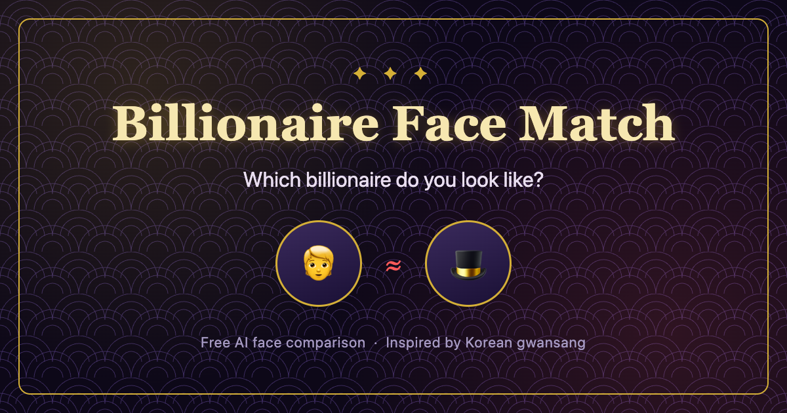

# Billionaire Lookalike Test: Which Billionaire Do You Look Like?

[Try the Billionaire Lookalike Test](https://saramjh.github.io/richChecker-us/)

## What is this?

Billionaire Face Match is a free AI face comparison app that analyzes a photo you upload and finds which Forbes billionaire your face is closest to. It compares six facial proportions and shows a match percentage, a breakdown by feature (eyes, nose, mouth, face shape), and a shareable match card.

It isn't a wealth predictor or a real physiognomy reading. It's a playful entertainment project built on top of face landmark detection, loosely inspired by the Korean tradition of face reading known as **gwansang**.

## How it works

1. **Add a photo.** Use a clear, well-lit photo facing the camera.
2. **Scan features.** The app detects facial landmarks and calculates a feature vector for six proportions.
3. **Find a match.** Your features are compared against a sample of Forbes billionaires to find the closest match.
4. **Share your card.** Save the result or share it through your device's share sheet.

## Privacy

Your photo is analyzed entirely on your device. This is a static site with no backend, so there is no server to upload your photo to, and the face-matching model and comparison data all run in the browser.

Google Analytics and Google AdSense are used for basic usage stats and ads, so standard web analytics and advertising cookies from Google may apply — but your photo itself is never sent anywhere for analysis.

## Who it's for

Anyone who wants a quick, shareable face comparison to send to friends, anyone curious which billionaire they resemble, or anyone curious how a browser-only AI face analysis app works under the hood.

Treat the result as a fun conversation starter, not a serious judgment — your face doesn't determine your fortune, personality, or potential.

## FAQ

**Is the billionaire lookalike test free?**

Yes. No sign-up is required — it runs directly in your browser.

**Is my photo stored on a server?**

No. Face analysis runs entirely in your browser, and the site doesn't operate a server that stores photos.

**Does the result predict real wealth or success?**

No. The result is a playful comparison of facial similarity and has no bearing on actual wealth, personality, or future success.

**Are the billionaire photos real?**

No — matches are shown using AI-generated caricatures, not real photographs of the named individuals.

#### Links

- [Billionaire Face Match (English)](https://saramjh.github.io/richChecker-us/)
- [부자 관상 테스트 (Korean version)](https://saramjh.github.io/richChecker/)
- [Github Repository: richChecker-us](https://github.com/saramjh/richChecker-us)
