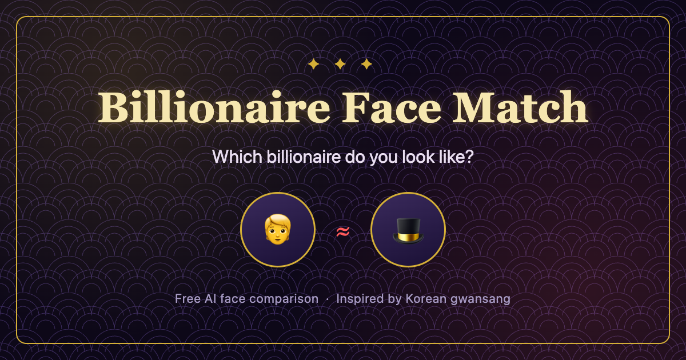

# Billionaire Lookalike Test: Which Billionaire Do You Look Like?

[Start the free Billionaire Lookalike Test](https://saramjh.github.io/richChecker-us/)

Upload one photo to compare six facial proportions with a 100-person billionaire sample. The result shows your Top 3 closest overall matches, your standout facial feature, and a result card you can save or share. No sign-up is required.

## What is this?

Billionaire Face Match is a browser-based entertainment app. It detects facial landmarks, calculates six facial proportions, and compares them with the current 100-person billionaire sample.

The app is inspired by the visual theme of Korean face reading, or gwansang, but it does not predict wealth, personality, or future success. Matching is based on measured facial proportions.

## How is this different from a general celebrity lookalike test?

A general celebrity lookalike finder searches a broad entertainment roster. This edition deliberately narrows the comparison to a 100-person billionaire sample. It also shows the Top 3 overall matches and the six measured facial proportions behind the result instead of presenting a single unexplained celebrity match.

So this is not a replacement for a general celebrity lookalike search. It is a focused face-match edition for people specifically curious about billionaire lookalikes and the facial proportions behind the ranking.

## What do you get?

- Top 3 overall matches based on six facial proportions
- A feature-by-feature comparison
- A standout facial feature and the closest person on that feature
- A result card that can be saved or shared
- No account or sign-up requirement

## How it works

1. **Choose a photo.** A clear, well-lit, front-facing image works best.
2. **Detect landmarks.** MediaPipe Face Landmarker identifies facial landmarks in your browser.
3. **Compare six proportions.** The app compares forehead height, eye spacing, nose length, mouth width, lower-face length, and face aspect ratio.
4. **Rank the matches.** The three closest overall matches are shown in distance order.
5. **Save or share.** You can create a result card from the result screen.

## Privacy

Your face-match photo is processed locally in your browser and is not uploaded or stored by the site for matching. The site uses Google Analytics and Google AdSense, so normal site-access and advertising data may be handled under Google's policies, but the photo itself is not sent to those services for face matching.

## Korean edition

There is also a separate Korean edition using a 47-person Korean rich-list sample.

[Try the Korean Rich Match edition](https://saramjh.github.io/richChecker/)

## FAQ

**Is the billionaire lookalike test free?**

Yes. No sign-up is required.

**Is my photo stored on a server?**

No. The face-match photo is processed in your browser and is not uploaded or stored by this site for matching.

**Does the result predict real wealth or success?**

No. It is an entertainment comparison of six facial proportions.

**Are the billionaire result portraits real photos?**

No. Match portraits shown in the result UI are AI-generated caricatures. Matching features are based on the project's curated source-photo dataset, with the documented fallback described in the project repository.

[Start the Billionaire Lookalike Test](https://saramjh.github.io/richChecker-us/)

#### Links

- [Billionaire Face Match](https://saramjh.github.io/richChecker-us/)
- [Korean Rich Match](https://saramjh.github.io/richChecker/)
- [Github Repository: richChecker-us](https://github.com/saramjh/richChecker-us)
