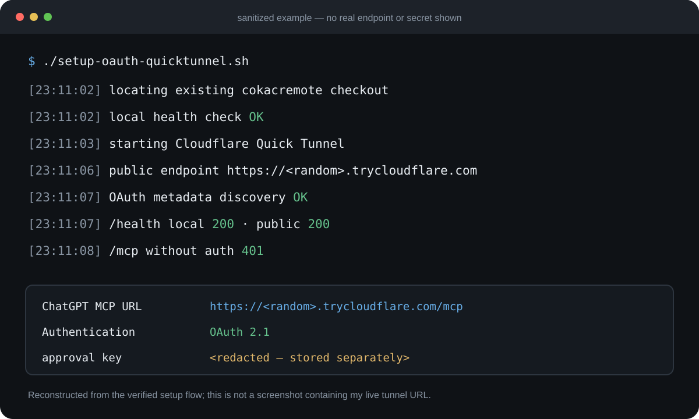

# 웹 ChatGPT가 내 Mac을 직접 조작한다

**MCP로 파일·터미널·Git까지 연결한 실제 구성**

<p style="background: rgba(0, 120, 212, 0.08); border-left: 4px solid #0078d4; padding: 10px 14px; margin-bottom: 22px; border-radius: 4px; font-size: 0.95rem;">
  🌐 <strong>English version:</strong> <a href="/en-chatgpt-mcp-local-development-setup/">ChatGPT Web App + MCP on Mac</a>
</p>

이 글에서 말하는 **웹 ChatGPT**는 정확히 **Chrome, Safari, Edge 같은 인터넷 브라우저에서 `chatgpt.com`을 열어 사용하는 일반 ChatGPT 채팅 화면**을 뜻합니다. ChatGPT 데스크톱 앱, Codex, OpenAI API, Codex CLI 같은 별도 제품이나 클라이언트를 뭉뚱그려 부르는 말이 아닙니다.

즉 **OpenAI 모델 일반이나 Codex 같은 별도 로컬 코딩 에이전트 이야기가 아닙니다.** 주체는 브라우저에서 열어 쓰는 **ChatGPT 웹 자체**입니다.

브라우저의 웹 ChatGPT에서 프로젝트를 지정하면, 연결해 둔 MCP를 통해 제 Mac의 실제 디렉터리를 읽고 터미널 명령을 실행합니다. 파일을 수정하고 테스트를 돌린 뒤 Git diff까지 확인할 수 있습니다.

예전에는 `git status`를 확인하고, 필요한 코드를 복사해 ChatGPT에 붙여넣고, 답을 다시 로컬에 반영한 뒤 테스트했습니다. 새 채팅을 열 때마다 프로젝트 상태도 다시 설명해야 했습니다.

지금은 웹 ChatGPT 자체가 **복사된 코드 조각이 아니라 실제 로컬 프로젝트의 현재 상태**를 기준으로 작업합니다. 이 글 역시 그 연결을 통해 로컬 Jekyll 저장소를 읽고 수정하면서 작성했습니다.


## 웹 ChatGPT와 로컬 Mac을 MCP로 연결한 구조

핵심은 [Model Context Protocol(MCP)](https://modelcontextprotocol.io/) 서버 하나입니다. 제가 쓰는 서버는 [cokacremote](https://github.com/kstost/cokacremote)이고, 로컬 Mac에서 실행합니다.

대략적인 흐름은 이렇습니다.

```text
ChatGPT
   ↓  MCP over HTTPS + OAuth
Cloudflare Quick Tunnel
   ↓
cokacremote (localhost)
   ↓
내 Mac
 ├─ 파일 읽기/쓰기
 ├─ shell 실행
 ├─ Git
 ├─ 빌드와 테스트
 ├─ 브라우저 자동화
 └─ 프로젝트 컨텍스트
```

OpenAI의 현재 개발자 문서에서도 ChatGPT 개발자 모드에서 HTTPS의 `/mcp` 엔드포인트를 연결하는 흐름을 제공하고 있습니다. Cloudflare Quick Tunnel은 로컬 HTTP 서비스를 임시 `trycloudflare.com` 주소로 외부에 노출할 수 있어서, 개발 단계에서 별도 도메인과 서버를 먼저 준비하지 않아도 됩니다.

여기서 중요한 점이 하나 있습니다. **Cloudflare Tunnel이 보안을 대신해 주는 것은 아닙니다.** 제 MCP는 파일 삭제나 쉘 명령 실행까지 가능한 강한 권한을 갖기 때문에, 익명으로 인터넷에 열어두면 안 됩니다. 제가 쓰는 구성은 OAuth를 켜고, 인증되지 않은 `/mcp` 요청이 실제로 `401`을 반환하는지 셋업 과정에서 확인합니다.

## 웹 ChatGPT가 로컬 파일·터미널을 직접 다루면 달라지는 점

처음에는 "웹 ChatGPT에서 SSH 비슷하게 명령을 실행할 수 있으면 편하겠다" 정도였습니다. 그런데 실제로 계속 쓰다 보니 편한 지점은 쉘 자체가 아니었습니다.

예를 들어 제가 이렇게 말합니다.

> /Users/.../project가 현재 프로젝트다. 먼저 파악해.

그러면 대화 안에서 다음 흐름을 그대로 진행할 수 있습니다.


예전에는 제가 직접 하던 `git status → 관련 문서 찾기 → 코드 확인 → 수정 → 테스트 → diff 확인`을 ChatGPT가 실제 저장소를 기준으로 이어갈 수 있습니다.

이게 특히 좋은 이유는 **코드를 복사해 전달한 시점의 상태가 아니라 지금 디스크에 있는 상태를 본다는 것**입니다.

다른 세션에서 코드가 바뀌었거나 제가 직접 수정한 파일이 있어도, 먼저 현재 Git과 파일을 다시 읽도록 하면 예전 대화 기억에 기대서 잘못된 수정을 하는 문제를 줄일 수 있습니다.

## Quick Tunnel과 셋업 스크립트도 묶어버렸다

처음에는 서버를 띄우고, `cloudflared`를 실행하고, 생성된 URL을 확인하고, OAuth 관련 환경값을 맞춘 다음, ChatGPT에 새 URL을 넣는 과정을 수동으로 했습니다.

몇 번 해보니 당연히 귀찮았습니다.

그래서 지금은 `setup-oauth-quicktunnel.sh` 하나가 대부분을 처리합니다.

현재 스크립트가 하는 일은 대략 이 정도입니다.

1. 로컬의 실제 cokacremote 저장소와 실행 상태 확인
2. 필요하면 빌드
3. `cloudflared tunnel --url http://127.0.0.1:3000` 형태로 Quick Tunnel 실행
4. 생성된 공개 URL 확보
5. OAuth용 상태와 키 파일 준비
6. MCP 서버 재기동
7. 로컬 `/health` 검사
8. 공개 `/health` 검사
9. OAuth discovery endpoint 검사
10. **인증 없는 `/mcp`가 401인지 확인**
11. 모든 검증이 끝나면 ChatGPT에 넣을 MCP URL 출력
12. 종료할 때는 이 스크립트가 직접 띄운 프로세스만 정리

실제 URL이나 인증키가 들어 있는 터미널 화면을 공개할 생각은 없어서, 아래는 현재 스크립트의 출력 흐름을 **민감정보만 제거해 다시 만든 그림**입니다.



Quick Tunnel은 재시작할 때 임시 주소가 달라질 수 있습니다. 그래서 이 구성은 현재 제 개인 개발용으로는 굉장히 편하지만, 장기적으로 고정 엔드포인트가 필요한 환경이라면 named Cloudflare Tunnel이나 별도 도메인 구성이 더 맞습니다.

## 새 채팅에서 프로젝트 설명을 또 해야 하는 문제

로컬 접근만 연결하고 나니 다음 문제가 바로 생겼습니다.

ChatGPT가 파일을 읽을 수 있어도 **"왜 이렇게 만들었는지", "어떤 접근을 이미 버렸는지", "이번 세션에서 무엇을 완료했는지"**까지 자동으로 알 수는 없습니다.

그래서 지금은 프로젝트를 시작하거나 다시 이어갈 때 빠른 bootstrap을 먼저 합니다.

제가 쓰는 컨텍스트 계층은 대략 다음 원칙입니다.

```text
현재 실행 코드 / Git 상태
        ↓
현재 상태 문서 / checkpoint
        ↓
확정된 설계와 결정
        ↓
과거 프로젝트 메모리
        ↓
예전 대화 기억
```

오래된 기억이 현재 코드보다 우선하면 안 된다는 게 핵심입니다.

중요한 결정이나 구현이 끝났을 때는 프로젝트 안의 checkpoint를 갱신하고, 새 채팅에서는 전체 히스토리를 매번 다 읽는 대신 현재 상태부터 짧게 복구합니다. 더 오래된 이유가 정말 필요한 경우에만 별도의 recall을 하도록 해 두었습니다.

이 구조를 만들게 된 과정과 Serena·Ponytail·claude-mem을 실제로 어떻게 분리해서 쓰게 됐는지는 [별도 글에서 현재 구현과 코드 일부까지 정리했습니다](/ai-coding-context-continuity-cokacremote/). 다만 **컨텍스트 구조가 동작한다는 것과 총 토큰/시간 비용이 줄었다는 것은 별개의 주장**이라 비용 절감 효과는 과장하지 않습니다.

## 실제로 써보니 좋은 점

가장 큰 변화는 ChatGPT에게 전달하는 정보의 형태였습니다.

예전:

```text
이 파일이 이렇고...
여기 코드가 이거고...
방금 다른 모델이 이런 걸 바꿨고...
현재 에러는 이거고...
```

지금:

```text
이 프로젝트 파악하고 현재 상태부터 확인해.
```

물론 모델이 무조건 잘한다는 뜻은 아닙니다. 오히려 로컬 시스템을 직접 건드릴 수 있기 때문에 **잘못된 가정을 못 하게 만드는 작업 규칙이 더 중요해졌습니다.**

제가 특히 강제하는 것은 다음입니다.

- 작업 시작 전에 현재 Git/코드 상태 확인
- 과거 기억보다 현재 실행 상태 우선
- 이미 있는 구현을 무시하고 중복 코드 만들지 않기
- 수정 후 실제 빌드/테스트 수행
- 큰 변경 뒤에는 현재 상태를 checkpoint로 남기기
- 공개 endpoint는 인증 없이 쓰기 도구에 접근할 수 없게 하기

이렇게 해두면 ChatGPT가 단순히 "코드를 써주는 창"보다 **현재 로컬 개발환경을 직접 다루는 컨트롤 인터페이스**에 가까워집니다.

## 모든 설정을 여기 다 공개하지 않은 이유

의도적으로 몇 가지는 이 글에서 생략했습니다.

`setup-oauth-quicktunnel.sh` 전체 내용, OAuth approval 흐름의 세부 설정, Quick Tunnel URL을 자동으로 뽑고 재시도하는 부분, 프로젝트 checkpoint 형식 등은 그대로 붙이면 글이 지나치게 길어집니다. 무엇보다 이 서버는 권한이 강해서, 설정 일부만 어설프게 복사해 공개 인터넷에 띄우는 방식은 권하고 싶지 않습니다.

대신 구조와 위험 조건은 숨기지 않았습니다.

혹시 실제로 비슷한 구성을 만들고 있다면 댓글로 **어느 부분이 필요한지 구체적으로** 물어봐 주세요.

- ChatGPT에서 MCP를 등록한 부분
- OAuth 2.1 / DCR 연결 과정
- Quick Tunnel 자동 발급과 URL 추출
- 셋업 sh의 프로세스 정리 방식
- 새 채팅에서 프로젝트 컨텍스트를 복구하는 구조
- Git/테스트/브라우저까지 한 흐름으로 묶은 방식
- Mac에서 계속 실행할 때의 운영 방법

제가 실제로 쓰는 구성에서 공개해도 되는 부분은 코드나 설정 예시까지 댓글로 정리해 보겠습니다. 같은 질문이 반복되면 이 글에 추가하거나 별도 2편으로 빼는 편이 더 좋을 것 같습니다.

## 자주 묻는 질문

### 웹 ChatGPT가 내 Mac의 로컬 파일을 직접 읽고 수정할 수 있나?

가능합니다. 다만 ChatGPT 웹이 로컬의 localhost에 그대로 붙는 구조는 아닙니다. 제가 쓰는 방식은 **로컬 Mac에서 MCP 서버를 실행하고, 인증된 원격 MCP 엔드포인트를 통해 ChatGPT가 그 도구를 호출하는 구조**입니다. 실제로 가능한 작업 범위는 MCP 서버가 어떤 도구와 권한을 노출하느냐에 따라 달라집니다.

### ChatGPT MCP로 터미널 명령, Git, 테스트까지 실행할 수 있나?

제 구성에서는 가능합니다. 파일 읽기/쓰기, 쉘 실행, Git 상태와 diff 확인, 빌드와 테스트, 브라우저 작업을 각각 MCP 도구로 노출해 두었습니다. 즉 ChatGPT가 답변으로 명령어만 적어주는 게 아니라, **실제 로컬 환경에서 그 명령을 실행하고 결과를 다시 읽는 흐름**입니다.

### Cloudflare Quick Tunnel만 열면 안전한가?

아닙니다. Tunnel은 로컬 서비스를 외부에서 접근 가능하게 만드는 경로이지 인증을 대신하지 않습니다. 특히 쉘과 파일 쓰기 권한이 있는 MCP라면 인증과 권한 검증이 먼저입니다. 그래서 제 셋업 스크립트는 공개 /health, OAuth discovery뿐 아니라 **인증 없는 /mcp 요청이 401로 거절되는지까지 확인**합니다.

## 이어서 읽기

- [ChatGPT 메시지 제한 vs Codex Plus 사용량 한도 (2026)](/chatgpt-unlimited-text-vs-codex-limits/)
- [AI 코딩 에이전트가 새 세션에서 컨텍스트를 잊는 이유와 유지 방법](/ai-coding-context-continuity-cokacremote/)

## 참고한 공식 문서

- [OpenAI — ChatGPT란 무엇인가요: FAQ (웹 = chatgpt.com)](https://help.openai.com/ko-kr/articles/12677804-what-is-chatgpt-faq)
- [OpenAI Plugins Quickstart — MCP 서버 연결](https://developers.openai.com/plugins/quickstart)
- [OpenAI — MCP server authentication](https://developers.openai.com/plugins/build/auth)
- [Cloudflare Docs — Quick Tunnels](https://developers.cloudflare.com/tunnel/get-started/quick-tunnels/)
- [Model Context Protocol](https://modelcontextprotocol.io/)

지금 단계에서 제 결론은 간단합니다. **ChatGPT에 코드를 계속 복사해서 주는 것보다, 인증된 MCP를 통해 필요한 로컬 도구를 직접 제공하는 쪽이 훨씬 자연스럽습니다.** 다만 그 순간부터 편의성보다 먼저 챙겨야 하는 것은 권한과 현재 상태 검증입니다.
