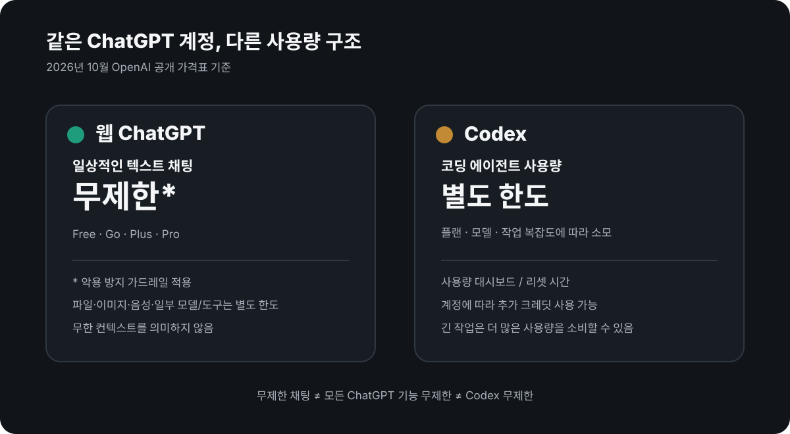
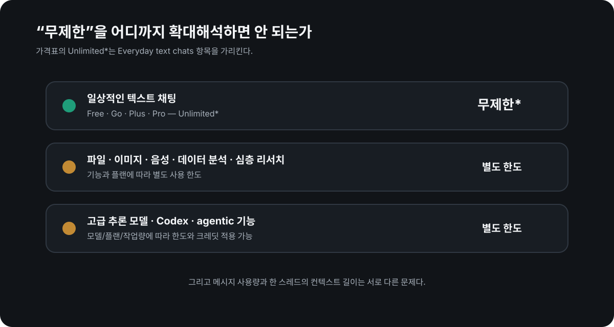

# 웹 ChatGPT의 일반 텍스트 채팅은 무제한이다*

**그런데 Codex 사용량은 별도다. 이 둘을 같은 한도로 생각하면 계산이 완전히 달라진다.**

<p style="background: rgba(0, 120, 212, 0.08); border-left: 4px solid #0078d4; padding: 10px 14px; margin-bottom: 22px; border-radius: 4px; font-size: 0.95rem;">
  🌐 <strong>English version:</strong> <a href="/en-chatgpt-unlimited-text-vs-codex-limits/">ChatGPT Text Chats Are Unlimited* — Codex Usage Is Not</a>
</p>

최근 [웹 ChatGPT를 MCP로 제 Mac에 연결해서 쓰는 방식](/chatgpt-mcp-local-development-setup/)을 정리하다가 의외로 많이 놓치고 있는 차이를 다시 확인했습니다.

**브라우저에서 `chatgpt.com`을 열어 쓰는 일반 ChatGPT의 일상적인 텍스트 채팅은 현재 공식 가격표에서 무제한*으로 표시됩니다.** Free, Go, Plus, Pro 모두 가격 비교표의 `Everyday text chats` 항목이 `Unlimited*`입니다.

반면 **Codex는 별도의 사용량 체계**를 가집니다. 같은 ChatGPT 구독에 포함되어 있어도 Codex는 모델, 작업 복잡도, 플랜에 따라 사용량을 소모하고 한도에 도달할 수 있습니다.

<picture>
  <source media="(max-width: 600px)" srcset="chat-vs-codex-mobile.svg">
  
</picture>

## 먼저 '무제한'이 정확히 무엇인지

OpenAI 가격표에서 말하는 무제한은 **일상적인 텍스트 채팅**입니다.

2026년 10월 현재 개인 플랜 비교표는 다음처럼 표시됩니다.

| 기능 | Free | Go | Plus | Pro |
|---|---|---|---|---|
| 일상적인 텍스트 대화 | 무제한* | 무제한* | 무제한* | 무제한* |
| Codex | 제한적/별도 한도 | 제한적/별도 한도 | 사용 한도 확대 | 최대 사용 한도 |
| 파일·이미지·음성·일부 도구 | 별도 한도 | 별도 한도 | 확대된 한도 | 더 높은 한도 |

별표도 중요합니다. **무제한 텍스트 채팅에는 악용 방지 가드레일이 적용됩니다.**

그리고 이 문장을 다음처럼 확대 해석하면 안 됩니다.

> ChatGPT에서 하는 모든 작업이 무제한이다.

그건 아닙니다.

<picture>
  <source media="(max-width: 600px)" srcset="unlimited-is-not-everything-mobile.svg">
  
</picture>

파일 업로드, 이미지 생성, 음성, 데이터 분석, 심층 리서치, 일부 고급 추론 모델과 도구에는 별도 한도가 적용될 수 있습니다. OpenAI 도움말도 Free/Go의 무제한 일상 텍스트 채팅과 도구 한도를 명시적으로 분리합니다.

## Codex는 왜 다르게 느껴지나

Codex 가격 페이지는 아예 **사용 한도 표**를 제공합니다.

예를 들어 개인 플랜의 Codex는 선택한 모델과 작업에 따라 사용량이 달라지고, 사용량 대시보드에서 남은 한도와 리셋 상태를 확인할 수 있습니다. 한도에 도달하면 더 저렴한 모델로 바꾸거나, 리셋을 기다리거나, 계정에서 제공되는 경우 추가 크레딧을 사용할 수 있습니다.

즉 구조적으로는 이렇습니다.

```text
웹 ChatGPT
└─ 일상적인 텍스트 채팅: 무제한*
   ├─ 특정 고급 모델/추론: 별도 제한 가능
   ├─ 파일·이미지·음성·도구: 별도 제한 가능
   └─ Codex: 별도의 agentic usage 한도/크레딧
```

Codex를 오래 돌리는 작업과 웹 ChatGPT에서 일반적인 텍스트 대화를 계속하는 것은 **같은 '메시지 하나'처럼 보여도 사용량 체계가 같지 않습니다.**

## 그래서 MCP로 웹 ChatGPT를 로컬 개발에 붙이는 방식이 흥미로웠다

제가 이 차이에 관심을 가진 이유는 단순히 "무제한이라 개이득" 같은 이야기를 하려는 게 아닙니다.

현재 저는 **인터넷 브라우저에서 `chatgpt.com`을 열어 쓰는 일반 ChatGPT 채팅 화면**에 MCP를 연결하고, 그 MCP가 제 Mac의 파일·터미널·Git·테스트를 다루게 하는 구조를 실사용 중입니다.

그러면 대화와 판단의 상당 부분은 일반 ChatGPT 채팅에서 진행하고, 필요한 순간에만 로컬 도구를 호출할 수 있습니다.

이 구조가 Codex의 모든 기능을 대체한다는 뜻은 아닙니다. Codex는 전용 코딩 에이전트로서 훨씬 잘 통합된 작업 흐름과 전용 기능을 제공합니다.

다만 **"코딩을 하려면 반드시 Codex 사용량을 계속 태워야 한다"는 전제는 아닙니다.** 대화형 설계·검토·의사결정·로컬 도구 호출을 웹 ChatGPT 중심으로 구성하는 선택지가 있다는 뜻입니다.

여기서 특히 중요한 주의점이 있습니다.

**OpenAI가 'MCP 도구 호출도 무제한'이라고 보장한 것은 아닙니다.** 공식 가격표의 무제한 항목은 `Everyday text chats`입니다. 따라서 제가 확인할 수 없는 도구별 내부 과금이나 미래 정책까지 무제한이라고 단정하지 않습니다.

## 무제한 메시지와 무한 컨텍스트는 완전히 다른 이야기다

이 부분은 자주 섞입니다.

**무제한 채팅 = 한 스레드가 모든 내용을 영원히 기억한다**는 뜻이 아닙니다.

긴 대화에는 컨텍스트 길이, 압축, 메모리, 세션 경계 등의 문제가 여전히 있습니다. 오히려 저는 웹 ChatGPT를 로컬 개발에 오래 붙여 쓰면서 이 문제가 더 분명하게 보였습니다.

그래서 별도로 [Serena·Ponytail·claude-mem을 설치해 놓고도 세션 컨텍스트가 제대로 이어지지 않았던 문제를 cokacremote 안에서 어떻게 다시 설계했는지](/ai-coding-context-continuity-cokacremote/)도 기록했습니다.

요약하면:

- **사용량 문제:** 몇 번 더 메시지를 보낼 수 있는가?
- **컨텍스트 문제:** 새 세션이 이전 결정과 현재 프로젝트 상태를 정확히 이어받는가?

서로 다른 문제입니다.

## 이 차이를 몰랐던 이유

UI에서는 둘 다 "ChatGPT 계정으로 쓰는 OpenAI 코딩 기능"처럼 보입니다.

Codex도 ChatGPT 플랜에 포함되고, 웹 ChatGPT도 같은 계정을 씁니다. 그래서 구독자가 체감하기에는 하나의 사용량 풀처럼 생각하기 쉽습니다.

하지만 공식 문서는 명확히 분리합니다.

- ChatGPT 가격표: **Everyday text chats = Unlimited***
- Codex 문서: **Usage limits vary by plan**
- Codex 한도 도달 시: 사용량 대시보드 확인, 리셋 대기, 가능한 경우 크레딧 추가

이 차이는 AI 코딩 워크플로우를 설계할 때 생각보다 큽니다.

## 지금 기준으로 제가 이해한 결론

2026년 10월 기준으로는 다음처럼 이해하는 것이 가장 정확합니다.

1. **웹 ChatGPT의 일상적인 텍스트 채팅은 개인용 Free·Go·Plus·Pro에서 무제한*이다.**
2. **무제한은 모든 모델·도구·파일·이미지·추론 기능이 무제한이라는 뜻이 아니다.**
3. **Codex는 별도의 사용량 한도와 크레딧 구조가 있다.**
4. **무제한 메시지는 무한 컨텍스트를 의미하지 않는다.**
5. 따라서 개발 워크플로우에서는 **채팅 사용량, 전용 에이전트 사용량, 컨텍스트 지속성**을 따로 설계하는 편이 낫다.

OpenAI는 가격과 사용 한도를 바꿀 수 있으므로 이 글의 숫자나 정책은 영구 규칙이 아닙니다. 아래 공식 페이지를 현재 기준으로 다시 확인하는 것이 가장 정확합니다.

## 공식 자료

- [ChatGPT 가격 — 개인 플랜 비교](https://chatgpt.com/ko-KR/pricing/)
- [Codex 가격 및 사용 한도](https://chatgpt.com/ko-KR/codex/pricing/)
- [OpenAI 도움말 — ChatGPT 플랜에서 Codex 사용하기](https://help.openai.com/en/articles/11369540-using-codex-with-your-chatgpt-plan)
- [OpenAI 도움말 — ChatGPT란 무엇인가요? 웹은 chatgpt.com](https://help.openai.com/ko-kr/articles/12677804-what-is-chatgpt-faq)
- [OpenAI 릴리스 노트 — 무제한 텍스트 채팅과 Work/Codex 구분](https://help.openai.com/en/articles/6825453-chatgpt-release-notes)

*무제한은 OpenAI의 abuse-prevention guardrails 적용 대상입니다.*
