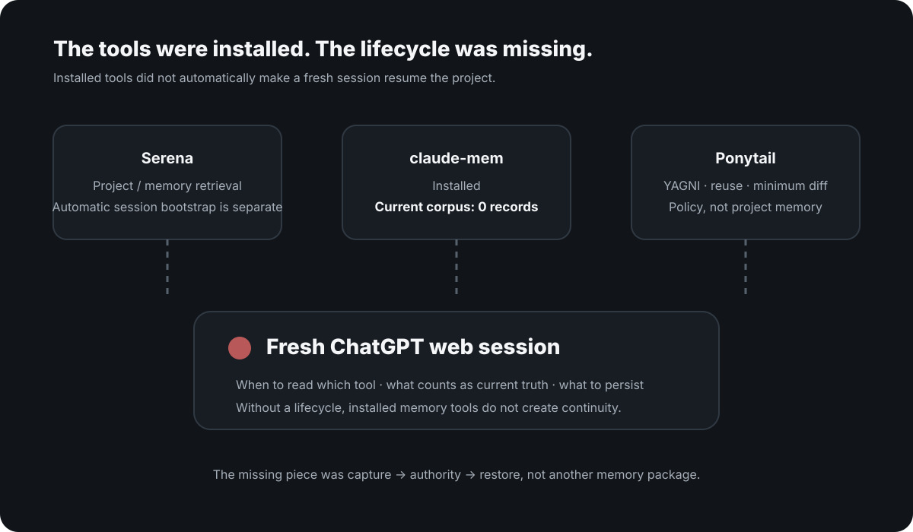
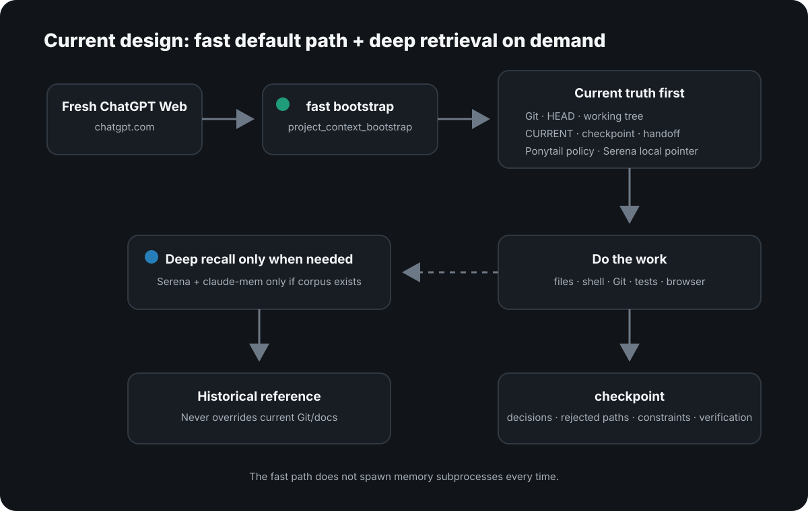
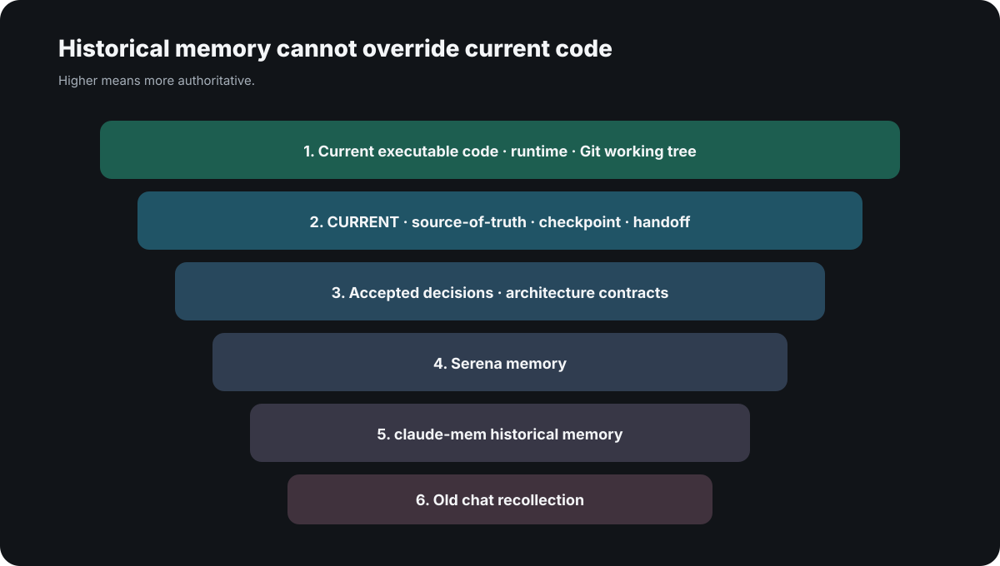

# How to keep AI coding agent context across sessions

**The missing piece was not another memory package. It was a lifecycle that decides what a fresh session reloads, what gets checkpointed, and which source wins when historical memory conflicts with the current repository.**

<p style="background: rgba(0, 120, 212, 0.08); border-left: 4px solid #0078d4; padding: 10px 14px; margin-bottom: 22px; border-radius: 4px; font-size: 0.95rem;">
  🌐 <strong>한국어 버전:</strong> <a href="/ai-coding-context-continuity-cokacremote/">툴을 깔았는데도 새 세션은 프로젝트를 잊었다</a>
</p>

If you searched for `AI coding agent memory`, `persistent memory`, `keep context across coding sessions`, or `context engineering`, start by separating three different things:

| Layer | What it provides | Does it survive a fresh session? |
|---|---|---|
| **Context window** | Conversation, files and tool results the model can see right now | Primarily current-session state |
| **Instruction file** | Repeatable rules in files such as `AGENTS.md` or `CLAUDE.md` | Yes, when the client reloads the file |
| **Persistent project memory** | Decisions, rejected approaches, blockers, verification state and next actions | Only if you build a capture-and-restore lifecycle |

A larger context window does **not** replace persistent memory, and a repository instruction file does **not** automatically represent the current state of an in-progress project. That distinction is also the dominant pattern in current search results about coding-agent memory and cross-session continuity.

After I [connected the ChatGPT web app to my Mac through MCP](/en-chatgpt-mcp-local-development-setup/), this became more than an inconvenience. Being able to see the repository is not the same as carrying intent, rejected approaches, constraints and verification state into a new conversation.

I already had Serena, Ponytail and claude-mem installed. **Their presence did not automatically make a fresh session resume the right project state.**

<picture>
  <source media="(max-width: 600px)" srcset="before-context-mobile.svg">
  
</picture>

## Why coding agents lose project context between sessions

The roles were different from what I had mentally grouped together.

### Serena

Serena can understand a codebase and store or retrieve project memory. But **having Serena installed does not mean every fresh ChatGPT session automatically reads the right Serena memory before doing work.**

You still need to decide when retrieval happens, what gets retrieved, and what wins if a memory conflicts with the current repository.

### claude-mem

I expected claude-mem to help with historical session recall.

When I later inspected the actual local state, however, the claude-mem SQLite corpus existed but its `observations`, `session_summaries`, `user_prompts` and `tool_uses` counts were all **zero**.

So this was a useful reality check:

**installed is not the same thing as capturing useful history in my actual workflow.**

### Ponytail

This one was a category error on my side.

The Ponytail setup I use is an **implementation-policy layer**: prefer YAGNI, reuse existing code, use the standard library, minimize diffs, and avoid unnecessary abstractions.

That is useful, but it is not a project-memory source.

I now classify it explicitly as:

> implementation discipline, not a source of historical truth.

## cokacremote made the session problem more important

Once the ChatGPT web app could use MCP to edit real files and run shell commands, stale context became more than an annoying answer-quality problem.

A fresh session could reintroduce an approach I had already rejected, or treat an old memory as more authoritative than today's Git state.

I needed a system that could answer five practical questions:

1. What should a new session read first?
2. If old memory conflicts with current code, what wins?
3. When should meaningful decisions be persisted?
4. Can deep historical retrieval happen only when it is actually needed?
5. Can the normal startup path stay fast without spawning every memory tool?

## Cross-session continuity needs capture → authority → restore

I added a **project-context lifecycle** directly into cokacremote.

<picture>
  <source media="(max-width: 600px)" srcset="final-context-flow-mobile.svg">
  
</picture>

The normal path is:

```text
new session / resume project
        ↓
project_context_bootstrap
        ↓
Git + current docs + checkpoint + local policy
        ↓
do the work
        ↓
meaningful decision/change
        ↓
project_context_checkpoint
        ↓
next session bootstraps again
```

Only when current state is not enough:

```text
project_context_recall
        ↓
Serena semantic retrieval
+ claude-mem (only if a real corpus exists)
```

That split between a fast path and a deep path ended up being the important design choice.

## The core code, stripped of private and security-specific details

If I reduce the current implementation to only the continuity mechanics, it looks roughly like this:

```ts
server.registerTool("project_context_bootstrap", schema, async ({ path, query }) => {
  const root = await resolveProjectRoot(path);
  const checkpoint = await inspectCheckpoint(root);

  const [docs, serena, ponytail, continuity] = await Promise.all([
    collectDocs(root),
    collectSerenaLocalMemories(root, query),
    ponytailLocalPolicy(),
    continuityStatus(root),
  ]);

  const snapshot = projectSnapshot(root);
  const contextHandle = guard.issue(root, snapshot);

  return boundedBootstrap({
    contextHandle,
    checkpoint: checkpoint.snapshot?.data ?? null,
    project: snapshot,
    documents: docs,
    serena,
    ponytail,
    continuity,
  });
});
```

Write and shell-oriented operations are gated so they cannot simply skip bootstrap:

```ts
async function mutate(projectPaths, contextHandle, operation) {
  await guard.require(projectPaths, contextHandle);
  return operation();
}
```

Historical retrieval is a separate path rather than part of every startup:

```ts
server.registerTool("project_context_recall", recallSchema, async ({ path, query }) => {
  const root = await resolveProjectRoot(path);

  const [serena, claudeMem] = await Promise.all([
    serenaDeepContext(root, query),
    claudeMemDeepContext(root, query),
  ]);

  return { serena, claudeMem };
});
```

The real implementation also handles journal recovery, revisions/CAS, working-tree fingerprints and output budgets. The excerpt above keeps only the **continuity architecture** and omits private paths, authentication and deployment details.

## 1. Fast bootstrap: read the minimum current truth first

`project_context_bootstrap` runs at a project/session boundary.

The current implementation checks:

- Git branch, HEAD and working tree
- current/source-of-truth/checkpoint/handoff documents
- a short pointer to local Serena memory if it exists
- Ponytail's local implementation policy
- whether the working tree drifted since the last checkpoint

The important part is what it **does not** do by default:

**it does not spawn Serena or claude-mem subprocesses on every bootstrap.**

I considered a design that eagerly loaded every memory helper at session start. That was rejected because it increases latency and input volume.

In one separate lifecycle comparison, the candidate context provider actually increased both the input proxy and elapsed time compared with the baseline. I stopped that path instead of treating "more context" as automatically better.

## 2. Checkpoint meaningful changes before the session ends

I also stopped relying on "save everything at session end."

`project_context_checkpoint` records events such as:

- accepted or rejected direction
- architecture decisions
- a superseded approach
- a new constraint or prohibition
- a meaningful blocker
- a milestone
- verification results
- handoff information that a fresh session must know

The current structure keeps a durable journal in `.context/CONVERSATION.jsonl` and produces readable views such as `.context/SNAPSHOT.json`, `SESSION_CHECKPOINT.md`, `HANDOFF.md` and `DECISIONS.md`.

The goal is not to dump the entire transcript.

The goal is to preserve **the semantic state that prevents the next session from heading in the wrong direction.**

## 3. Deep recall only when the current state is insufficient

`project_context_recall` is deliberately not the default path.

When deeper historical reasoning is genuinely missing, it can open one Serena MCP session for semantic retrieval. claude-mem is queried only when its local corpus actually contains records.

Right now my claude-mem corpus is empty, so the health check skips it automatically.

That small behavior matters because the system checks **useful state, not merely whether a package is installed.**

## 4. Historical memory is never allowed to override the current repository

<picture>
  <source media="(max-width: 600px)" srcset="authority-order-mobile.svg">
  
</picture>

The authority order I now use is:

```text
current executable code / runtime / Git
        ↓
current source-of-truth / checkpoint / handoff
        ↓
accepted decisions and architecture contracts
        ↓
Serena memory
        ↓
claude-mem historical memory
        ↓
old chat recollection
```

Without an ordering like this, "more memory" can make a coding agent less safe.

If a Serena note from three weeks ago conflicts with today's working tree, **today's repository wins.**

## 5. contextHandle is a continuity guard, not memory

Write and shell-oriented cokacremote tools are designed to require a `contextHandle` issued by bootstrap.

That handle is not another bundle of model memory.

It answers a simpler question:

**did this session bootstrap the relevant project context before it started making changes?**

The handle is scoped to the project and can become invalid when the branch or HEAD changes, after inactivity, or after a server restart.

This is still not a sandbox. It does not understand the full side effects of arbitrary shell commands. Its role is continuity gating, not OS-level isolation.

## What did it cost?

In one local validation pass, fast bootstrap averaged roughly **40–96 ms across three projects**, a rolling checkpoint was around **30 ms**, and one on-demand deep recall took around **2.1 seconds**.

Those numbers are not a performance guarantee. Repository size, machine state and implementation changes can move them.

The useful lesson was simply that the fast/deep split had a measurable reason to exist.

More importantly, **adding context machinery did not automatically reduce total token or time cost.** One experimental comparison got worse, not better, and that design was abandoned.

## What is still not magically solved

There is an important boundary.

**If a ChatGPT web conversation ends without calling the MCP or another supported persistence path, cokacremote cannot see the conversation that was never sent to it.**

This is not a magical transcript harvester.

For a meaningful decision to survive into the next session, it has to be checkpointed through an observable path.

That is why I describe this as **verifiable project continuity**, not perfect automatic memory.

## How I classify the tools now

| Tool | Role now |
|---|---|
| Git / current code | Highest-authority implementation evidence |
| CURRENT / checkpoint / handoff | Current intent and state |
| cokacremote bootstrap | Fast session entry point |
| cokacremote checkpoint | Persist meaningful semantic state |
| Serena | Optional historical/project retrieval |
| claude-mem | Historical retrieval only when a real corpus exists |
| Ponytail | Implementation policy: YAGNI, reuse, minimum diff |
| old chat memory | Lowest-priority reference |

The useful shift was from asking **"which memory tool should I install?"** to asking:

**what information is captured, when is it captured, who reads it, and what source is allowed to override another?**

## Why this matters more with the ChatGPT web app

I also found this more interesting after noticing that [everyday ChatGPT text chats and Codex use separate allowance structures](/en-chatgpt-unlimited-text-vs-codex-limits/).

If the ordinary browser ChatGPT UI is going to act as a long-running development control plane, being able to send more chat messages is not enough.

The hard part is whether a fresh session can safely resume the project.

At first I expected Serena, Ponytail and claude-mem to solve that individually. The design I use now is the opposite: **cokacremote owns the lifecycle, and each helper is allowed to do only the job it is actually good at.**

## Primary references for the concepts and tools

I cross-checked the distinction between context windows, session memory, project memory, and the intended roles of the tools against their primary sources:

- [OpenAI Cookbook — Short-Term Memory Management with Sessions](https://developers.openai.com/cookbook/examples/agents_sdk/session_memory): session history and context-management patterns
- [Serena — official repository](https://github.com/oraios/serena): MCP-based semantic code retrieval/editing and project memory
- [claude-mem — official repository](https://github.com/thedotmack/claude-mem): persistent observations and summaries across sessions
- [Ponytail — official repository](https://github.com/DietrichGebert/ponytail): an implementation-policy stack centered on YAGNI, reuse, standard/native options and minimum working code; I do not classify it as project memory

These sources do **not** validate my cokacremote design as a universal solution. The implementation details and performance measurements in this post come from my local setup; the links above establish the concepts and the intended roles of the individual tools.

## What I intentionally left out

I left out private local paths, real authentication material, live MCP endpoints, OAuth keys and user-specific data.

I also did not paste the full implementation. The useful part is the design:

- verify actual data flow instead of trusting an installed package;
- let current code outrank historical memory;
- separate fast bootstrap from deep recall;
- persist meaningful decisions when they happen, not only at shutdown;
- do not confuse "more injected context" with lower total cost.

If there is a specific part worth expanding, leave a comment. I can break out the bootstrap/checkpoint schema, journal layout, contextHandle gate, or Serena/claude-mem integration in a follow-up without publishing private configuration.
