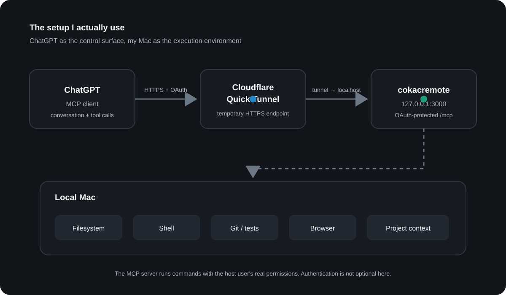
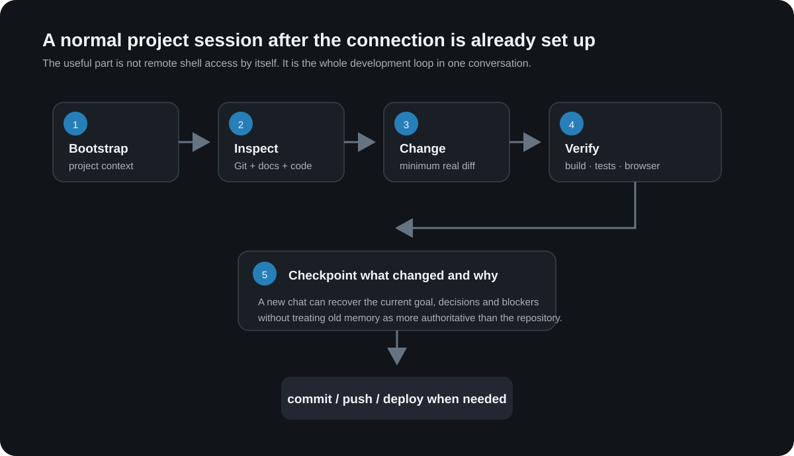

# How I Let ChatGPT Control My Mac with MCP: Files, Terminal, Git & Browser

  🌐 <strong>한국어 버전:</strong> <a href="/chatgpt-mcp-local-development-setup/">ChatGPT가 내 Mac을 직접 제어하게 만들기: MCP로 파일·터미널·Git 연결</a>

<strong>This is not a story about me using ChatGPT as a coding assistant.</strong> In this setup, I can point ChatGPT at a project and it can use MCP to read the real directory on my Mac, run terminal commands, edit files, execute tests, and inspect the Git diff.\n\n<strong>This is not a story about me using ChatGPT as a coding assistant.</strong> In this setup, I can point ChatGPT at a project and it can use MCP to read the real directory on my Mac, run terminal commands, edit files, execute tests, and inspect the Git diff.\n\nThe part of AI-assisted coding that annoyed me most wasn't generating code. It was the boundary between a ChatGPT conversation and the project actually sitting on my machine.

I would check <code>git status</code>, open a file, copy the relevant section into ChatGPT, paste the answer back into the repository, run tests, and then repeat the same explanation in a new chat: what the project is, what changed, what must not be touched, and what I already tried.

Eventually I inverted the workflow.

<strong>ChatGPT can now inspect the real project on my Mac, run shell commands, edit files, check Git, run tests, and use browser automation through MCP.</strong> This post itself was prepared by letting ChatGPT inspect and edit the local Jekyll repository where the blog lives.

## The MCP setup that lets ChatGPT control my local Mac

The core is a [Model Context Protocol (MCP)](https://modelcontextprotocol.io/) server. Mine is based on [cokacremote](https://github.com/kstost/cokacremote), running locally on my Mac.

At a high level:

<pre><code>ChatGPT
   ↓  MCP over HTTPS + OAuth
Cloudflare Quick Tunnel
   ↓
cokacremote (localhost)
   ↓
my Mac
 ├─ filesystem
 ├─ shell
 ├─ Git
 ├─ builds and tests
 ├─ browser automation
 └─ project context</code></pre>

OpenAI's current developer documentation supports connecting an HTTPS <code>/mcp</code> endpoint from ChatGPT developer mode. For development, Cloudflare Quick Tunnels can give a local HTTP service a temporary public <code>trycloudflare.com</code> URL without first setting up a permanent domain.

One point matters more than the convenience: <strong>the tunnel is not the security boundary.</strong> My MCP server can execute commands and modify or delete files with the permissions of the local process. I therefore run it behind OAuth and make the setup script explicitly verify that an unauthenticated <code>/mcp</code> request gets <code>401</code>.

## What changes when ChatGPT can access local files and the terminal

My original goal was basically "remote shell access from ChatGPT." In practice, the useful part isn't the shell by itself.

I can start a conversation with something like:

> This directory is the project. Inspect the current state before changing anything.

From there, the conversation can drive the full loop.

Instead of me manually doing <code>git status → find docs → inspect code → edit → test → review diff</code>, ChatGPT can perform those steps against the repository that actually exists on disk.

That distinction matters. The model is no longer reasoning only from a pasted snapshot. If another session changed the code, or I edited something manually, the next session can re-read the current Git and filesystem state before making decisions.

## I automated the Quick Tunnel setup too

Initially I started the MCP server, launched <code>cloudflared</code>, copied the newly generated URL, adjusted OAuth-related settings, and reconnected ChatGPT by hand.

That got old quickly.

I now use a <code>setup-oauth-quicktunnel.sh</code> script that handles most of the boring parts.

The current version roughly does this:

1. Locate and validate the real cokacremote checkout
2. Inspect the currently running local service
3. Build it if required
4. Start a Quick Tunnel pointing at <code>127.0.0.1:3000</code>
5. Extract the generated public URL
6. Prepare OAuth state and key material
7. Start the MCP server with the public URL
8. Verify local <code>/health</code>
9. Verify public <code>/health</code>
10. Verify OAuth discovery metadata
11. <strong>Verify that unauthenticated <code>/mcp</code> returns <code>401</code></strong>
12. Print the MCP URL to enter in ChatGPT
13. Clean up only the processes the script itself owns when it exits

I don't want a real tunnel hostname or approval key in a public screenshot, so the following image is a <strong>redacted reconstruction of the verified output flow</strong>, not a screenshot containing my live credentials.

A Quick Tunnel hostname is temporary and can change when the process restarts. That's fine for how I currently use this on my own development machine. If I needed a stable long-lived endpoint, I would use a named Cloudflare Tunnel or another permanent HTTPS deployment instead.

## The next problem: new chats still forget project history

Giving ChatGPT filesystem access solves only part of the problem.

It can see the current code, but it does not automatically know <strong>why a decision was made, which approach was rejected, what a previous session finished, or which constraints are still active</strong>.

So I added a lightweight project-context layer.

The authority order I use is roughly:

<pre><code>current executable code / Git state
        ↓
current-state docs / checkpoint
        ↓
accepted architecture and decisions
        ↓
older project memory
        ↓
old conversation memory</code></pre>

The key rule is that old memory never gets to override the repository.

At a project or session boundary I run a fast bootstrap that reads the current Git state and the small amount of current project context needed to resume work. Meaningful decisions and material changes are checkpointed back into the repository. Deeper historical recall is optional instead of being loaded on every prompt.

I'm still testing this part. <strong>A feature working is not the same thing as proving that it reduces total token or time cost</strong>, so I'm deliberately not claiming that the context layer is already an optimal solution.

## What changed in day-to-day use

Before:

<pre><code>Here is the file...
Here is the error...
Another model changed this...
Don't touch these parts...
This is what I tried...</code></pre>

Now:

<pre><code>Inspect this project and verify its current state first.</code></pre>

That doesn't make the model infallible. In fact, because the model has real host access, I need stricter operating rules than I did when it was only returning code snippets.

The rules that matter most in my setup are:

- inspect current Git and code before making changes;
- current executable state outranks old memory;
- reuse existing implementations instead of creating duplicate helpers;
- run the real build/tests after changes;
- checkpoint meaningful implementation or architecture decisions;
- never expose write-capable MCP tools anonymously on a public endpoint.

With those rules in place, ChatGPT feels less like a code-generation window and more like a <strong>control surface for the development environment that already exists on my machine</strong>.

## Why I am not publishing every line of the setup here

I intentionally left out some details.

The full <code>setup-oauth-quicktunnel.sh</code>, the complete OAuth approval configuration, the tunnel URL retry logic, and the exact project-checkpoint format would make this post much longer. More importantly, this MCP server has powerful host permissions. I don't want a partial copy-paste recipe to encourage someone to expose an unrestricted local command server carelessly.

The architecture and security boundary are not hidden, though.

If you're building something similar, leave a comment with the specific part you want to see. Useful topics would be:

- the ChatGPT MCP registration flow;
- OAuth 2.1 / DCR configuration;
- extracting and retrying Quick Tunnel URLs;
- process ownership and cleanup in the setup shell script;
- restoring project context across new chats;
- combining Git, tests and browser automation in one workflow;
- keeping a local MCP service running on macOS.

If I can share the relevant part safely, I'll post the actual configuration or a reduced code sample in the comments. If the same question keeps coming up, I'll move it into this article or make it a follow-up post.

## FAQ

### Can ChatGPT read and edit files directly on my local Mac?

Yes, if those capabilities are exposed through an authenticated MCP server. ChatGPT on the web does not simply connect to your machine's localhost; the setup needs a reachable remote MCP endpoint or a supported secure tunnel. In my setup, **cokacremote exposes the local tools and Cloudflare Tunnel plus OAuth provides the connection**.

### Can ChatGPT run terminal commands, Git and tests through MCP?

Yes. In this setup, file operations, shell execution, Git inspection, builds, tests and browser automation are exposed as MCP tools. ChatGPT is not merely suggesting a terminal command: **it can invoke the tool on the local Mac and read the result back into the conversation**.

### Is a Cloudflare Quick Tunnel enough to secure this?

No. A tunnel provides connectivity, not authorization. A write-capable MCP server needs authentication and careful permission handling. My setup therefore checks the public health and OAuth metadata and also verifies that an unauthenticated request to /mcp is rejected with 401.

## References

- [OpenAI Plugins Quickstart — connect an MCP server](https://developers.openai.com/plugins/quickstart)
- [OpenAI — MCP server authentication](https://developers.openai.com/plugins/build/auth)
- [Cloudflare Docs — Quick Tunnels](https://developers.cloudflare.com/tunnel/get-started/quick-tunnels/)
- [Model Context Protocol](https://modelcontextprotocol.io/)

My current takeaway is simple: <strong>for serious development work, giving ChatGPT a properly authenticated MCP interface to the real environment feels much more natural than continuously copying snapshots of that environment into the chat.</strong> Once you do that, though, permissions and state verification become first-class engineering problems.
