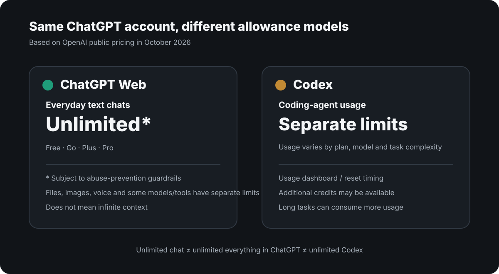
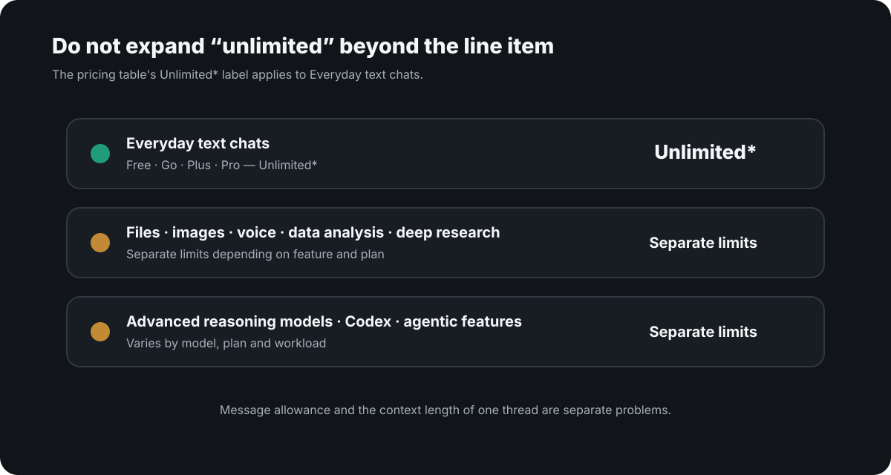

# ChatGPT message limits vs Codex usage limits

**As of October 5, 2026, ordinary ChatGPT text chat and Codex do not use the same allowance model. Codex has separate model-dependent usage limits, and local messages plus cloud chats draw from the same plan allowance.**

<p style="background: rgba(0, 120, 212, 0.08); border-left: 4px solid #0078d4; padding: 10px 14px; margin-bottom: 22px; border-radius: 4px; font-size: 0.95rem;">
  🌐 <strong>한국어 버전:</strong> <a href="/chatgpt-unlimited-text-vs-codex-limits/">ChatGPT 메시지 제한 vs Codex Plus 사용량 한도</a>
</p>

If you searched for `ChatGPT message limit`, `ChatGPT Plus Codex limit`, or `Codex usage limits`, the short answer is:

| Question | Answer as of Oct. 5, 2026 |
|---|---|
| Ordinary ChatGPT text chat | **Unlimited*** under the personal-plan ladder, subject to abuse-prevention safeguards |
| Codex on ChatGPT Plus | **Not unlimited.** OpenAI publishes model-specific estimated usage ranges |
| Local Codex messages vs cloud chats | **They share the plan allowance** |
| Weekly limits | **May also apply** |
| Where to check the real remaining limit | Codex usage dashboard or **`/status`** in Codex CLI |

So the practical mistake is treating every request under one ChatGPT subscription as if it came out of one message bucket. **Ordinary browser ChatGPT conversation and Codex are separate usage surfaces.**

I ran into this distinction while [using the ChatGPT web app as a control surface for my local Mac](/en-chatgpt-mcp-local-development-setup/).

<picture>
  <source media="(max-width: 600px)" srcset="chat-vs-codex-mobile.svg">
  
</picture>

## What "unlimited ChatGPT text chat" actually means

The unlimited item in OpenAI's pricing table is **everyday text chats**.

As of October 2026, the personal-plan comparison is effectively:

| Feature | Free | Go | Plus | Pro |
|---|---|---|---|---|
| Everyday text chats | Unlimited* | Unlimited* | Unlimited* | Unlimited* |
| Codex | Limited / separate allowance | Limited / separate allowance | Expanded usage | Maximum usage |
| Files, images, voice, some tools | Separate limits | Separate limits | Expanded limits | Higher limits |

The asterisk matters: **unlimited text chats are still subject to abuse-prevention guardrails.**

It would be wrong to turn that into:

> Everything I do inside ChatGPT is unlimited.

It is not.

<picture>
  <source media="(max-width: 600px)" srcset="unlimited-is-not-everything-mobile.svg">
  
</picture>

File uploads, image generation, voice, data analysis, deep research, some advanced reasoning models and tools can have their own limits. OpenAI's Help Center explicitly separates unlimited everyday text chats from these other allowances.

## How many Codex messages does ChatGPT Plus actually include?

The Codex pricing page has an explicit **usage limits** table. As of October 5, 2026, the English pricing page publishes these estimated Plus ranges:

| Codex model | Plus estimated usage |
|---|---:|
| GPT-6 Astra | 5–45 |
| GPT-6.1 Sol | 15–160 |
| GPT-6 Sol | 15–150 |
| GPT-6 Luna | 350–3,000 |

These are **current estimates for local messages within a five-hour window, not monthly totals or guaranteed message counts**. GPT-5.6-family models and GPT-5.5 still appear in the separate credit-rate table, but they are not in the current Plus local-message estimate table. Actual consumption varies with model, task complexity, context, reasoning, where the task runs and the tools involved. **Local messages and cloud chats share the plan allowance, and weekly limits may also apply.**

So the best answer to “how many Codex messages do I get on Plus?” is: **it depends on the model and workload, and your usage dashboard is the authoritative current value**. In an active Codex CLI session, `/status` shows the remaining allowance.

If you run out, the available options can include switching to a lower-cost model, waiting for the reset, or using credits when your account offers them.

A useful mental model is:

```text
ChatGPT web app
└─ Everyday text chats: unlimited*
   ├─ Some advanced models/reasoning: separate limits may apply
   ├─ Files/images/voice/tools: separate limits may apply
   └─ Codex: separate agentic usage allowance / credits
```

A long Codex task and a normal text turn in the ChatGPT web UI may both feel like "one request," but they do not use the same allowance model.

## Why this matters to my MCP setup

I did not look into this just to say "unlimited is cheaper."

My current workflow uses **the normal ChatGPT conversation UI at `chatgpt.com` in an internet browser** and connects that web product to my Mac through MCP. The MCP server can expose local files, terminal commands, Git, tests and browser automation.

That means a large part of the planning, review and decision-making loop can happen in ordinary ChatGPT conversation, while local tools are invoked only when needed.

This does **not** mean the ChatGPT web app replaces every Codex capability. Codex is a dedicated coding agent with purpose-built workflows and integrations.

The point is narrower: **you do not necessarily have to spend Codex allowance for every part of a coding workflow.** A browser ChatGPT + MCP architecture gives you another way to split conversation, reasoning and local execution.

One important caveat:

**OpenAI does not state that every MCP tool invocation is unlimited.** The pricing table says `Everyday text chats` are unlimited. I would not extend that claim to every tool, connector or future policy unless OpenAI documents it explicitly.

## Unlimited messages are not unlimited context

This is a separate problem.

**Unlimited chat does not mean one conversation thread remembers everything forever.**

Long-running conversations still run into context, memory, compaction and session-boundary issues. I noticed that problem more clearly after using the ChatGPT web app for sustained local development.

That led to a separate project: [I had installed Serena, Ponytail and claude-mem expecting better continuity, but the sessions still did not reliably carry the project state forward. I eventually built a deterministic context layer into cokacremote.](/en-ai-coding-context-continuity-cokacremote/)

So I now separate two questions:

- **Usage:** how many more messages or agent tasks can I run?
- **Continuity:** can a fresh session recover the correct decisions, constraints and current project state?

They are not the same problem.

## Why this is easy to miss

Both products live under the same account.

Codex is included with ChatGPT plans, and the ordinary ChatGPT interface uses the same subscription. From the user side, it is natural to assume there is one common message bucket.

The official documentation separates them:

- ChatGPT pricing: **Everyday text chats = Unlimited***
- Codex documentation: **Usage limits vary by plan**
- When Codex usage runs out: check the usage dashboard, wait for reset, or use available credits

That difference is significant when you design an AI coding workflow rather than just use one product at a time.

## My current reading of the policy

As of October 2026:

1. **Everyday text chats are unlimited* on ChatGPT Free, Go, Plus and Pro.**
2. **That does not make every model, tool, file upload, image, reasoning mode or agent feature unlimited.**
3. **Codex has a separate usage-limit and credit structure.**
4. **Unlimited messages do not mean infinite context in one thread.**
5. For development workflows, it is useful to treat **chat allowance, coding-agent allowance and context continuity as separate resources.**

OpenAI can change pricing and allowances, so this is not a permanent rule. The official pages below are the source of truth.

## Official sources

- [ChatGPT pricing — personal plans](https://chatgpt.com/pricing/)
- [ChatGPT Learn — Work and Codex pricing and usage limits](https://learn.chatgpt.com/docs/pricing)
- [OpenAI Help — Using Codex with your ChatGPT plan](https://help.openai.com/en/articles/11369540-using-codex-with-your-chatgpt-plan)
- [OpenAI Help — What is ChatGPT? Web access is chatgpt.com](https://help.openai.com/en/articles/12677804-what-is-chatgpt-faq)
- [ChatGPT release notes — unlimited text chats and the Work/Codex distinction](https://help.openai.com/en/articles/6825453-chatgpt-release-notes)

*Unlimited is subject to OpenAI's abuse-prevention guardrails.*
