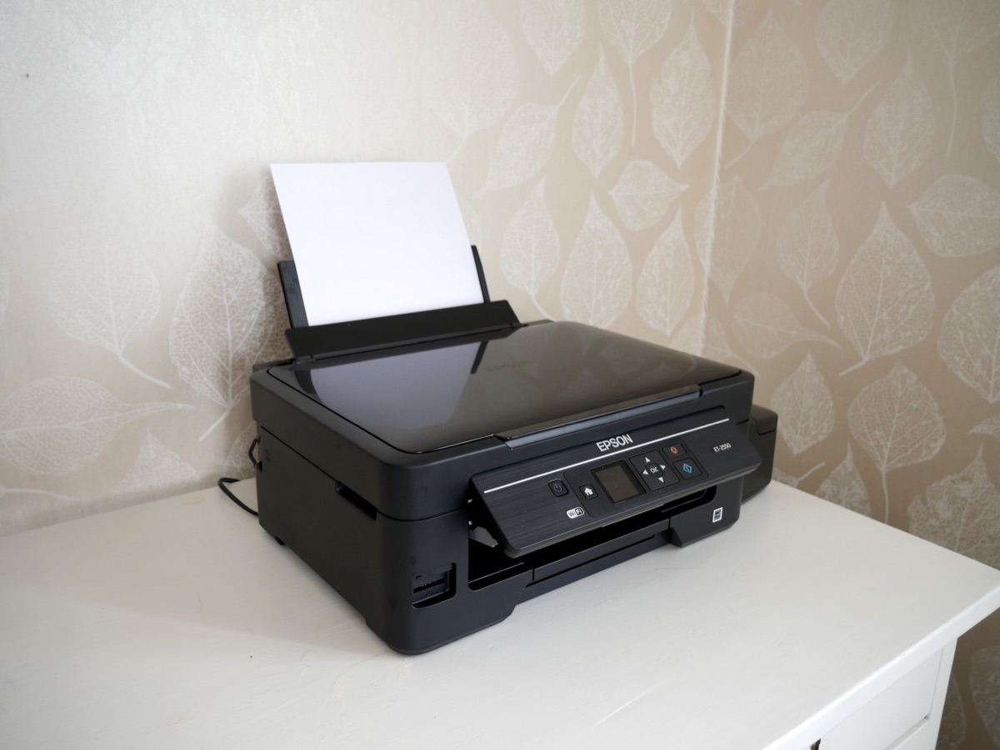
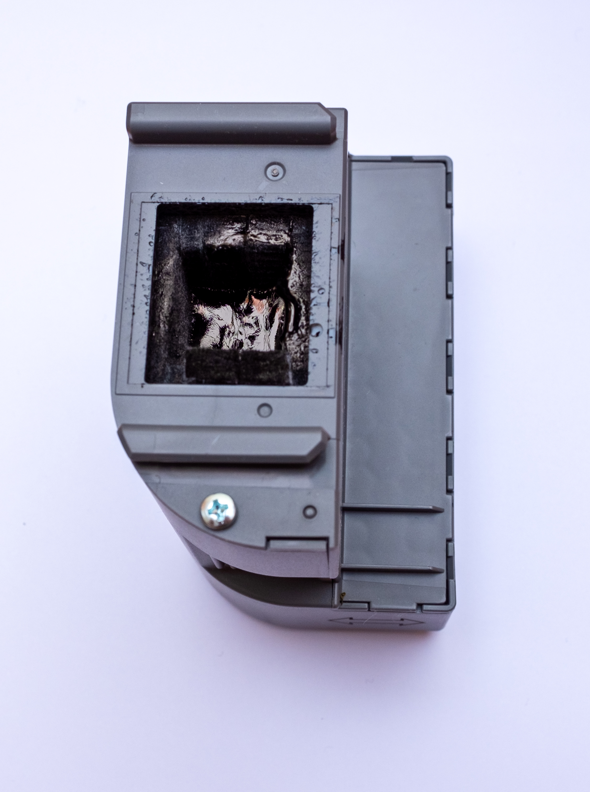

### When Your Epson Printer Says "Waste Ink Pad Life Expired"


<p style="font-size:0.8em; color:#888; margin-top:-10px;">Epson L-Series Printer (Photo: Dinkun Chen, CC BY-SA 4.0 via Wikimedia Commons)</p>

If you own an Epson EcoTank / L-Series printer (such as the L3100, L3106, L3110, L3150, or L4150), after printing a certain number of pages you will inevitably run into this blocking error:

> **"A printer's ink pad is at the end of its service life. Please contact Epson Support."**

All ink and paper LEDs start flashing alternately, and the printer locks up completely.

When searching for solutions online, users typically hit two frustrating roadblocks:
1. **Expensive and scammy software resets**: Tools like WIC Reset require you to buy a one-time reset key for \$10–\$15. Free alternatives like the Epson Adjustment Program (AdjProg) are 99% Windows-only `.exe` binaries, often flagged by antiviruses and unusable on **macOS (MacBook)** or **Linux**.
2. **Overpriced plastic assembly**: Buying the entire plastic cartridge housing costs significantly more and creates unnecessary plastic waste, even though the plastic case itself is completely intact and reusable.

By **replacing only the felt absorption pads** and using an open-source Python tool (**reinkpy-fix**) with an AI coding assistant or terminal, you can completely repair your printer in **under 10 minutes** for roughly \$4–\$5 on any operating system.

---

### 1. Cost & Waste Comparison: Full Assembly vs. Felt Pads Only


<p style="font-size:0.8em; color:#888; margin-top:-10px;">Epson Ink Maintenance Box / Waste ink absorber (Photo: Ll1324, CC0 Public Domain via Wikimedia Commons)</p>

The waste ink maintenance box is just a molded plastic container. What actually gets saturated with discarded ink is the **felt absorption pads** inside.

| Aspect | Full Maintenance Box Assembly | Felt Absorber Pads Only (Recommended) |
| :--- | :--- | :--- |
| **Typical Cost** | \$7 – \$10 + shipping | **\$4 – \$5 (Free shipping available online)** |
| **Hardware Work** | Remove 1 screw, swap box | Remove 1 screw, swap inner felt pads |
| **Time Needed** | ~3 minutes | ~5 minutes |
| **Eco Impact** | Throws away durable plastic | Reuses plastic housing, zero extra plastic waste |

You only need to buy pre-cut replacement sponge pads for your model (e.g. L3100 / L3110 / L3150) from online marketplaces like Amazon, AliExpress, or local vendors.

---

### 2. Hardware Replacement (Takes 5 Minutes)

**Items needed**: Cross-head screwdriver, disposable gloves (or tweezers), paper towels, new felt pads.

1. **Power Off**: Disconnect the power cord and USB cable.
2. **Remove Outer Screw**: Locate the single screw on the lower right back panel of the printer. Unscrew it and slide the small plastic cover downwards to remove it.
3. **Slide Out Ink Box**: Remove the inner screw securing the waste ink container. Slide the container out gently towards the right.
4. **Swap Sponges**: Wearing gloves, pull out the ink-soaked sponges and discard them into a trash bag. Wipe the inside of the plastic casing with a paper towel, then insert the new, clean felt pads in the exact same orientation.
5. **Reassemble**: Slide the box back into the printer, tighten both screws, and reattach the cover.

---

### 3. Software Counter Reset via reinkpy-fix (Cross-Platform)

Physical pad replacement is only half the battle. The internal EEPROM memory in the printer still retains the maximum counter value, which must be reset to 0%.

Instead of paying for proprietary reset keys or hunting down sketchy Windows-only tools, we use **`reinkpy-fix`**, an open-source Python tool that communicates directly with the printer over low-level USB commands.

You can run these steps directly in your terminal, or pass these instructions to an AI coding agent (like Codex, Claude Code, or Antigravity) to execute and troubleshoot automatically.

#### Step 1 — Clone the Repository

Clone the patched repository locally:

```bash
git clone https://github.com/LeFZdev/reinkpy-fix
cd reinkpy-fix
```

#### Step 2 — Install libusb

`libusb` is required for raw USB device communication on macOS and Linux.

On macOS (via Homebrew):
```bash
brew install libusb
```

On Ubuntu/Debian Linux:
```bash
sudo apt-get install libusb-1.0-0-dev
```

#### Step 3 — Create Virtual Environment & Install Dependencies

```bash
python3 -m venv venv
venv/bin/pip install pyusb pysnmp zeroconf
venv/bin/pip install -e .
```

#### Step 4 — Fix Library Import Bug (Crucial Step!)

In the current `reinkpy-fix` repository commit, running the script immediately results in an `ImportError`. The underlying file `usb.py` was renamed to `usbtest.py`, but `reinkpy/__init__.py` was not updated.

Open `reinkpy/__init__.py` and search for `from usb import UsbIO`. You will find two occurrences. **Change both lines to:**

```python
# Before
from usb import UsbIO

# After
from .usbtest import UsbIO
```

*(If you are using an AI coding agent, simply tell it: "Fix the UsbIO import in reinkpy/__init__.py to import from .usbtest", and it will patch the file instantly.)*

#### Step 5 — Replace main.py with USB Reset Routine

Replace the entire contents of `reinkpy/main.py` with the following clean reset script:

```python
import reinkpy

# Discover connected EPSON USB printer
printer = reinkpy.Device.from_usb(manufacturer='EPSON')

driver = printer.epson
if not driver.spec.model:
    driver.configure("L3106")  # Specify your model or compatible series (e.g. L3100, L3106, L3150)

print("Connected Printer:", printer)
print("Configured Model:", driver.spec.model)

# Reset waste ink counter to 0%
driver.reset_waste()
print("Waste ink pad counter successfully reset to 0%!")
```

#### Step 6 — Execute with Elevated Privileges

Raw USB access requires root permissions on macOS/Linux:

```bash
sudo venv/bin/python3 reinkpy/main.py
```

You will see output identifying your printer followed by:
```text
Connected Printer: <Device EPSON ...>
Configured Model: L3106
Waste ink pad counter successfully reset to 0%!
```

Finally, **turn the printer off and back on**. The flashing warning lights will disappear, and the printer will return to a completely normal and ready printing state!

---

### Supported Epson Printer Models (33 Compatible Models)

This method is verified not only for L3100 / L3106, but across **all 33 Epson EcoTank / L-Series models** that share the same motherboard architecture and USB EEPROM command mapping:

#### 1) L3100 / L3110 Series
- **L3100 Models**: L3100, L3101, L3104, L3105, L3106, L3107, L3108, L3109
- **L3110 Models**: L3110, L3111, L3114, L3115, L3116, L3117, L3118, L3119

#### 2) L3150 / L3160 Wi-Fi Series
- **L3150 Models**: L3150, L3151, L3152, L3153, L3156, L3158
- **L3160 Models**: L3160, L3161, L3163, L3165, L3166, L3168

#### 3) L1110 Single Function & L5190 Fax All-in-One Series
- **L1110 Models**: L1110, L1118, L1119
- **L5190 Models**: L5190, L5196, L5198

> **Configuration Note**: In Step 5, simply replace `driver.configure("L3106")` in `main.py` with your exact model string (e.g., `L3150`, `L1110`, `L5190`). The driver will target the exact memory register of your printer.

---

### Summary: Solved in 10 Minutes with \$5

- **Total Cost**: ~$5 for felt pads (Zero dollars spent on reset keys)
- **Time Spent**: 5 mins physical pad swap + 5 mins terminal reset = **10 minutes total**
- **Key Advantage**: 100% native on macOS and Linux without Windows virtualization, and reusable for every future reset cycle.
