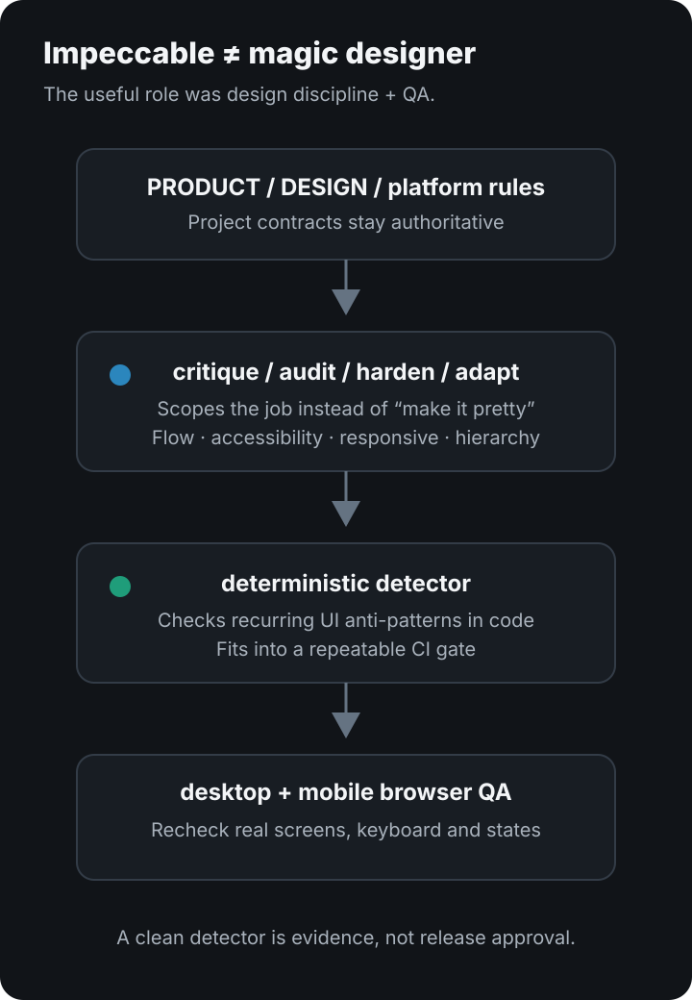
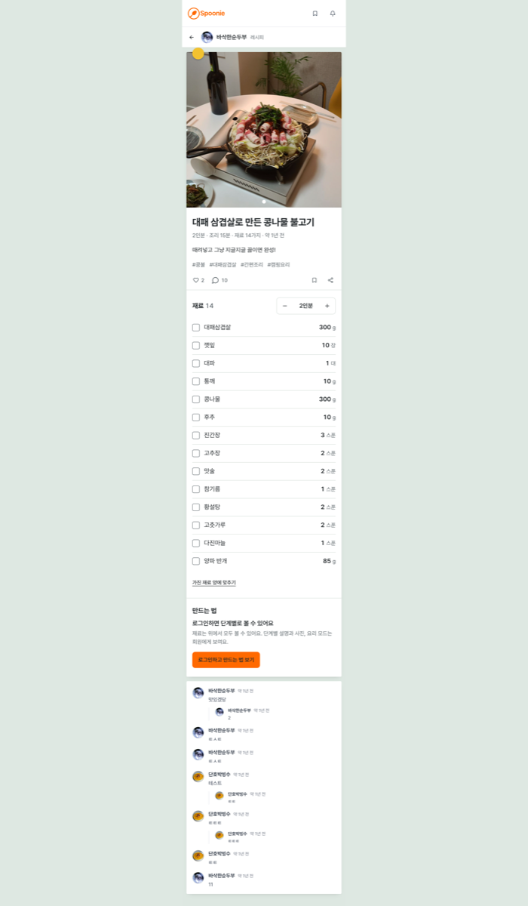
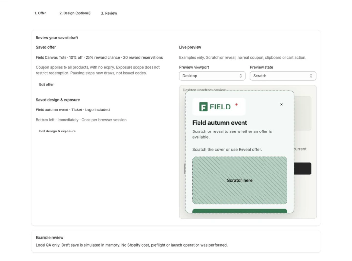
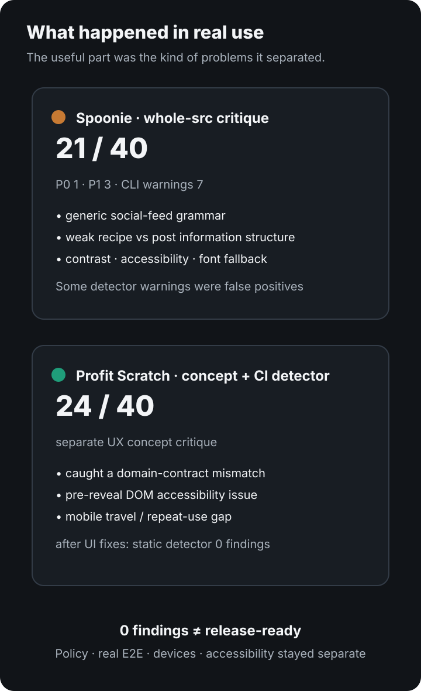
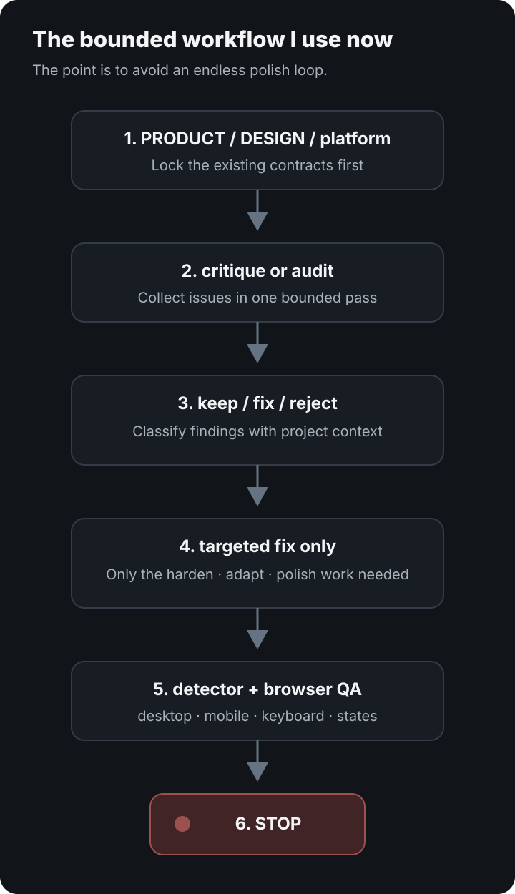

# Impeccable review: two real projects

**My verdict: Impeccable is more useful as design discipline + critique + a QA gate for AI coding agents than as a magic “make this UI beautiful” button.**

<p style="background: rgba(0, 120, 212, 0.08); border-left: 4px solid #0078d4; padding: 10px 14px; margin-bottom: 22px; border-radius: 4px; font-size: 0.95rem;">
  🌐 <strong>한국어 버전:</strong> <a href="/impeccable-review-ai-ui-design/">Impeccable 실사용 후기</a>
</p>

If you search for `Impeccable review`, `AI frontend design skill`, `npx impeccable install`, or `AI UI detector`, the practical question is usually:

> **Does this actually make AI-built interfaces less generic and less obviously AI-generated?**

In my experience: **yes, sometimes — but not automatically.**

I used Impeccable on two real projects rather than a throwaway demo:

- **Spoonie**, a recipe/social product
- **Profit Scratch**, a Shopify app

Because the products have very different UI constraints, the combination exposed both the useful parts and the limitations.



## What Impeccable actually is

The official project describes Impeccable as a **frontend design skill + CLI for AI coding agents**.

The default installation starts with:

```bash
npx impeccable install
```

Then you initialize it inside the coding tool and use design-specific workflows such as `audit`, `critique`, `polish`, `harden`, and `adapt`. The official docs currently use `$impeccable` for Codex and `/impeccable` for many other supported agents.

The useful part is that it has two distinct layers.

1. **Skill / design vocabulary**
   Instead of asking an agent to “make the UI better,” you can scope the job to critique, hardening, responsive adaptation, polishing, and so on.

2. **Deterministic detector**
   The CLI scans frontend source for recurring design anti-patterns. The current npm description documents 61 deterministic rules.

That matters because the workflow is not purely an LLM giving aesthetic opinions.

## Real use #1: Spoonie — the critique was harsher than expected

A whole-`src` critique of Spoonie scored **21/40**, with one P0 and three P1 findings.

It was not just a spacing review.

The report called out issues such as:

- a recipe product still reading like a **generic social feed**
- recipes and ordinary posts sharing too much of the same card grammar
- nested card structures
- too much chrome before the first ingredient
- insufficient contrast for white text on the brand orange
- weak accessibility labeling on icon controls
- a font choice that did not actually cover Korean glyphs
- product-specific concepts such as recipe vs. recipeed/citation not being explained strongly enough

<figure>
  
  <figcaption>A real Impeccable review artifact from Spoonie. At the time, the desktop recipe detail still behaved like a long narrow single-column surface.</figcaption>
</figure>

The useful part was not “this page is ugly.” It was the explanation of **why it did not express the product strongly enough**.

One question from the critique was especially good:

> If you removed the food photos, what about the interface would still tell you this is a cooking product?

That is a much better design question than arguing over a border radius.

Spoonie later changed its recipe detail structure, cooking flow, design language, typography roles and color system substantially. I do not attribute the entire redesign to Impeccable — product decisions and implementation work were separate — but the critique was a useful input.

### The detector was not perfect

The same audit produced seven CLI warnings.

Some were useful, but several were effectively false positives in context:

- some gray-on-color warnings
- spinner border-accent warnings
- a functional side-tab pattern

One layout-transition finding was genuinely worth fixing.

That is why I do **not** treat detector output as an automatic patch list.

## Real use #2: Profit Scratch — more valuable once it became a CI gate

I integrated Impeccable more systematically in Profit Scratch.

The project has a dedicated design-check script:

```json
{
  "check:design": "npx --yes impeccable@4.1.0 detect app storefront extensions/profit-scratch-widget"
}
```

The full `npm run check` runs linting, tests, type checking, the production build, Shopify Theme Check and the design detector.

This is where Impeccable became more useful for me.

A one-off critique is helpful. **Running the same design anti-pattern checks after every relevant UI change is more durable.**

In one actual case, a progress animation was changing `width` directly. After replacing it with a transform-based animation, the static detector returned **zero findings**.

But there is an important caveat.

**Zero detector findings did not mean Profit Scratch was release-ready.**

The project still had separate blockers around accessibility, real Shopify E2E, representative themes/devices and coupon-policy correctness.

<figure>
  
  <figcaption>Actual local QA evidence from Profit Scratch. It uses synthetic test data; no real coupon or checkout action was performed.</figcaption>
</figure>

That is why I treat Impeccable as a **quality signal, not a release authority**.

## When critique was more valuable than the detector

A separate Profit Scratch UX concept received a **24/40** critique.

The useful findings were not visual taste:

- the concept allowed 100% paid-win probability while the real domain contract capped it at 99.99%
- reward content was exposed in the DOM before the scratch cover was removed
- narrow layouts created excessive vertical travel between controls and results
- repeated campaign operation was still under-designed

Those are product-contract and task-flow problems.

The critique also kept an important boundary: it did not automatically attribute a defect in the concept mockup to the real app.

That kind of evidence discipline was more valuable to me than “make this look premium.”



## What worked well

### 1. The design vocabulary narrows the agent's scope

Commands such as `audit`, `critique`, `harden`, `adapt`, and `polish` are more useful than a vague “improve the UI.”

That reduces the chance that the agent treats every request as permission to redesign the entire product.

### 2. It catches recurring AI UI habits at the code level

The anti-patterns it targets are recognizable if you use coding agents often:

- cards inside cards
- unnecessary rounded containers
- decorative gradients with no product reason
- weak contrast
- repeated icon tiles
- excessive motion
- generic SaaS hierarchy

You do not have to agree with every rule. The value is that it forces the question:

**Was this choice required by the product, or did the model generate it out of habit?**

### 3. The deterministic detector fits automated verification

This became the most durable part for me.

A critique report is episodic. A detector in the normal verification gate can keep catching the same category of mistakes later.

### 4. Review artifacts survive the session

Both projects accumulated critique reports, screenshots and review evidence under their Impeccable workflow.

That makes later sessions easier because the design decision has evidence attached to it rather than living only in a chat transcript.

## What I disliked or would be careful about

### 1. Generic design rules cannot outrank the product

Profit Scratch is a Shopify Admin product.

I explicitly keep **Shopify-native UI and the project's own product/design contracts above generic Impeccable heuristics**.

Otherwise a tool that is trying to make something “better designed” can accidentally make it less native to the platform.

### 2. False positives exist

The first Spoonie detector pass already showed that.

Chasing `0 findings` mechanically would be a mistake.

### 3. The process can become heavy

A project can accumulate skills, review artifacts, design context, detector runs and browser evidence.

Used badly, the workflow becomes:

`audit → critique → fix → polish → audit → polish → ...`

That is just another AI loop consuming time and tokens.

The current Impeccable skill itself emphasizes bounded passes, and that matches my experience.

### 4. It does not replace product judgment

Spoonie's biggest issue was not a shade of orange. It was that product-specific recipe mechanics were visually subordinate to generic social UI.

Profit Scratch's biggest blockers were not styling either; they included real campaign/coupon policy and Shopify integration requirements.

Impeccable can help expose those mismatches, but it cannot decide what product you should build.

## The workflow I use now

I use it more conservatively than I did at first.

```text
PRODUCT / DESIGN / platform constraints
            ↓
       critique or audit
            ↓
 classify findings manually
  keep / fix / reject
            ↓
run only the needed command
harden / adapt / polish ...
            ↓
deterministic detector
            ↓
desktop + mobile browser QA
            ↓
stop
```

The final `stop` matters.



## Who I would recommend it to

**Good fit**

- you build frontend UI frequently with Claude Code, Codex, Cursor or similar agents
- outputs keep converging on generic SaaS design
- you want a structured audit without giving the agent permission to rewrite everything
- responsive, accessibility, hierarchy and edge-state details are frequently missed
- you want deterministic design checks in an automated verification gate

**Probably unnecessary**

- you mostly work on backend systems
- you occasionally edit one tiny static page
- you already have a strong design system plus professional design-review process
- you plan to auto-fix every detector warning without product context

## Final verdict

I am keeping it in my workflow.

I just would not recommend it as **“a magic design tool that makes AI UI beautiful.”**

The parts I found most useful, in order, were:

1. **structured critique of the product UI**
2. **deterministic detection of recurring AI/frontend anti-patterns**
3. **shared design vocabulary such as audit/harden/adapt**
4. **review artifacts and repeatable QA**

The main risk is letting the tool's heuristics outrank the product.

You can absolutely still create AI slop while using Impeccable.

But if you already build a lot of UI with coding agents, it becomes much more valuable when you think of it as **a tool for preventing repeated bad habits rather than a tool for generating good taste automatically.**

## Installation and official references

- [Impeccable official site](https://impeccable.style/)
- [Getting started — npx impeccable install](https://impeccable.style/tutorials/getting-started/)
- [Impeccable official GitHub](https://github.com/pbakaus/impeccable)
- [Impeccable on npm — CLI and deterministic detector](https://www.npmjs.com/package/impeccable)

The screenshots in this post come from my actual local Impeccable review artifacts. I excluded private paths, credentials and account data; the Profit Scratch screen uses synthetic/local QA data.
