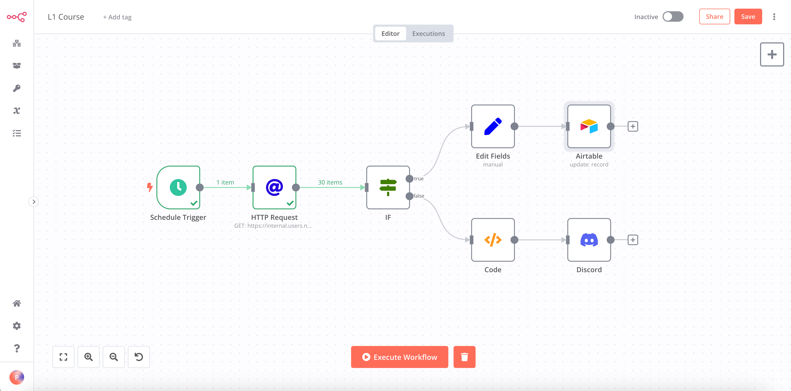
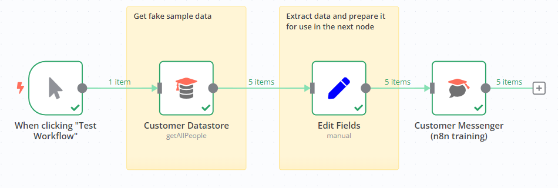
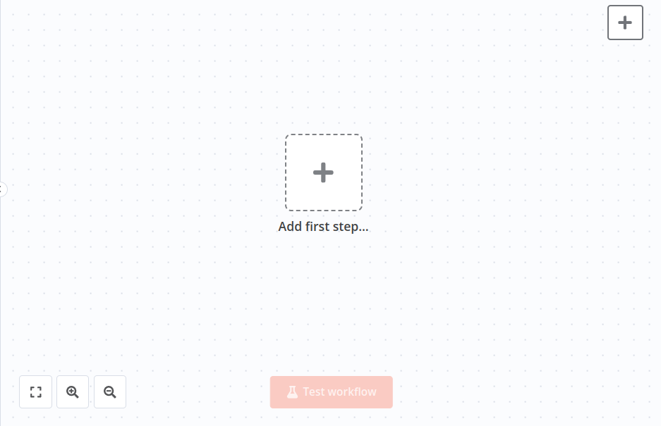
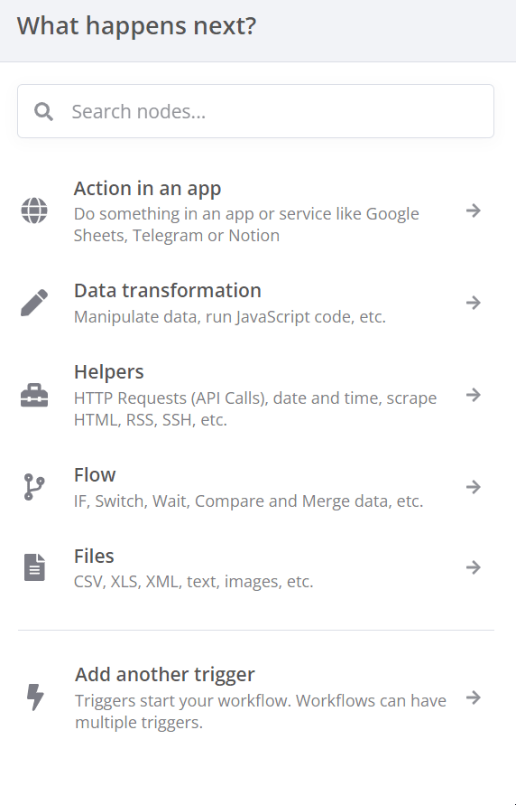
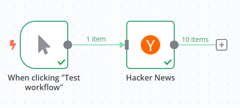
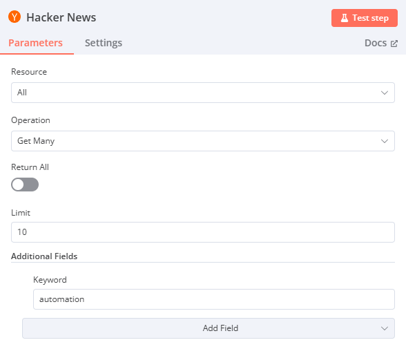
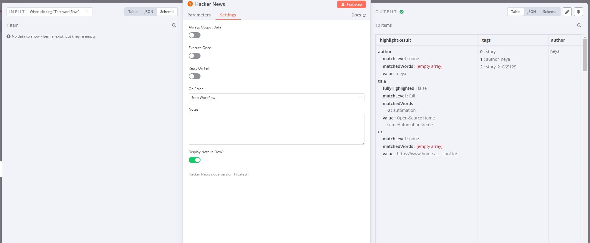

  🇰🇷 <strong>한국어 버전 안내:</strong> 이 글의 한국어 번역 및 국내 환경 가이드는 <a href="/n8n-workflow-for-novice/"><strong>초보자를 위한 n8n 워크플로우 가이드 (한국어)</strong></a>에서 확인하실 수 있습니다.

## n8n Workflow Guide for Beginners

n8n is a powerful workflow automation tool that allows you to easily connect various applications and services. This guide will explain the basic usage for those using n8n for the first time.

## Introduction to n8n

 n8n (pronounced n-eight-n) is an AI-based workflow automation tool. It provides an intuitive interface that even users without technical knowledge can easily use.

[n8n Docs](https://docs.n8n.io/)

### Key features:

- Visual workflow design
- Over 400 pre-built nodes
- AI integration capabilities
- Error handling and debugging support
- Self-hosting and cloud hosting options
- Low-code approach support

## Getting Started

1. Install n8n: You can install n8n using npm or Docker, or use n8n Cloud.
2. Familiarize with the interface: Get used to n8n's visual flow builder. You can add and connect nodes using drag and drop.
3. Explore nodes: Look at the various nodes provided by n8n. Each node is responsible for specific tasks or service integrations.

## Creating Your First Workflow

1. **Select a trigger node**: Choose a trigger node that will be the starting point of your workflow. For example, you can set it to run at a specific time or start when an event occurs.

2. **Add action nodes**: Add action nodes for tasks to be executed after the trigger. For example, you can perform tasks such as data retrieval, API calls, file processing, etc.

3. **Connect nodes**: Connect the nodes to set up the data flow.

4. **Set parameters**: Configure the parameters of each node to define the desired behavior.

5. **Test and debug**: Run the workflow and check the results. If errors occur, use debugging tools to resolve issues.

## Utilizing Advanced Features

- **AI Integration**: Integrate AI services like OpenAI into your workflow to automate tasks such as text summarization and natural language processing.
- **Using Code Nodes**: Add JavaScript code when needed to implement complex logic.
- **Error Handling**: Set up error handling logic for potential errors during workflow execution.

## Conclusion

n8n is a powerful yet easy-to-use workflow automation tool. Now that you've learned the basic usage of n8n through this guide, it's time to create your own creative workflows. Continue to explore various nodes and features and enjoy the world of automation!
