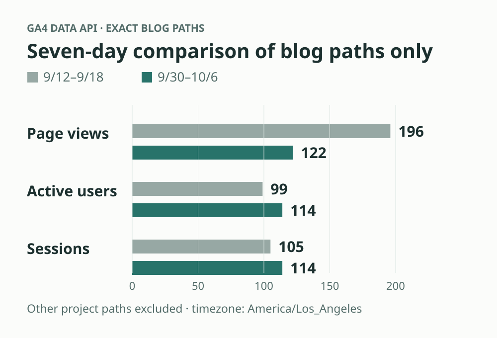
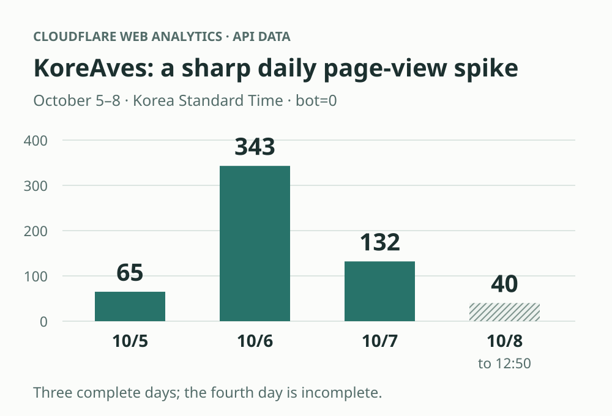
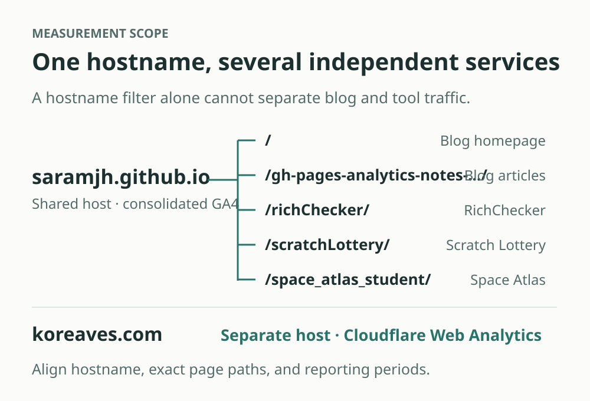

  🌐 <strong>한국어 버전:</strong> Read the Korean version at <a href="/gh-pages-analytics-notes-5-followup-kr/"><strong>애널리틱스 고민 노트 (한국어)</strong></a>.

  📚 <strong>Series</strong> — <a href="/gh-pages-analytics-notes-1-problem-en/">Part 1: The Problem</a> · <a href="/gh-pages-analytics-notes-2-reasoning-en/">Part 2: Reasoning</a> · <a href="/gh-pages-analytics-notes-3-decision-en/">Part 3: The Decision</a> · <a href="/gh-pages-analytics-notes-4-open-en/">Part 4: Current State &amp; Open Questions</a> · Part 5 <strong>After a Naver #2 Placement and a Traffic Spike</strong> (this post)

On September 18, I wrote about the analytics questions that appeared as I started running several GitHub Pages projects on my own. Should each tool have its own GA4 property? How much should Search Console consolidate? How could I see people moving from a blog post to the tool it described?

[The last installment](/gh-pages-analytics-notes-4-open-en/) ended with insufficient data to discuss results. I said I would return when traffic grew or I learned something new.

Twenty days later, there is enough to revisit. **RichChecker has gained a visible search placement on Naver, the blog has accumulated new posts and operational improvements, and KoreAves has begun receiving substantially more page views.** Seeing a response to something I built is rewarding.

The measurements make the story more complicated, though.

## Second in Naver's website results for ‘부자관상’

On October 8, 2026, I observed [RichChecker](https://saramjh.github.io/richChecker/) in the **second position in the website-results section** for the Naver query **‘부자관상’**, roughly “wealthy face reading.” This describes the section I checked, rather than the second item across Naver's entire integrated search page.

<figure>
  
  <figcaption>Original search capture · October 8, 2026. The query and adjacent website results remain visible. Click any figure to view the original size.</figcaption>
</figure>

For a small tool, being discoverable through a relevant search is a meaningful milestone. It feels different from having a blog post that merely introduces the project.

In late September, I also cleaned up the acquisition routes: connecting an older introduction URL to the current tool, revising Korean and English introduction posts, and updating sitemap references. The goal was to help people reach the current product without getting lost between old and new pages.

I cannot isolate how much each change contributed to this placement, or whether today's position will persist. Still, there is now a concrete example of the tool being visible in search.

My next question is about what follows: do visitors from Naver select a photo, finish an analysis, and share their result? The ranking gives me a reason to inspect actual use.

## The blog became busier; its metrics moved in different directions

The blog has become more active operationally. I have written about organizing Naver Map saved lists, using restaurant lists from YouTube, connecting ChatGPT to local development tools, preserving context in AI coding, and trying Impeccable on real projects. I have also worked on Korean and English editions, related-post links, search metadata, navigation, and post assets.

The GitHub Pages structure matters here. This blog and tools deployed from other repositories share the `saramjh.github.io` hostname. Host-wide totals include project endpoints such as RichChecker and Scratch Lottery alongside blog posts. Activity across the shared host cannot automatically be described as growth of the blog itself.

<figure>
  
  <figcaption>Original GA4 report · September 10–October 7, all users of the shared property. Its 573 active users are not blog-only users. The table below uses a different reporting window and an exact blog-path filter.</figcaption>
</figure>

It certainly felt more active. To see the activity on blog pages within that shared setup, I measured their exact paths separately.

| GA4 reporting period | Page views | Active users | Sessions |
| :--- | ---: | ---: | ---: |
| September 12–18 | 196 | 99 | 105 |
| September 30–October 6 | 122 | 114 | 114 |

<figure>
  
  <figcaption>Explanatory chart · Drawn from the verified GA4 Data API response. Each metric is compared separately from the same zero baseline.</figcaption>
</figure>

Both periods contain seven days, using the property's **America/Los_Angeles** timezone. I queried them on October 8 in Korea and excluded the property day still in progress. The filter includes the `saramjh.github.io` host and an exact list of current blog-post and root-page paths, excluding separately hosted project paths. Active users were queried for each whole period, not summed from daily rows.

Active users and sessions increased, while page views decreased. The earlier week included 104 page views on September 14 alone; the recent week's daily page views ranged from 13 to 21. This comparison establishes modest user and session increases and different daily distributions. It does not establish sustained growth or increased search acquisition.

Writing and maintaining the site more actively is a real change. The traffic measures need their own interpretation.

## KoreAves had a sharp daily page-view increase

[KoreAves](https://koreaves.com/) is a separate site for exploring public records and sources about Korean birds. Its hosting and measurement setup differ from my GitHub Pages tools. Cloudflare Web Analytics is its primary traffic measure; GA4 supplements that with behavior from visitors who explicitly opt in.

I queried Web Analytics through the connected Composio Cloudflare MCP. These are **page-load aggregates from `rumPageloadEventsAdaptiveGroups`**, rather than total CDN requests.

<figure>
  
  <figcaption>Original Cloudflare report · October 5, 00:00–October 8, 12:50, GMT+9; bots excluded. The period and filter match the article totals. Sidebar percentage changes use Cloudflare's own comparison interval, not the daily comparison below.</figcaption>
</figure>

| Period in Korea Standard Time | Page views | Cloudflare visits |
| :--- | ---: | ---: |
| October 5 | 65 | 54 |
| October 6 | 343 | 104 |
| October 7 | 132 | 95 |
| October 8, 00:00–12:50:20 | 40 | 28 |
| **Entire period above** | **580** | **281** |

<figure>
  
  <figcaption>Explanatory chart · Based on the Cloudflare MCP aggregates in Korea Standard Time. Hatching marks the incomplete final day. <a href="measurement-snapshot.json">Source aggregates and filters (JSON)</a> are available for inspection.</figcaption>
</figure>

October 6 had about 5.3 times the previous day's page views. That was a striking change for a small site. The following day was lower, so I would describe a traffic spike rather than continuing growth at the same pace. October 8 is a partial day.

The query uses `bot=0`: traffic not classified as a bot in this dataset. That does not remove every automated or operator visit, and 281 visits does not mean 281 distinct people. [Cloudflare's visit definition](https://developers.cloudflare.com/web-analytics/data-metrics/high-level-metrics/) is also different from a unique-user count, so I retain the provider's metric name.

The table begins at the operational acquisition baseline, **October 5 at 00:00 KST**, to separate it from earlier development, QA, and security-testing traffic. Operator activity is not completely excluded after that boundary either.

Google, Naver, and several community referrers appear in the data. However, 246 of the 281 visits have an empty referrer. I cannot identify their origin from these data, or attribute the entire increase to a particular promotion or SEO change.

What I want to understand next is whether visitors explore species and regions, use the map, and inspect record sources. Those actions are closer to why I built the site.

## A correction to the earlier notes: hostname alone cannot separate tools

This comparison also exposed an incomplete explanation in [Part 3](/gh-pages-analytics-notes-3-decision-en/). I wrote that I could use `hostName` to filter traffic for individual tools. That alone cannot separate projects sharing a GitHub Pages hostname.

The blog at `saramjh.github.io/` and RichChecker at `saramjh.github.io/richChecker/` share the same host. A hostname filter can separate local testing, but **service-level reporting also needs page-path conditions**. GA4 exposes [hostname and page path as separate dimensions](https://developers.google.com/analytics/devguides/reporting/data/v1/api-schema).

<figure>
  
  <figcaption>Explanatory diagram · Services deploy from different repositories despite sharing a hostname. Blog reporting must exclude tool paths; koreaves.com is a separate scope.</figcaption>
</figure>

The earlier snapshot of 672 sessions and 651 active users covered the shared host. Comparing it directly with this post's blog-only figures would mix scopes. Consolidating measurement still requires separating the data according to the question being asked.

## What changed, and what is still pending

Since September 18, the work has extended beyond analytics consolidation. I have connected posts to tools, checked search titles and descriptions, canonical URLs, alternate-language links, and structured data. I added a deployment workflow to notify Bing and IndexNow, and clarified the blog's privacy policy and the scope of advertising and analytics scripts.

Search Console also showed that some new posts had not yet been discovered by Google. Reachable sitemaps and correct metadata did not immediately translate into discovery and indexing. On October 7, I submitted the sitemaps requiring attention once and requested indexing for selected priority posts. Those requests are not confirmation of completed indexing; the outcome remains pending.

The Naver placement and KoreAves traffic increase happened while these changes were being made. They are welcome observations, but they do not establish that consolidating GA4 caused them. The original decision was primarily about reducing maintenance and making journeys easier to inspect.

For the next update, I want to see whether the Naver position persists, whether search visitors actually use RichChecker, whether new blog posts attract search traffic, and whether KoreAves visits lead to exploration of records and sources.

In September, I was asking where to place the measurement tools. Now I am asking how to interpret the visits arriving and where to spend more time. I do not have a success formula yet, but I am glad there is something new to examine.

← [Back to Part 4: Current State & Open Questions](/gh-pages-analytics-notes-4-open-en/)
