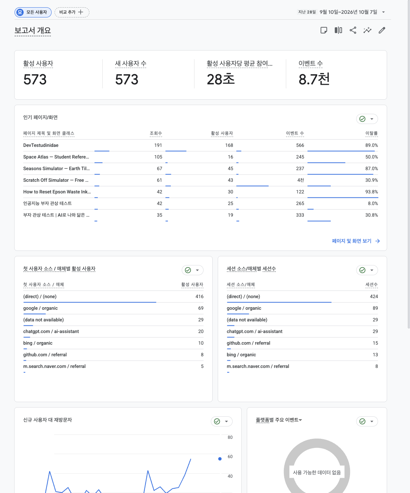
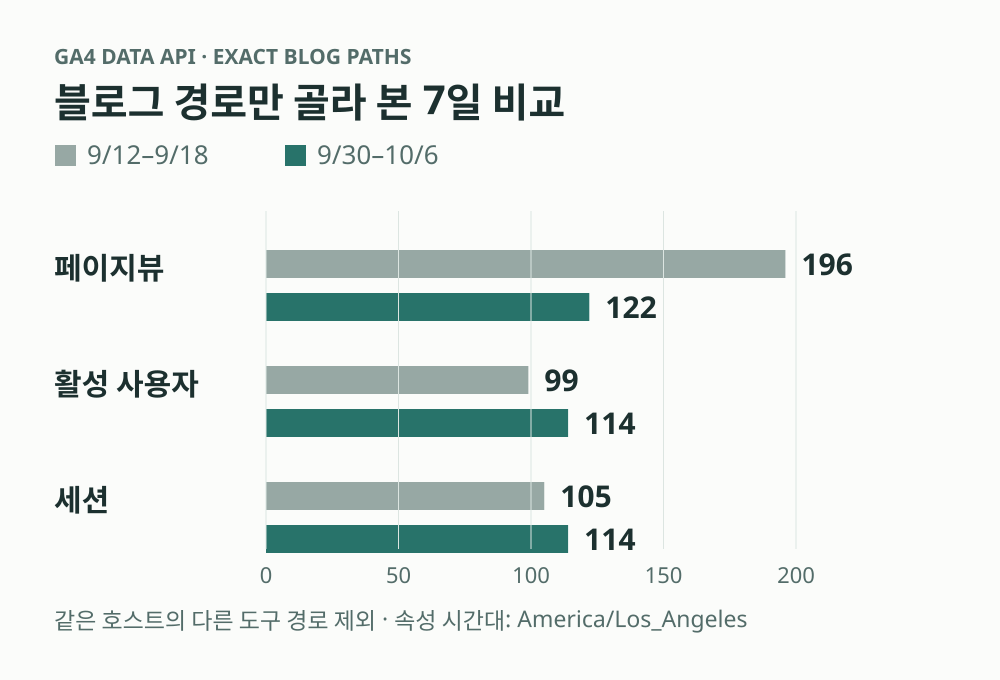
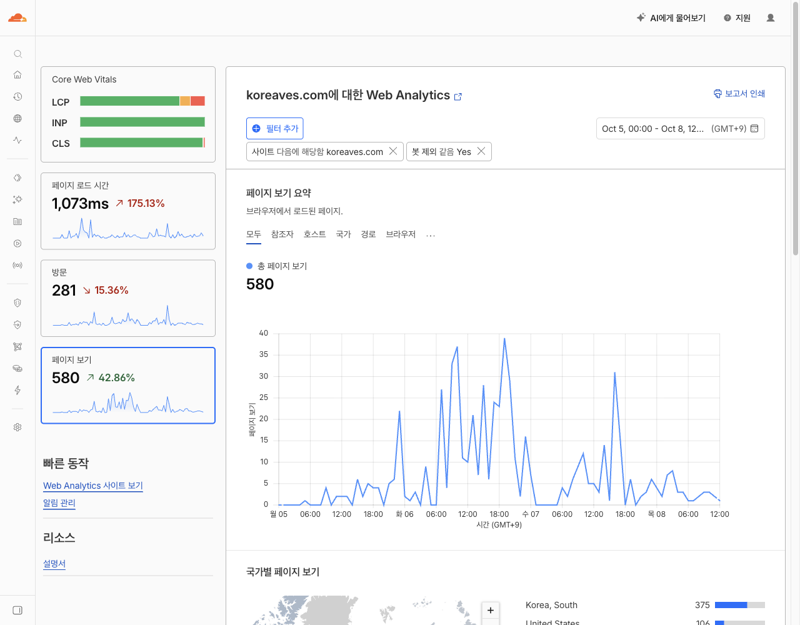
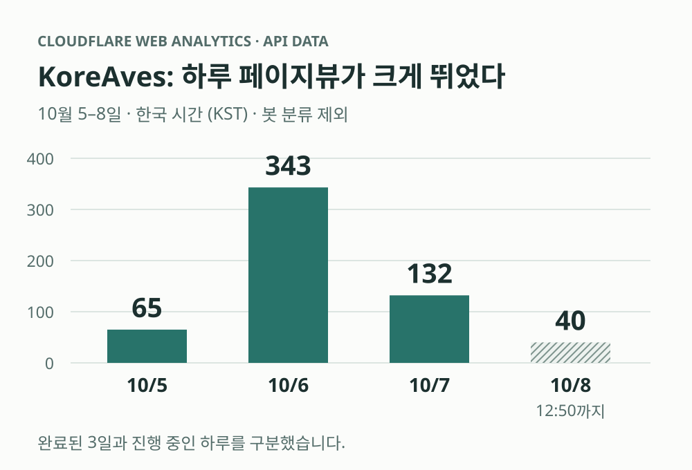
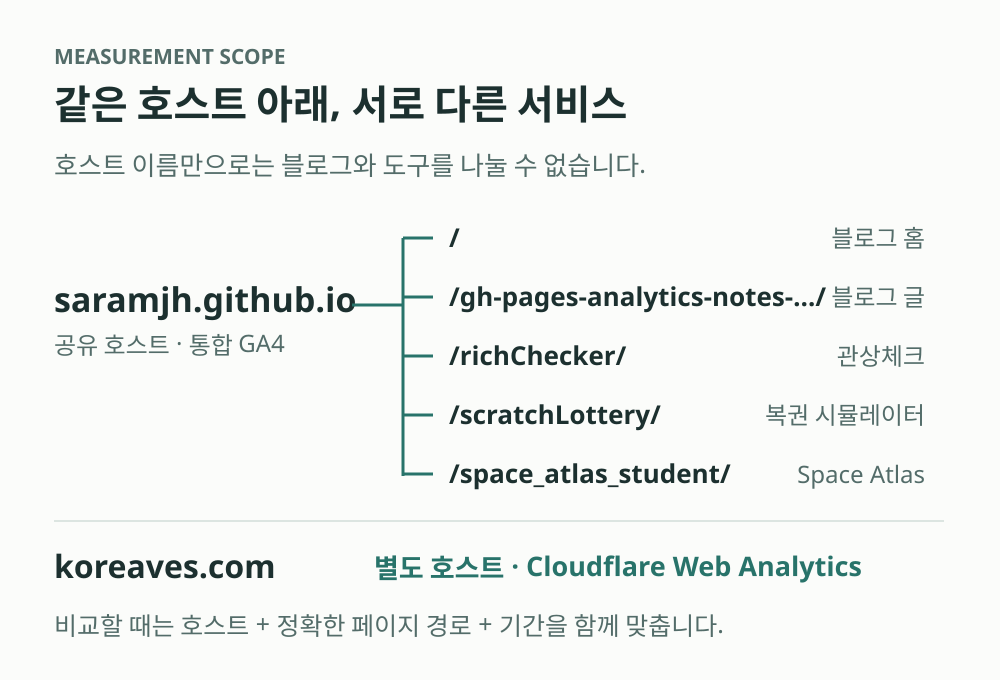

[English version](/gh-pages-analytics-notes-5-followup-en/) · [1편: 문제 정의](/gh-pages-analytics-notes-1-problem-kr/) · [2편: 근거 탐색](/gh-pages-analytics-notes-2-reasoning-kr/) · [3편: 결정과 적용](/gh-pages-analytics-notes-3-decision-kr/) · [4편: 당시 상태와 열린 질문](/gh-pages-analytics-notes-4-open-kr/)

9월 18일, 혼자 여러 GitHub Pages 프로젝트를 운영하면서 생긴 애널리틱스 고민을 썼습니다. GA4 속성을 프로젝트마다 나눌지, Search Console은 어디까지 묶어서 볼지, 블로그에서 도구로 넘어가는 흐름을 어떻게 확인할지가 당시의 질문이었습니다.

[마지막 글](/gh-pages-analytics-notes-4-open-kr/)에서는 아직 효과를 이야기할 만큼 데이터가 없다고 적었습니다. 트래픽이 늘거나 새로운 사실을 알게 되면 다시 기록하겠다고도 했고요.

20일이 지난 지금은 그 후속 글을 써도 될 것 같습니다. **관상체크는 네이버 검색에서 눈에 띄는 위치에 올라왔고, 블로그에는 새 글과 운영 작업이 쌓였으며, KoreAves에는 이전보다 훨씬 많은 페이지뷰가 들어오기 시작했습니다.** 직접 만든 것에 외부의 반응이 생기는 건 역시 반가운 일입니다.

그런데 실제 숫자를 들여다보니, 이 변화를 한 문장으로 설명하기는 어려웠습니다.

## ‘부자관상’ 검색에서 웹사이트 영역 2위

2026년 10월 8일, 네이버에서 **‘부자관상’**을 검색했을 때 제가 운영하는 [관상체크 사이트](https://saramjh.github.io/richChecker/)가 웹사이트 영역의 두 번째에 노출되는 것을 확인했습니다. 네이버 통합검색 전체의 두 번째 항목이라는 뜻은 아니고, 제가 확인한 검색 결과의 웹사이트 영역 기준입니다.

<figure>
  
  <figcaption>실제 검색 화면 · 2026년 10월 8일 캡처. 검색어와 앞뒤 웹사이트 결과를 함께 남겼습니다. 이미지를 누르면 원본 크기로 볼 수 있습니다.</figcaption>
</figure>

작은 도구 하나가 실제 검색어에 대응하는 페이지로 보이기 시작했다는 점에서 의미가 있었습니다. 블로그 안에 소개 글만 있는 상태와 검색 결과에서 도구 자체를 발견할 수 있는 상태는 운영하는 입장에서 다르게 느껴집니다.

그동안 이 도구로 가는 경로도 정리했습니다. 9월 말에는 예전 소개 URL을 현재 도구로 연결하고, 한국어·영어 소개 글과 사이트맵 안내를 손봤습니다. 오래된 페이지와 현재 도구 사이에서 사용자가 헤매는 일을 줄이려는 작업이었습니다.

이 작업 가운데 무엇이 이번 노출에 얼마나 기여했는지는 아직 분리해서 알 수 없습니다. 오늘의 2위가 앞으로도 유지되는지도 봐야 합니다. 그래도 **검색에서 발견될 수 있다는 구체적인 장면이 생겼다**는 사실은 남겨두고 싶었습니다.

이제 더 궁금한 건 그다음입니다. 네이버에서 들어온 사람이 사진을 선택하고, 분석을 마치고, 결과를 공유하는 데까지 이어지는가. 순위를 확인하는 일에서 실제 사용을 확인하는 일로 관심이 조금 옮겨갔습니다.

## 블로그는 활발해졌지만, 모든 숫자가 같은 방향은 아니었다

블로그도 9월 18일 무렵과 비교하면 운영이 꽤 활발해졌습니다. 네이버 지도 저장 목록 정리, 유튜브 맛집 목록 활용, ChatGPT와 로컬 개발 도구 연결, AI 코딩의 문맥 관리, Impeccable 실사용 후기처럼 실제로 진행한 일들을 글로 옮겼습니다. 한국어·영어 글을 함께 관리하고, 관련 글 연결과 검색 메타데이터, 탐색 메뉴, 글 첨부 파일 처리도 손봤습니다.

여기서 GitHub Pages의 구조를 먼저 짚어야 합니다. 이 블로그와 다른 레포지터리의 도구들이 같은 `saramjh.github.io` 호스트 아래 있습니다. 전체 집계에는 블로그 글뿐 아니라 관상체크나 복권 시뮬레이터 같은 프로젝트 엔드포인트 방문도 섞입니다. **호스트 전체의 활기를 곧바로 블로그 자체의 성장이라고 읽을 수는 없습니다.**

<figure>
  
  <figcaption>실제 GA4 화면 · 9월 10일–10월 7일, 공유 속성의 전체 사용자 보고서입니다. 이 화면의 573명을 블로그 전용 사용자 수로 읽으면 안 됩니다. 아래 표는 다른 기간의 블로그 경로만 따로 조회한 값입니다.</figcaption>
</figure>

운영하는 입장에서는 확실히 전보다 활성화됐다는 느낌이 있었습니다. 그 안에서 블로그 페이지에 해당하는 활동은 어떻게 보이는지, 정확한 경로를 골라 별도로 집계해봤습니다.

| GA4 집계 기간 | 페이지뷰 | 활성 사용자 | 세션 |
| :--- | ---: | ---: | ---: |
| 9월 12일–18일 | 196 | 99 | 105 |
| 9월 30일–10월 6일 | 122 | 114 | 114 |

<figure>
  
  <figcaption>설명용 그래프 · 검증한 GA4 Data API 응답으로 작성했습니다. 세 지표를 합산하지 않고 같은 기준선에서 각각 비교했습니다.</figcaption>
</figure>

두 기간 모두 7일이며, 날짜는 이 GA4 속성의 시간대인 **America/Los_Angeles** 기준입니다. 10월 8일 한국 시간에 조회했으며, 아직 진행 중인 속성 날짜는 비교에서 제외했습니다. `saramjh.github.io` 호스트 중 현재 블로그 글과 루트 페이지에 해당하는 정확한 경로만 포함해, 별도 도구의 방문이 섞이지 않도록 했습니다. 활성 사용자는 일별 값을 더한 것이 아니라 기간 전체로 다시 조회한 값입니다.

활성 사용자와 세션은 늘었지만 페이지뷰는 줄었습니다. 이전 기간에는 9월 14일 하루에 104페이지뷰가 잡혔고, 최근 기간의 일별 페이지뷰는 13–21 사이였습니다. 따라서 이 비교에서 말할 수 있는 건 사용자·세션의 소폭 증가와 서로 다른 일별 분포까지입니다. 꾸준한 성장이나 검색 유입 증가를 증명하는 자료로 보기에는 부족합니다.

**글을 더 자주 쓰고 사이트를 더 적극적으로 관리하게 된 변화는 분명합니다. 방문 지표의 변화는 별도로 읽어야 했습니다.** 이번에 다시 애널리틱스를 열어본 이유도 여기에 있습니다.

## KoreAves에서는 하루 페이지뷰가 크게 뛰었다

[KoreAves](https://koreaves.com/)는 한국 조류의 공개 기록과 출처를 탐색하는 별도 사이트입니다. 기존 GitHub Pages 도구들과 호스팅·측정 방식이 달라, 여기서는 Cloudflare Web Analytics를 주된 트래픽 지표로 봅니다. GA4는 명시적으로 동의한 방문의 행동을 보완해서 보는 용도입니다.

연결해둔 Composio의 Cloudflare MCP를 통해 Web Analytics 데이터를 다시 조회했습니다. CDN 전체 요청 수가 아니라 **`rumPageloadEventsAdaptiveGroups`의 페이지 로드 집계**입니다.

<figure>
  
  <figcaption>실제 Cloudflare 화면 · 10월 5일 00:00–10월 8일 12:50, GMT+9, 봇 제외 Yes. 본문 집계와 기간·조건을 맞춰 총 580페이지뷰·281방문을 확인했습니다. 좌측 증감률은 대시보드 자체 비교 기간 기준이므로, 아래 일별 비교와는 다릅니다.</figcaption>
</figure>

| 한국 시간 기준 | 페이지뷰 | Cloudflare 방문 |
| :--- | ---: | ---: |
| 10월 5일 | 65 | 54 |
| 10월 6일 | 343 | 104 |
| 10월 7일 | 132 | 95 |
| 10월 8일 00:00–12:50:20 | 40 | 28 |
| **위 기간 전체** | **580** | **281** |

<figure>
  
  <figcaption>설명용 그래프 · Cloudflare MCP의 한국 시간별 집계로 작성했습니다. 10월 8일은 진행 중인 하루라 사선으로 구분했습니다. <a href="measurement-snapshot.json">집계 원본과 필터 조건(JSON)</a>도 함께 공개합니다.</figcaption>
</figure>

10월 6일의 페이지뷰는 전날의 약 5.3배였습니다. 작은 사이트를 운영하는 입장에서는 충분히 놀랄 만한 변화였습니다. 다음 날에는 내려왔으니, 계속 같은 속도로 증가 중이라고 쓰기보다 **큰 유입 구간이 생겼다**고 기록하는 편이 정확합니다. 10월 8일 행은 하루 전체가 아닌 중간 집계입니다.

이 표는 `bot=0`, 즉 이 데이터셋에서 봇으로 분류하지 않은 트래픽을 조회한 결과입니다. 자동화·운영자 방문이 모두 제거됐다는 뜻도, 281명의 서로 다른 사람이 왔다는 뜻도 아닙니다. [Cloudflare의 방문 정의](https://developers.cloudflare.com/web-analytics/data-metrics/high-level-metrics/) 역시 고유 사용자 수와 다르므로, 여기서는 지표 이름 그대로 ‘방문’이라고 적었습니다.

개발·QA·보안 점검이 섞인 이전 기록과 구분하기 위해, 운영 기준을 새로 잡은 **10월 5일 00:00 KST 이후**를 표에 담았습니다. 그 이후에도 운영자 방문이 완전히 빠진 것은 아닙니다.

유입 경로에는 Google·네이버와 일부 커뮤니티 referrer도 보였습니다. 다만 전체 281방문 중 referrer가 비어 있는 방문이 246이었습니다. 이 방문들이 어디에서 왔는지는 현재 데이터로 특정할 수 없습니다. 그래서 페이지뷰 증가 전체를 특정 홍보나 검색 최적화의 성과로 돌리지는 않으려고 합니다.

이제는 얼마나 들어왔는지와 함께, 종·지역 페이지나 지도에서 공개 기록을 살펴보고 출처까지 확인했는지가 궁금합니다. 이 사이트를 만든 목적에 가까운 행동이기 때문입니다.

## 지난 글에서 고쳐 읽어야 할 부분: 호스트만으로 도구가 나뉘지는 않는다

이번에 실제 데이터를 비교하면서 [3편](/gh-pages-analytics-notes-3-decision-kr/)의 설명이 부족했던 부분도 확인했습니다. 당시에는 도구별 트래픽을 보고 싶을 때 `hostName`으로 필터링한다고 썼는데, 같은 GitHub Pages 호스트를 쓰는 도구들은 이것만으로 나뉘지 않습니다.

`saramjh.github.io/`의 블로그와 `saramjh.github.io/richChecker/`의 관상체크는 호스트 이름이 같습니다. 호스트 필터는 로컬 테스트를 구분하는 데에는 유용하지만, 서비스별 구분에는 **페이지 경로 조건도 필요합니다**. GA4에서도 [호스트 이름과 페이지 경로를 별도 차원](https://developers.google.com/analytics/devguides/reporting/data/v1/api-schema)으로 제공합니다.

<figure>
  
  <figcaption>설명용 구조도 · 같은 호스트를 공유해도 서비스는 서로 다른 레포지터리에서 배포됩니다. 블로그만 보려면 도구 경로를 제외해야 하고, koreaves.com은 별도 측정 범위입니다.</figcaption>
</figure>

지난 글의 672세션·651활성 사용자도 공유 호스트 전체의 스냅샷이었습니다. 그것을 이번 표의 블로그 전용 수치와 바로 비교하면 범위가 달라집니다. ‘하나로 모아 볼 수 있다’에서 한 걸음 더 가서, 실제 질문에 맞게 다시 나눠 보는 일이 필요했습니다.

## 그동안 한 일과, 아직 기다리는 일

9월 18일 이후의 작업은 속성을 묶는 일에서 끝나지 않았습니다. 글과 도구의 연결을 정리하고, 검색 제목과 설명·canonical·언어별 대체 링크·구조화 데이터를 점검했습니다. 배포 뒤 Bing과 IndexNow에 URL을 알리는 자동화도 추가했고, 블로그 개인정보처리방침과 광고·분석 스크립트 적용 범위도 정리했습니다.

Search Console에서는 새 글 일부가 아직 Google에 발견되지 않은 상태인 것도 확인했습니다. 사이트맵이 열리고 메타데이터가 정상이라고 해서 새 글의 발견과 색인이 바로 따라오는 것은 아니었습니다. 10월 7일에는 확인이 필요했던 사이트맵을 한 번 제출하고 일부 우선 글의 색인을 요청했습니다. 그 요청이 실제 색인 완료를 의미하지는 않으니, 결과는 더 기다려봐야 합니다.

이런 작업을 하는 동안 네이버 검색 노출과 KoreAves 페이지뷰 증가가 함께 관찰됐습니다. 반가운 변화지만, GA4를 통합했기 때문에 생겼다고 결론 낼 근거는 없습니다. 애초에 그 선택의 이유도 관리 부담을 줄이고 흐름을 보기 쉽게 만드는 데 더 가까웠습니다.

다음 기록에서는 네이버 순위가 유지되는지, 검색에서 온 사람이 관상체크를 실제로 사용하는지, 블로그의 새 글이 검색 유입을 만드는지, KoreAves의 유입이 기록·출처 탐색으로 이어지는지를 보고 싶습니다.

9월에는 측정 도구를 어디에 붙일지가 고민이었습니다. 지금은 들어오기 시작한 방문을 어떻게 읽고, 어디에 시간을 더 쓸지가 고민입니다. 아직 성공 공식이라고 부를 수는 없지만, 다시 들여다볼 이유가 생겼다는 점은 꽤 기쁩니다.
