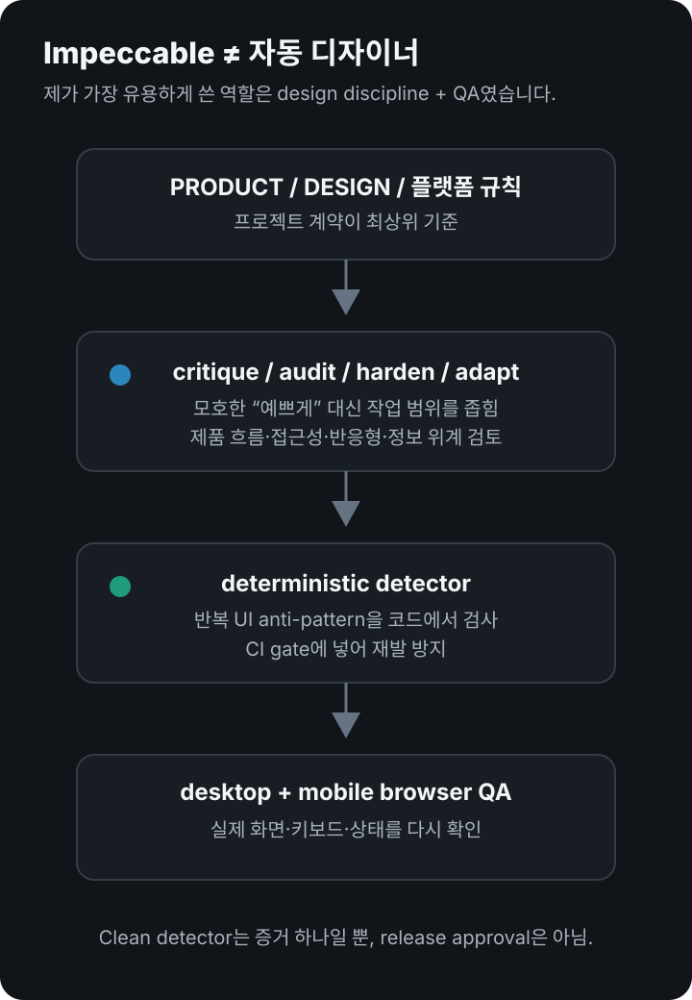
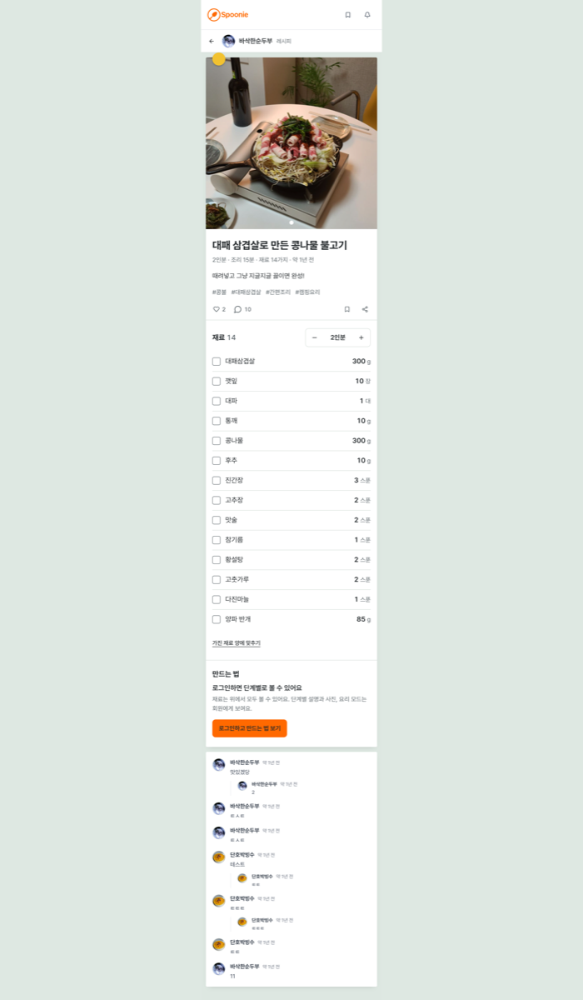
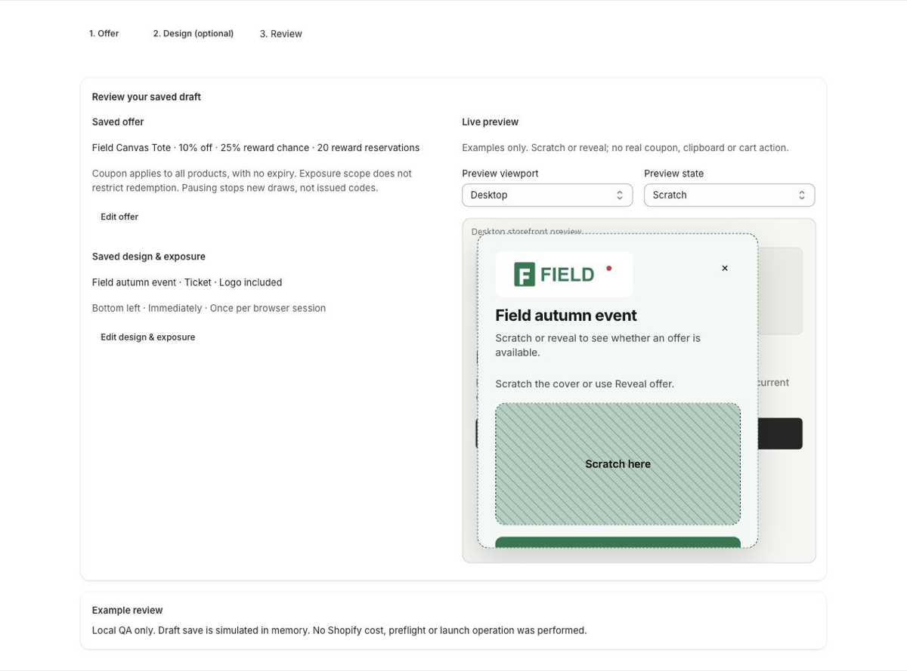
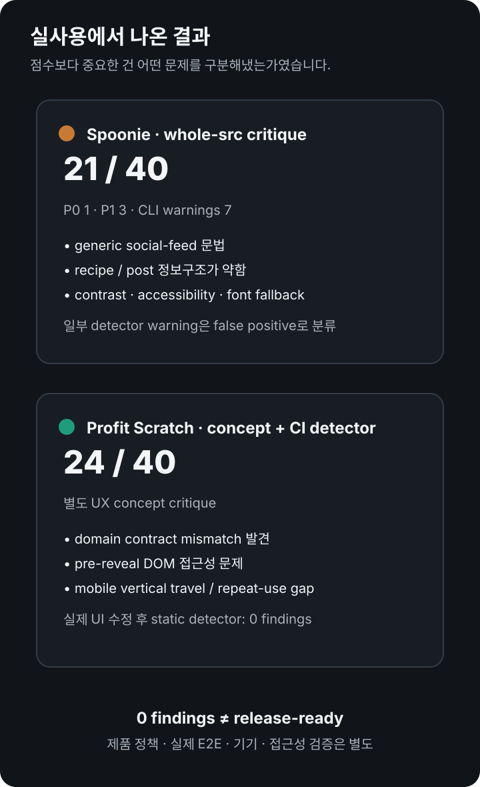
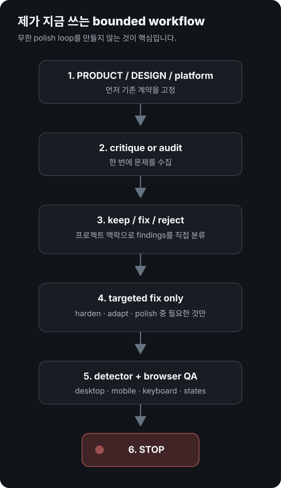

# Impeccable 실사용 후기: 프로젝트 2개에 적용해봤다

**결론부터 말하면, Impeccable은 “AI가 대신 예쁜 화면을 만들어주는 도구”라기보다 AI 코딩 에이전트에 디자인 규율·검사·리뷰 절차를 붙이는 도구에 더 가깝습니다.**

<p style="background: rgba(0, 120, 212, 0.08); border-left: 4px solid #0078d4; padding: 10px 14px; margin-bottom: 22px; border-radius: 4px; font-size: 0.95rem;">
  🌐 <strong>English version:</strong> <a href="/en-impeccable-review-ai-ui-design/">Impeccable Review: Two Real Projects</a>
</p>

`Impeccable review`, `AI frontend design skill`, `npx impeccable install`, `AI UI detector`를 검색하는 사람이 가장 먼저 궁금한 건 보통 하나입니다.

> **그래서 이걸 설치하면 AI가 만든 UI가 진짜 덜 뻔하고, 덜 “AI스럽게” 되나?**

제 경험으로는 **도움은 됐지만 자동으로 해결되지는 않았습니다.**

저는 Impeccable을 토이 프로젝트가 아니라 두 실제 프로젝트에 적용했습니다.

- 레시피·소셜 서비스 **Spoonie**
- Shopify 앱 **Profit Scratch**

두 프로젝트의 성격이 꽤 달라서 오히려 장단점이 잘 보였습니다.



## Impeccable이 정확히 무엇인가

공식 설명을 기준으로 Impeccable은 AI 코딩 에이전트를 위한 **frontend design skill + CLI**입니다.

설치의 기본 흐름은 다음입니다.

```bash
npx impeccable install
```

그 뒤 사용하는 코딩 도구 안에서 Impeccable을 초기화하고 `audit`, `critique`, `polish`, `harden`, `adapt` 같은 목적별 디자인 작업을 호출합니다. Codex에서는 공식 문서상 `$impeccable` 문법을 사용하고, 다른 다수의 에이전트에서는 `/impeccable` 형태를 사용합니다.

제가 중요하게 본 건 두 층이 분리돼 있다는 점입니다.

1. **Skill / design vocabulary**
   에이전트에게 “UI 좀 예쁘게 해”라고 던지는 대신 `critique`, `harden`, `adapt`, `polish`처럼 작업의 종류를 좁힙니다.

2. **Deterministic detector**
   HTML, CSS, JSX, TSX 등의 반복적인 디자인 반패턴을 규칙으로 검사합니다. 현재 공식 npm 설명은 61개의 deterministic rule을 안내합니다.

즉 LLM의 감상문만 받는 구조가 아닙니다.

## 실제 사용 1: Spoonie — 생각보다 세게 맞았다

Spoonie 전체 `src`를 critique했을 때 결과는 **21/40**, P0 1개, P1 3개였습니다.

단순히 “간격이 조금 아쉽다” 수준이 아니었습니다.

주요 지적은 다음과 같았습니다.

- 레시피 앱인데 실제 레시피 상세가 **generic social feed**처럼 보임
- 레시피와 일반 게시물이 같은 카드 문법을 공유함
- 카드 안에 카드가 겹치는 구조
- 재료까지 도달하기 전에 chrome이 너무 길어짐
- 흰색 텍스트 + 브랜드 오렌지의 명도 대비 부족
- 아이콘 버튼의 접근성 라벨 부족
- 한국어를 지원하지 않는 폰트 때문에 fallback이 발생
- 레시피/레시피드/인용 같은 서비스 고유 개념이 제대로 설명되지 않음

<figure>
  
  <figcaption>실제 Impeccable review artifact. 데스크톱에서도 좁은 단일 컬럼에 레시피 상세가 길게 이어지던 시점의 화면입니다.</figcaption>
</figure>

여기서 유용했던 건 **“이 페이지가 못생겼다”가 아니라 왜 제품답지 않은지 구조적으로 설명했다는 점**입니다.

특히 “사진을 빼면 이 화면에서 무엇이 cooking app임을 보여주나?”라는 질문은 꽤 정확했습니다.

그 뒤 Spoonie에서는 레시피 상세 구조, 조리 단계 공개 방식, 화면 디자인 언어, 폰트 역할, 색 체계 등을 실제로 크게 손봤습니다. 다만 그 개선 전체를 Impeccable 덕이라고 계산하지는 않습니다. 제품 방향 결정과 구현은 별도 판단이 필요했습니다.

### 그런데 detector는 완벽하지 않았다

같은 감사에서 CLI detector는 7개의 경고를 냈습니다.

그중에는 실제 문제도 있었지만,

- gray-on-color 일부
- spinner border accent
- 기능상 필요한 side-tab

처럼 **false positive로 판단한 항목도 있었습니다.**

반면 layout transition 한 건은 실제 수정 가치가 있었습니다.

이 경험 때문에 저는 **detector 결과를 자동 수정 목록으로 보지 않습니다.**

## 실제 사용 2: Profit Scratch — CI gate로 넣었을 때 더 유용했다

Profit Scratch에서는 Impeccable을 더 체계적으로 사용했습니다.

프로젝트 안에서 detector를 별도 스크립트로 고정하고 전체 검증 게이트에 넣었습니다.

```json
{
  "check:design": "npx --yes impeccable@4.1.0 detect app storefront extensions/profit-scratch-widget"
}
```

전체 `npm run check`는 lint, test, typecheck, build, Shopify Theme Check 같은 검증 뒤에 design detector도 실행합니다.

여기서 체감한 장점은 **“한 번 디자인 평가를 받는 것”보다 UI 변경 때마다 같은 종류의 반패턴을 다시 검사하는 것**이었습니다.

실제로 progress animation이 `width`를 직접 변화시키던 부분을 transform 기반으로 바꾼 뒤 static detector가 **0 findings**가 됐습니다.

하지만 이것도 아주 중요한 제한이 있습니다.

**detector가 0이라고 제품이 출시 가능한 상태가 된 것은 아니었습니다.**

당시 Profit Scratch에는 여전히 실제 Shopify E2E, 접근성, 테마/기기 검증, coupon policy 등 별도의 release blocker가 남아 있었습니다.



이 점 때문에 저는 Impeccable을 **release authority가 아니라 quality signal**로 두는 게 맞다고 봅니다.

## critique가 detector보다 더 가치 있었던 순간

Profit Scratch의 별도 UX 컨셉을 critique했을 때는 **24/40**이 나왔습니다.

그 보고서에서 의미 있었던 건 시각적 취향보다 다음 항목이었습니다.

- 컨셉은 100% paid-win을 허용하지만 실제 domain은 99.99%가 최대라는 계약 불일치
- scratch cover 아래 결과가 DOM에 노출되는 접근성 문제
- 좁은 화면에서 설정과 결과를 오가는 세로 이동 비용
- 반복 캠페인 운영 UX가 부족함

이건 `border-radius`나 색상 취향을 고르는 문제가 아닙니다.

**UI가 제품 계약과 실제 사용자 업무를 어기는 지점**을 잡은 겁니다.

다만 여기에서도 보고서는 별도 컨셉의 결함을 실제 앱 결함으로 섞지 않았습니다. 이 구분이 꽤 중요했습니다.



## 써보니 좋았던 점

### 1. “UI 좀 개선해”보다 명령의 범위가 훨씬 명확해진다

`audit`, `critique`, `harden`, `adapt`, `polish`처럼 작업 종류를 나누면 에이전트가 **디자인 전체를 멋대로 재설계하는 확률이 줄어듭니다.**

특히 이미 디자인 시스템이 있는 프로젝트에서는 이게 중요했습니다.

### 2. AI 특유의 반복 패턴을 코드 단계에서 잡을 수 있다

Impeccable이 겨냥하는 문제 중에는 실제로 AI 코딩에서 자주 보는 것들이 있습니다.

- 카드 안에 카드
- 필요 이상으로 둥근 박스
- 의미 없는 gradient
- 약한 대비
- 장식용 icon tile
- 과한 animation
- generic SaaS hierarchy

모든 규칙에 동의할 필요는 없지만, 최소한 **“모델이 습관적으로 만든 것인지 제품이 요구한 것인지”를 다시 묻게 해줍니다.**

### 3. 정적 detector를 CI에 넣을 수 있다는 점이 생각보다 크다

개인적으로 가장 지속적으로 가치가 있는 부분은 이쪽이었습니다.

한 번 `/critique`를 돌리고 끝나는 것보다, UI 변경 뒤 동일한 detector를 재실행하는 쪽이 재발 방지에 더 효과적이었습니다.

### 4. review artifact가 남는다

Spoonie와 Profit Scratch 모두 `.impeccable/review/`, critique report, screenshot 같은 증거가 남았습니다.

세션이 바뀌어도 “왜 이걸 고쳤지?”를 복구하기 쉬워집니다.

## 불편하거나 위험했던 점

### 1. 규칙을 권위로 취급하면 오히려 망가질 수 있다

Profit Scratch는 Shopify Admin 제품입니다.

그래서 제 프로젝트 규칙에는 **Shopify-native UI와 기존 제품 계약이 일반적인 Impeccable heuristic보다 우선한다**고 명시했습니다.

그렇지 않으면 “더 예쁘게” 만들기 위해 플랫폼 관례를 깨는 이상한 결과가 나올 수 있습니다.

### 2. false positive가 있다

Spoonie의 첫 detector에서도 여러 항목은 실제 결함이라기보다 문맥상 허용 가능한 코드였습니다.

따라서 `0 findings`를 목표로 기계적으로 수정하면 안 됩니다.

### 3. 프로세스가 무거워질 수 있다

설치하면 skill 파일, review artifact, design context, detector, browser QA 등이 붙습니다.

잘못 쓰면 UI 하나 고치는데도

`audit → critique → fix → polish → audit → polish...`

같은 **끝없는 자기검토 루프**가 생길 수 있습니다.

현재 공식 skill 자체도 bounded pass를 강조하는데, 실제 사용에서도 그게 맞았습니다.

### 4. 제품 판단을 대신하지 못한다

Spoonie의 가장 중요한 문제는 “색이 조금 이상하다”가 아니라 **레시피 서비스의 고유한 정보 구조가 UI에서 약했다는 것**이었습니다.

Profit Scratch의 큰 blocker도 디자인이 아니라 상품 범위·쿠폰 정책·실제 Shopify 검증 같은 제품 문제였습니다.

Impeccable은 이런 문제를 발견하는 데 도움을 줄 수는 있어도 **어떤 제품을 만들어야 하는지 대신 결정해주지는 않습니다.**

## 지금 제가 쓰는 방식

처음보다 훨씬 보수적으로 씁니다.

```text
PRODUCT / DESIGN / platform constraints
            ↓
       critique or audit
            ↓
  findings를 직접 분류
  keep / fix / reject
            ↓
필요한 command만 실행
harden / adapt / polish ...
            ↓
deterministic detector
            ↓
desktop + mobile browser QA
            ↓
stop
```

핵심은 마지막 `stop`입니다.



## 추천하는 경우 / 굳이 필요 없는 경우

**추천하는 경우**

- Claude Code, Codex, Cursor 같은 에이전트로 프론트엔드를 자주 만듦
- 결과가 자꾸 generic SaaS UI로 수렴함
- 이미 있는 UI를 망가뜨리지 않고 체계적으로 audit하고 싶음
- 접근성·responsive·spacing·hierarchy를 빠뜨리는 일이 잦음
- UI anti-pattern detector를 자동 검증에 넣고 싶음

**굳이 필요 없는 경우**

- 거의 backend만 작업함
- 작은 정적 페이지 하나를 가끔 수정하는 정도
- 자체 디자인 시스템과 전문 디자인 리뷰 프로세스가 이미 강함
- detector 결과를 맥락 없이 자동 수정할 계획임

## 최종 후기

저는 계속 쓸 생각입니다.

다만 **“AI UI를 예쁘게 만들어주는 디자인 마법봉”으로는 추천하지 않습니다.**

제가 실제로 가장 가치 있게 느낀 역할은 이 순서였습니다.

1. **제품 UI를 구조적으로 비판하는 critique**
2. **AI 코딩 특유의 반복 반패턴을 잡는 detector**
3. **audit/harden/adapt 같은 공통 디자인 언어**
4. **수정 후 review artifact와 검증 루틴**

반대로 가장 경계해야 할 건 **도구의 heuristic을 제품 요구사항보다 위에 두는 것**입니다.

Impeccable을 쓰고도 AI slop은 만들 수 있습니다.

하지만 이미 AI 코딩 에이전트로 UI를 많이 만들고 있다면, **“좋은 UI를 생성하는 도구”보다 “나쁜 습관을 반복하지 않게 만드는 도구”로 보는 순간 꽤 쓸 만해집니다.**

## 설치와 공식 자료

- [Impeccable 공식 사이트](https://impeccable.style/)
- [Getting started — npx impeccable install](https://impeccable.style/tutorials/getting-started/)
- [Impeccable 공식 GitHub](https://github.com/pbakaus/impeccable)
- [Impeccable npm — CLI와 deterministic detector](https://www.npmjs.com/package/impeccable)

이 글의 스크린샷은 제 로컬 프로젝트의 실제 Impeccable review artifact에서 가져왔습니다. 계정 정보·인증값·개인 경로는 포함하지 않았고, 제품 내부 검증 화면은 synthetic/local QA 데이터입니다.
