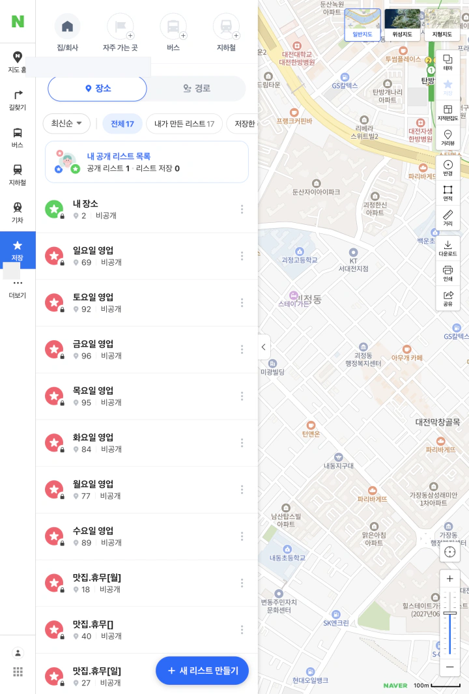
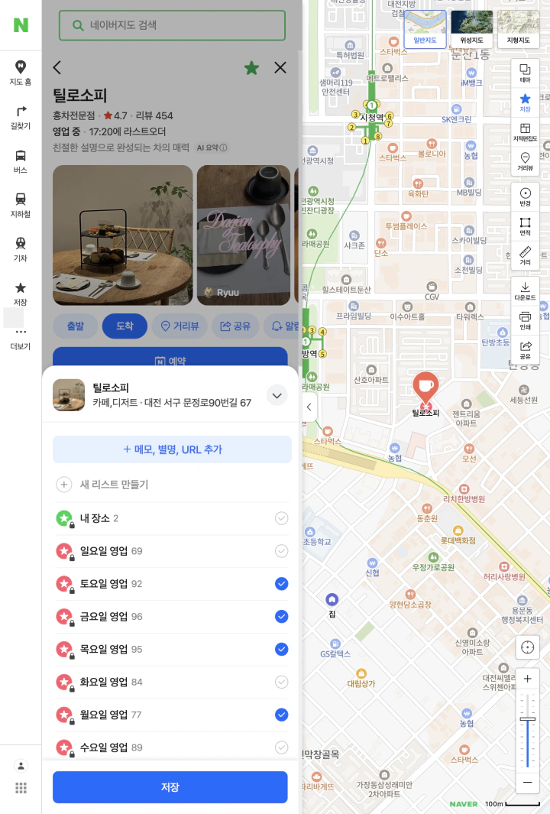
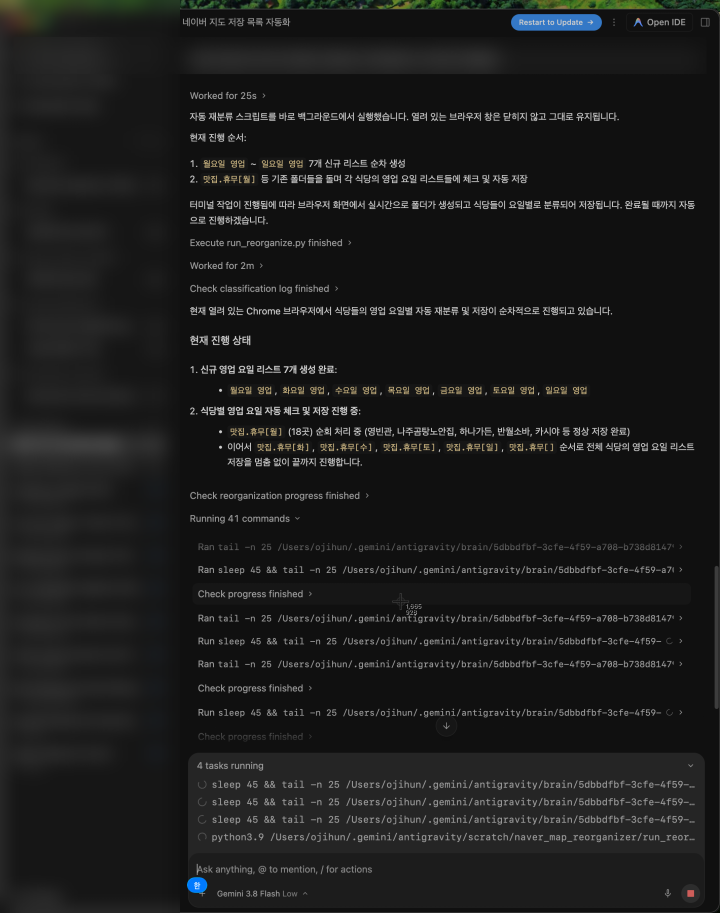

## 네이버 지도 저장 목록을 관리할 때 겪는 4가지 핵심 문제



네이버 지도에 가보고 싶은 장소를 열심히 모아두었지만, 실제로 쓰려고 할 때 다음과 같은 불편과 비효율을 겪어보셨을 겁니다:

* ❌ **문제 1: 저장 핀이 화면 전체를 뒤덮어 정작 길 찾기가 불가능한 현상**  
  수십, 수백 개의 붉은 깃발과 별표가 겹쳐 있어 지금 당장 가야 할 도로나 지하철 출구조차 제대로 보이지 않습니다.
* ❌ **문제 2: 앱 내에서 장소들을 다른 리스트로 '한 번에 일괄 이동'하는 기능 부재**  
  새로운 폴더를 만들어 장소를 체계적으로 분류하려 해도, 장소 하나하나마다 수동으로 편집창을 열어 수정해야 하는 피로감이 큽니다.
* ❌ **문제 3: 정작 약속 당일에 확인하면 휴무일·브레이크타임에 걸리는 비효율**  
  '가고 싶은 곳' 위주로만 모아두어, 오늘 당장 문을 열었는지 확인하느라 길거리에서 10군데의 영업시간을 일일이 눌러보다 지칩니다.
* ❌ **문제 4: 폐업하거나 위치가 바뀐 장소가 그대로 방치되어 있는 혼란**  
  이미 사라진 식당이나 정보가 변경된 장소가 목록에 그대로 남아있어 정작 필요할 때 헛걸음을 유발합니다.

---

## 💡 본 가이드에서 다루는 단계별 해결책 (User Flow)

이 글에서는 위 4가지 문제를 가장 확실하게 해결할 수 있는 **2단계 솔루션**을 단계별로 제공합니다:

1. **기본 앱 기능으로 10초 만에 해결하기 (Part 1~2)**  
   - 툴바 터치 한 번으로 복잡한 지도 핀 즉시 숨기기
   - 폐업·위치변경 장소 원클릭 일괄 정리
   - '휴무일'이 아닌 **`월~일 영업 요일별 7개 폴더`** 실전 설계법
2. **500회 수작업 클릭 없이 3분 만에 일괄 배속하기 (Part 3~4)**  
   - 브라우저 원격 제어(Playwright CDP)와 AI 에이전트를 연동하여, 내 계정의 100개 맛집을 영업 요일별 폴더로 1초 만에 자동 중복 배속하는 실전 파이프라인

---

## ⚡ 딱 3분 만에 해결하는 퀵 가이드 (원하는 것만 쏙 골라 하세요!)

수백 개 맛집을 일일이 검색하고 수작업으로 옮길 필요 없습니다. 본인의 상황에 맞춰 아래 방법 중 하나를 선택하세요:

### 1. 앱에서 10초 만에 화면 정리하기 (기본 기능)
- **지도를 덮은 핀 숨기기**: 지도 우측 툴바의 **[별(⭐) 아이콘]**을 한 번 터치하면 저장 핀이 깔끔하게 숨겨져 쾌적하게 길을 찾을 수 있습니다.
- **망한 집 걸러내기**: [저장] 탭 상단의 **[정보가 없거나 위치가 변경된 장소]** 알림을 눌러 이미 폐업한 식당을 원클릭으로 정리하세요.
- **핵심 정리법**: '휴무일' 폴더를 지우고, **`월요일 영업` ~ `일요일 영업` 7개 폴더**를 만들어 두세요. 금요일엔 그냥 `금요일 영업` 폴더만 켜면 고민이 0초로 줄어듭니다.

### 2. 100개 맛집을 7개 요일에 한 번에 자동 배속하기 (AI 비서 3분 컷)
식당 100곳을 화~일 영업 요일에 손가락으로 체크하려면 **500번이 넘는 클릭 노가다**를 해야 합니다.  
요즘 무료로 쓸 수 있는 AI 코딩 에이전트(Cursor, Windsurf, Claude Code 등)에게 **명령어 한 줄과 프롬프트 하나만 복사해서 던지면, 3분 만에 내 계정의 모든 맛집이 영업 요일별로 자동 중복 배속**됩니다. (자세한 프롬프트는 아래 Part 4 참조)

---

## Part 1. 일반 사용자를 위한 기본 정리 & 관리 팁

지도 앱을 쓰다 보면 인스타나 유튜브에서 본 맛집들을 무작정 '내 장소'나 단일 폴더에 저장하게 됩니다. 시간이 지나 장소가 수십 개를 넘어가면 지도가 온통 붉은 핀으로 뒤덮여 정작 필요한 순간에 길을 찾기 어려워집니다.

### 1. 지도 위 저장 핀 숨기기/켜기
저장한 장소가 너무 많아 지도상의 길이나 건물명이 잘 보이지 않는다면 전체 핀을 잠시 숨길 수 있습니다.
- **경로**: 네이버 지도 화면 우측 레이어 툴바 → **[별(⭐) 모양 아이콘]** 클릭
- 한 번 누르면 모든 저장 핀이 지도에서 감춰져 쾌적하게 길 찾기를 할 수 있고, 다시 누르면 언제든 저장 핀이 복원됩니다.

### 2. 기본 편집 기능으로 리스트 정리하기
- **리스트별 장소 이동/삭제**: 하단 **[저장]** 탭 진입 → 정리할 폴더 선택 → 우측 상단 **[편집]** 버튼 클릭.
- 원하는 장소들을 체크한 뒤 다른 폴더로 이동하거나 일괄 삭제할 수 있습니다.
- **폐업/정보 변경 장소 점검**: 저장 탭 상단의 **[정보가 없거나 위치가 변경된 장소]** 알림을 확인하면 이미 문을 닫은 매장을 한 번에 솎아낼 수 있습니다.

### 3. 인지 비용을 없애는 최적의 폴더링: "휴무일" 말고 "영업일"로!
많은 분들이 맛집을 모을 때 흔히 실수하는 구조가 바로 '휴무일' 기준 분류입니다:
> *"이 가게는 월요일에 쉬니까 `맛집.휴무[월]`에 넣자!"*

하지만 금요일 밤 약속 장소를 정할 때 머릿속에서는 복잡한 계산이 시작됩니다.
- *'오늘 갈 수 있는 곳 = 전체 목록 - (휴무[금] + 주말전용 + 미정)'*
- 매번 모든 폴더를 일일이 열어보며 제외하는 **인지 과부하(Cognitive Overload)**가 발생합니다.

**가장 이상적인 구조는 `월요일 영업`부터 `일요일 영업`까지 7개 폴더를 만들고, 해당 요일에 문을 여는 식당을 중복해서 담아두는 것**입니다. 이렇게 해두면 금요일엔 그냥 `금요일 영업` 폴더만 켜면 고민이 끝납니다.

---

## Part 2. 한계 직면: 90개 장소를 7개 요일에 중복 배속하려면?



문제는 **데이터의 양과 네이버 지도의 UI 구조**입니다.
- 주 1회 정기휴무인 식당은 **6개 요일 폴더에 동시에 체크**되어야 합니다.
- 주 2회 정기휴무인 식당은 **5개 요일 폴더에 체크**되어야 합니다.
- 보유한 맛집이 90개라면: 90개 × 평균 5.5회 ≈ **500회의 체크박스 클릭**이 필요합니다.

네이버 지도 앱 내의 기본 '편집' 기능은 **한 폴더에서 다른 한 폴더로 단순 이동**만 지원할 뿐, **하나의 장소를 여러 영업일 폴더에 동시에 다중 배속하는 기능은 지원하지 않습니다.**

결국 장소 90개의 상세 페이지를 하나하나 검색해서 들어가 `저장` → `화, 수, 목, 금, 토, 일` 체크 → `완료`를 누르는 끔찍한 수동 노가다를 해야 합니다.

---

## Part 3. 파워유저·전문가를 위한 하이브리드 자동화 (O(N))

이 노가다를 해결하기 위해 개발자 도구(F12) 네트워크 탭을 뜯어보고 자동화 파이프라인을 구축했습니다.

### 1. 왜 순수 REST API 호출은 실패하는가? (`ncaptcha`의 벽)
네이버 지도 내부 API를 추적해 보면 조회는 매우 깔끔하게 열려 있습니다:
- 폴더 메타데이터: `GET https://pages.map.naver.com/save-widget/api/maps-bookmark/folders`
- 북마크 전수 목록: `GET https://pages.map.naver.com/save-pages/api/maps-bookmark/v3/shares/{shareId}/bookmarks?limit=5000`

이 엔드포인트를 브라우저 세션 쿠키로 찌르면 **90여 개의 모든 북마크 데이터를 단 0.3초 만에 JSON으로 긁어올 수 있습니다.**

하지만 저장/수정 API(`PATCH /save-widget/api/maps-bookmark/bookmarks/{id}`)를 직접 쏘면 곧바로 에러가 발생합니다:
```json
HTTP/1.1 500 Internal Server Error
{
  "message": "ncaptcha token is invalid"
}
```
네이버 지도는 봇의 무단 크롤링과 어뷰징을 차단하기 위해, **저장 모달에서 사용자가 실제 마우스 이벤트를 일으킬 때 `ncaptcha-api.js`가 동적으로 암호화 토큰을 생성하여 백엔드로 전달하도록 강제**하고 있습니다. 개발자용 공식 쓰기 API가 없기 때문에 순수 HTTP 클라이언트(Requests, cURL 등)로는 쓰기 작업이 원천 차단됩니다.

### 2. 정답은 하이브리드 아키텍처: "조회는 API + 쓰기는 Playwright CDP"
따라서 가장 강력하고 안전한 해법은 **API의 초고속 조회 성능과 실제 브라우저 이벤트(CDP)를 결합하는 하이브리드 구성**입니다.

1. **초고속 API 조회 (0.3초)**: 기존 휴무일 폴더(`맛집.휴무[월]`, `맛집.휴무[화]` 등)에 들어있는 식당 목록과 고유 ID(`sid`)를 API로 즉시 수집.
2. **로컬 정기휴무 매핑 (0.001초)**: 식당의 정기휴무 요일을 제외한 나머지 요일(`target_folders`)을 로컬 메모리에서 계산.
   - 예: `틸로소피` (휴무: 화, 수, 일) → 목표 영업 폴더: `[월요일 영업, 목요일 영업, 금요일 영업, 토요일 영업]`
3. **Playwright 브라우저 DOM 에뮬레이션 (O(N))**: 이미 로그인된 본인의 Chrome 브라우저에 원격 접속(CDP)하여 각 장소의 상세 URL(`map.naver.com/p/entry/place/{sid}`)로 진입, 저장 팝업의 요일 체크박스를 정밀 클릭.



### 3. 데이터 규모별 소요 시간 예측 (O(N))
장소당 상세 페이지 로딩 및 체크박스 인터랙션 시간은 약 **1.8초**가 소요됩니다.

| 맛집 저장 개수 ($N$) | 예상 소요 시간 | 체감 속도 | 수동 작업 대비 절감 효과 |
|:---:|:---:|:---:|:---:|
| **10개** (동네 단골집) | 약 18초 | 커피 한 모금 | ~2분 절약 |
| **50개** (일반적인 유저) | 약 1분 30초 | 숏폼 영상 1개 | ~8분 절약 |
| **98개** (실제 구축 케이스) | **약 3분 05초** | **스트레칭 한 번** | **~25분 절약 (오클릭 방지)** |
| **300개** (전국구 맛집러) | 약 9분 | 커피 한 잔의 여유 | ~1시간 10분 절약 |

> **💡 파워유저를 위한 속도 극대화 & 차단 방지(Jitter) 팁**:  
> 네이버 지도 페이지 로딩 시간의 대부분은 지도 타일(`tile*.pstatic.net`)과 고화질 사진이 차지합니다. Playwright에서 `page.route`로 이미지/폰트/미디어를 `route.abort()` 차단하고 `wait_until='domcontentloaded'`로 진입하면 장소당 로딩이 **0.6초 수준으로 3배 이상 단축**됩니다.  
> 단, 너무 빠른 연속 요청은 네이버 방화벽의 레이트 리밋(Rate Limit)이나 캡차 팝업을 유발할 수 있으므로, 각 식당 저장 사이에 **`0.8 ~ 1.5초`의 자연스러운 랜덤 지연(Jitter)**을 두는 것이 차단 없이 가장 빠르게 끝내는 황금 밸런스입니다.

---

## Part 4. 실전 스크립트 & 재사용 가능한 프롬프트

### Step 1. 평소 쓰던 Chrome을 디버깅 모드로 띄우기
아이디/비밀번호를 스크립트에 하드코딩할 필요 없이, 네이버 로그인이 이미 되어 있는 본인 크롬 브라우저를 그대로 활용합니다.

```bash
# macOS 터미널인 경우
/Applications/Google\ Chrome.app/Contents/MacOS/Google\ Chrome \
  --remote-debugging-port=9222 \
  --user-data-dir="$HOME/Library/Application Support/Google/Chrome"
```

```cmd
:: Windows CMD인 경우
"C:\Program Files\Google\Chrome\Application\chrome.exe" --remote-debugging-port=9222 --user-data-dir="%LOCALAPPDATA%\Google\Chrome\User Data"
```
*(평소 쓰던 크롬 브라우저가 열리면 네이버 지도에 로그인해 두세요.)*

### Step 2. AI 코딩 에이전트에게 지시할 프롬프트 (Prompt)
Cursor, Windsurf, Claude Code 등 AI 에이전트에게 아래 프롬프트를 전달하면 복잡한 설정 없이 원클릭으로 수행할 수 있습니다:

```text
현재 Chrome 9222 포트에 내 네이버 계정이 로그인되어 있어.
Playwright CDP(http://localhost:9222)로 연결해서 다음 작업을 수행해줘:

1. `pages.map.naver.com/save-widget/api/maps-bookmark/folders` API를 호출해
   기존 '맛집.휴무[X]' 폴더에 들어있는 장소 목록과 sid(식당ID)를 JSON으로 추출해줘.
2. 각 식당의 정기휴무 요일을 분석해서, 실제 문을 여는 요일 목록
   ('월요일 영업' ~ '일요일 영업' 중 해당 요일들)을 계산해줘.
3. 각 식당의 상세 페이지(`https://map.naver.com/p/entry/place/{sid}`)로 순차 이동해서:
   - iframe#entryIframe 내의 '저장' 버튼 클릭
   - 저장 모달에서 목표 영업 요일에 해당하는 체크박스가 '선택해제됨'이면 클릭하여 선택
   - 비영업일 요일이 혹시 '선택됨' 상태면 클릭하여 해제
   - 최종 '저장' 버튼 클릭으로 확정
4. 전체 완료 후, 7개 영업 폴더의 북마크를 다시 API로 조회하여
   각 식당이 모든 해당 영업일 폴더에 빠짐없이 중복 배속되었는지 교차 검증해줘.
```

---

## Part 5. 글로벌 레퍼런스: 구글 지도(Google Maps)의 상황은?

구글 지도 유저들도 똑같은 문제를 겪고 있을까요? 놀랍게도 **구글 지도 역시 거의 100% 동일한 폐쇄성 문제**를 가지고 있습니다.

| 비교 항목 | 네이버 지도 (Naver Map) | 구글 지도 (Google Maps) |
|:---|:---|:---|
| **공식 개인 리스트 API** | ❌ 미제공 (Places API는 검색/장소 정보만 지원) | ❌ 미제공 (개인 Saved Lists CUD API 미지원) |
| **공식 데이터 백업/내보내기** | ❌ 지원 안 함 (수동 화면 확인만 가능) | ⭕ **Google Takeout** (CSV / GeoJSON 다운로드 지원) |
| **쓰기 작업 보안 메커니즘** | 일회성 암호화 토큰 (`ncaptcha`) | Protobuf 기반 배치 통신 (`batchexecute`) + CSRF 방어 |
| **추천 자동화 파이프라인** | **내부 REST API(Read) + Playwright CDP(Write)** | **Google Takeout(Read) + Playwright CDP(Write)** |

구글 지도 역시 개인 저장 목록을 관리할 수 있는 공식 오픈 API를 열어주지 않고 있습니다. 다만 구글은 [Google Takeout](https://takeout.google.com/)을 통해 저장된 장소를 GeoJSON으로 깔끔하게 내려받을 수 있으므로, **"읽기는 Takeout → 새 리스트 배속은 Playwright 브라우저 제어"** 방식으로 동일하게 해결할 수 있습니다.

---

## Part 6. 지속 가능한 유지보수: "인박스(Inbox) 수집 → 정기 일괄 동기화" 루틴

이미 수십 개의 식당이 정리된 상태에서, 앞으로 새로운 맛집을 발견할 때마다 매번 5~6개 영업 요일 폴더를 일일이 찾아 체크하는 것은 다시 인지 비용을 유발합니다. 

이를 방지하기 위해 **GTD(Getting Things Done)의 '인박스(Inbox)' 개념을 지도에 도입하는 지속 가능한 방법론**을 추천합니다:


1. **`00.맛집_INBOX` 임시 폴더 생성**: 네이버 지도 최상단에 임시 수납용 폴더를 하나 만듭니다.
2. **일상 수집은 원클릭으로**: 평소 인스타, 유튜브, 지인 추천으로 가보고 싶은 식당이 생기면 요일 고민 없이 그냥 `00.맛집_INBOX` 단 하나의 폴더에만 넣어둡니다.
3. **정기적 자동 파이프라인 트리거**:
   - 식당이 10~20개 정도 모였을 때 에이전트에게 프롬프트 한 줄만 던집니다:
   > *"내 네이버 지도의 `00.맛집_INBOX` 폴더에 있는 식당들의 정기휴무를 조회해서, 각 영업 요일 폴더(`월요일 영업` ~ `일요일 영업`)로 자동 배속하고 INBOX에서 빼줘."*
4. **결과**: 일상에서는 저장 피로도가 '0'이 되고, 실제 맛집을 탐색하는 주말에는 항상 100% 정합성을 유지하는 요일별 뷰를 누릴 수 있습니다.

---

## 마치며

플랫폼이 제공하는 기능이 내 일상의 사용 흐름(휴무일이 아닌 영업일 기준의 직관적 탐색)과 맞지 않을 때, 방법은 두 가지입니다.  
수동으로 수백 번 클릭하며 손가락 통증을 견디거나, **브라우저 제어 기술과 AI 에이전트를 결합해 나만의 최적화된 인터페이스를 구축하는 것**입니다.

저장해 둔 장소가 50개를 넘어가는 분들이라면, 이번 주말엔 인지 비용을 없애주는 '영업 요일별 폴더링'과 '인박스 수집 루틴'을 꼭 적용해 보시기 바랍니다.
