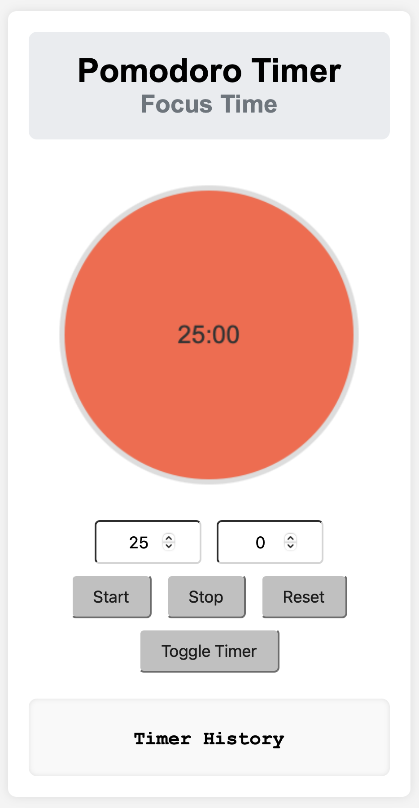

<p style="background: rgba(0, 120, 212, 0.08); border-left: 4px solid #0078d4; padding: 10px 14px; margin-bottom: 24px; border-radius: 4px; font-size: 0.95rem;">
  🇰🇷 <strong>한국어 버전 안내:</strong> 이 글의 한국어 번역 및 국내 환경 가이드는 <a href="/pomodoro-timer-kr/"><strong>뽀모도로 타이머 사용법 (한국어)</strong></a>에서 확인하실 수 있습니다.
</p>
# Pomodoro Timer



Increase your focus and productivity using the Pomodoro Timer. Manage your work time efficiently with a simple interface.
The Pomodoro Timer consists of a 25-minute focus time and a 5-minute break time by default.

[Go to Pomodoro Timer](https://saramjh.github.io/pomodorotimerEN/)

## Features

- You can set focus time and break time.
- You can start, stop, and reset the timer.
- You can switch between timer modes (focus time ↔ break time).
- You can check the timer history.

## Usage

1. **Set Time**: Set the focus time or break time in the `minutes` and `seconds` input fields.
2. **Start Timer**: Click the `Start` button to start the timer.
3. **Stop Timer**: Click the `Stop` button to pause the timer.
4. **Reset Timer**: Click the `Reset` button to reset the timer.
5. **Switch Session**: Click the `Switch Timer` button to switch between focus time and break time.
6. **Check Timer History**: Check the previous session records in the timer history section.

## File Structure

```
pomodoroTimerEN/
├── css/
│   └── styles.css
├── js/
│   └── script.js
├── index.html
└── README.md
```

## Installation and Execution

1. Clone this repository:
   ```bash
   git clone https://github.com/saramjh/pomodoroTimerEN.git
   ```
2. Move to the project directory:
   ```bash
   cd pomodoroTimerEN
   ```
3. Open the `index.html` file in your browser.

## Contribution

Contributions are welcome! If you find any bugs or have improvements, please create an issue or submit a pull request.

## License

This project is distributed under the MIT License.

#### Links

- [pomodoro-timer-en](https://saramjh.github.io/pomodorotimerEN/)
- [Github Repository: pomodoro-timer-en](https://github.com/saramjh/pomodorotimerEN/tree/main)
