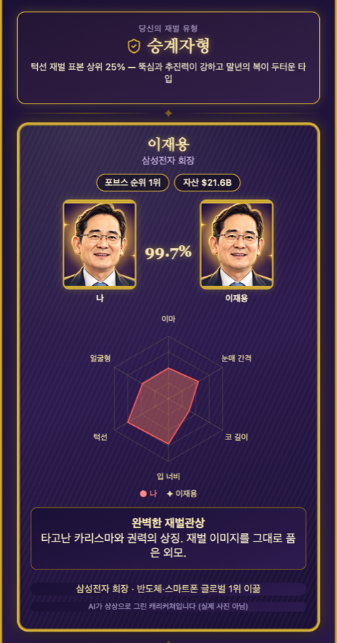

# 부자 관상 테스트: AI로 나와 닮은 부자 찾기

[무료로 부자 관상 테스트 시작하기](https://saramjh.github.io/richChecker/)

사진 한 장으로 포브스 2026 한국 부자 47인 표본과 6가지 얼굴 비율을 비교해 가장 가까운 Top 3와 내 두드러진 특징을 확인할 수 있습니다. 별도 가입이 필요하지 않고 얼굴 매칭용 사진은 브라우저에서 처리됩니다.

## 무엇을 확인할 수 있나요?

부자 관상 테스트는 업로드한 사진에서 얼굴 랜드마크를 찾고, 이마 높이, 눈 사이 거리, 코 길이, 입 너비, 하안부 길이, 얼굴 종횡비를 계산합니다. 이 6개 비율을 포브스 2026 한국 부자 47인 표본과 비교합니다.

결과 화면에서는 다음을 확인할 수 있습니다.

- 전체 6개 얼굴 비율 기준 가장 가까운 Top 3
- 1위 매치와의 얼굴 비율 비교
- 6개 항목 레이더 차트와 특징 점수
- 내 얼굴에서 가장 두드러진 특징
- 각 특징에서 가장 가까운 표본 인물
- 저장하거나 공유할 수 있는 결과 카드

이 서비스는 실제 재산, 성격, 성공 가능성을 예측하는 관상 판정 도구가 아닙니다. 전통 관상 테마를 사용하지만 계산 결과는 측정한 얼굴 비율의 오락용 비교입니다.

## 어떻게 사용하나요?

1. [부자 관상 테스트](https://saramjh.github.io/richChecker/)를 엽니다.
2. 사진 선택 버튼을 누르고 정면을 향한 밝은 사진 한 장을 고릅니다.
3. 브라우저에서 얼굴 랜드마크와 6개 비율을 계산합니다.
4. Top 3와 두드러진 특징을 확인합니다.
5. 원하는 경우 결과 카드를 저장하거나 공유합니다.

## 개인정보와 이미지 처리

얼굴 매칭용 사진은 서버에 업로드하지 않고 사용자의 브라우저에서 처리합니다. 별도 회원가입이나 얼굴 사진 저장 기능은 없습니다.

사이트 이용 통계와 광고 게재를 위해 Google Analytics와 Google AdSense가 사용될 수 있으므로 일반적인 접속 정보와 광고 관련 쿠키는 Google 서비스 정책의 영향을 받을 수 있습니다. 얼굴 사진 자체를 매칭 목적으로 Google Analytics나 AdSense에 보내지는 않습니다.

## 사용 기술

- MediaPipe Face Landmarker: 얼굴 랜드마크 분석
- 브라우저 JavaScript: 얼굴 비율 계산과 Top 3 매칭
- html2canvas: 결과 카드 이미지 생성
- GSAP, Tone.js: 결과 공개 애니메이션과 효과음
- GitHub Pages: 정적 사이트 배포

## 글로벌 버전도 있나요?

네. 한국 부자 47인과 별도로 글로벌 억만장자 100인 표본을 사용하는 영어 버전도 운영합니다.

[Global Billionaire Face Match 해보기](https://saramjh.github.io/richChecker-us/)

## 자주 묻는 질문

**부자 관상 테스트는 무료인가요?**

네. 별도 가입 없이 브라우저에서 바로 사용할 수 있습니다.

**내 사진이 서버에 저장되나요?**

얼굴 매칭용 사진은 서버에 업로드하거나 저장하지 않고 브라우저에서 처리합니다.

**결과가 실제 재산이나 성공 가능성을 의미하나요?**

아니요. 결과는 6가지 얼굴 비율의 유사도를 재미로 비교한 것이며 실제 재산, 성격, 성공 가능성을 의미하지 않습니다.

[지금 부자 관상 테스트 시작하기](https://saramjh.github.io/richChecker/)

#### Links

- [부자 관상 테스트](https://saramjh.github.io/richChecker/)
- [Global Billionaire Face Match](https://saramjh.github.io/richChecker-us/)
- [Github Repository: richChecker](https://github.com/saramjh/richChecker)
- [초기 프로젝트 기록: 인공지능 부자 관상 분석](/rich-tester/)
