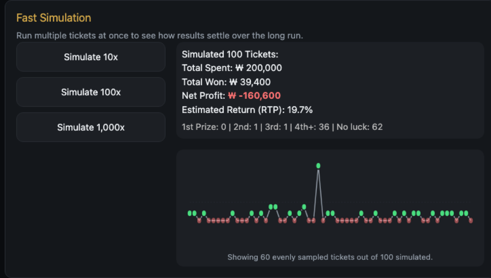

  🔄 <strong>Updated 2026-09-18:</strong> The simulator has been rebuilt since this post was first published. It now models real ticket formats (Powerball, a US $5 scratch-off, Korea's Speetto 1000/2000), draws each result from a proper CDF-based odds engine, and adds fast-forward simulation, a real-world odds comparison table, and a sourced lottery tax calculator. The description below reflects the current version — see what's new further down.

### Scratch Lottery Simulation — Try your luck!

A free scratch-off lottery simulator. It reproduces the tactile "scratching" experience using the published odds of real lotteries — Powerball, a typical US $5 scratch-off, and Korea's Speetto 1000/2000 — with no real money ever involved. Try it at [saramjh.github.io/scratchLottery](https://saramjh.github.io/scratchLottery).

#### Who it's for

- Anyone curious what it actually feels like to scratch off a losing ticket after losing ticket, at zero cost.
- Anyone who wants to see, numerically, how a jackpot's odds compare to everyday risks.
- Anyone who wants to understand Return to Player (RTP) by running thousands of tickets instantly instead of buying them.

#### What's new since the first version

- **Real ticket formats.** Powerball draws 5 white balls + 1 red bonus ball in a fixed order; Speetto 1000 matches two rows (LUCKY NUMBER / MY NUMBER); Speetto 2000 has you scratch two symbols per panel looking for a match. A "Custom Odds" mode still lets you build your own ticket with any jackpot probability.

  

- **A proper odds engine.** Each scratch draws a single random number from a cumulative distribution (CDF) and matches it to exactly one prize tier — the same mechanism a real printed ticket relies on. A ticket can never win two tiers at once, and a jackpot can never get silently overwritten by a lesser prize.
- **Fast-forward simulation.** Run 10, 100, or 1,000 tickets at once and watch a time-series chart converge toward the theoretical odds table — a fast way to build intuition for the law of large numbers.

  

- **Real-world odds comparisons and a sourced lottery tax calculator.** The odds table is placed next to comparable everyday odds (e.g., an amateur golfer's odds of a hole-in-one), and a separate calculator estimates US/Korean tax withholding on a given prize amount, with its assumptions stated.
- **Persistent history.** Cost, winnings, profit, and attempt count are saved to your device automatically, so your record picks up where you left off next time you visit.

#### How the odds/RTP are calculated

Each preset defines only a jackpot probability and a per-tier prize table; the ratio between tiers follows a fixed shape shared across all presets. On every scratch, the engine draws one random number in [0, 1) and checks which tier's cumulative-probability range it falls into. Lower-tier prize amounts are calibrated so the resulting RTP lands in the range real lotteries typically use, roughly 50–70%.

#### Tech stack

No build tools or frameworks — plain HTML/CSS/JS, deployed as-is via GitHub Pages.

- `index.html` — page structure (SEO meta, ticket UI, odds/simulation panels, FAQ)
- `css/style.css` — all styling
- `js/script.js` — odds engine, ticket generation/rendering, scratch interaction, charts, localStorage persistence, GA4 event tracking

#### Disclaimer

This site is a pure simulation. No real money is wagered, and no real lottery tickets are bought or sold. Odds/RTP figures are based on the public information each preset references and aren't guaranteed to exactly match any specific lottery operator's official figures.

#### Links

- [Scratch Lottery Simulation](https://saramjh.github.io/scratchLottery)
- [GitHub Repository: Scratch Lottery Simulation](https://github.com/saramjh/scratchLottery)
