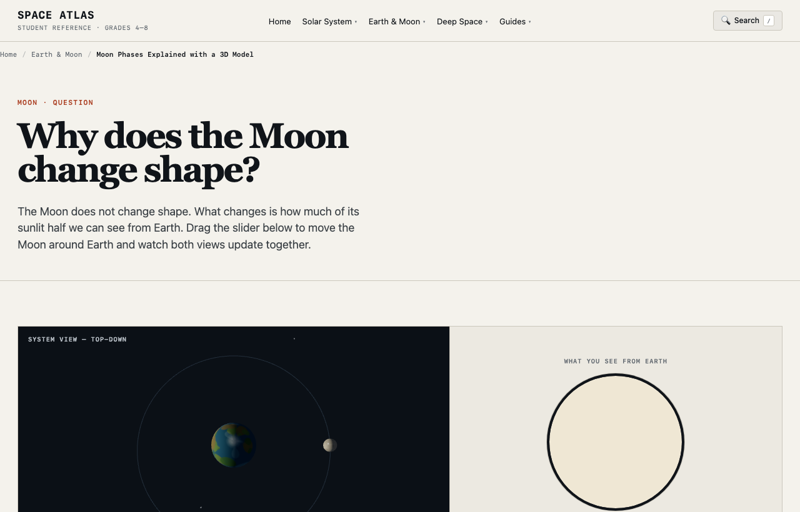
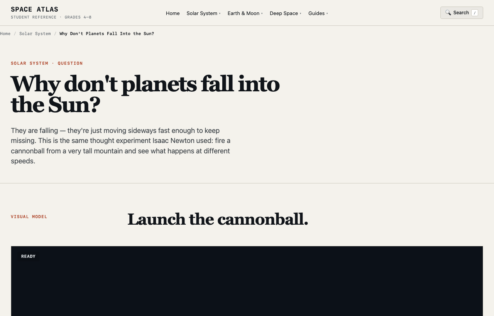

# Space Atlas: 3D Interactive Astronomy Reference

  <strong>한국어 버전:</strong> 이 글의 한국어 원문은 <a href="/space-atlas-student/"><strong>Space Atlas: 3D 인터랙티브 우주 과학 아틀라스</strong></a>에서 확인하실 수 있습니다.

> **"Why do textbook diagrams of the Solar System distort actual orbital scales?"**  
> **"Are Earth's seasons caused by distance from the Sun, or by axial tilt?"**

When students learn astronomy, the two biggest hurdles are the **unimaginable physical scale** of space and the **persistent misconceptions created by flat textbook illustrations**.

[Launch Space Atlas](https://saramjh.github.io/space_atlas_student/)

Built to solve these problems, **Space Atlas (Student Reference)** is an interactive astronomy encyclopedia where students manipulate simulation variables, rotate 3D viewpoints, and discover physical relationships firsthand.

---

## Core Modules and Visual Experiments

Space Atlas organizes **27 core astronomy topics** into four primary clusters.

### 1. Moon Phases and Eclipses Interactive Lab

* **Synchronized System View and Earth View**:
  * Dragging the Moon's orbit in the left 3D viewport updates the right 2D canvas in real time, rendering the illuminated fraction seen from Earth (crescent, quarter, gibbous, full).
  * Students visually contrast the sunlit physical hemisphere with the apparent shape seen by an observer on Earth.

### 2. Newton's Cannonball Orbital Simulator

* **Real-Time 2D Canvas Physics**:
  * Addresses the question: "Why do planets not crash into the Sun?"
  * Testing different launch velocities reveals:
    * **Sub-orbital speed**: The cannonball falls back to Earth.
    * **Orbital speed (~7.9 km/s)**: A stable circular orbit forms around Earth.
    * **Escape velocity**: The trajectory becomes hyperbolic, escaping Earth's gravitational field.

### 3. Planetary Scale Lab
* True planetary diameter ratios (e.g., how many Earths fit inside Jupiter).
* True distance ratios (1 AU scale) compared against compressed textbook layouts using an interactive slider.

### 4. Deep Space and Exoplanets
* **Exoplanet Transit Method**: Dragging a planet across a star plots real-time light curve dips.
* **Star Life Cycle**: Interactive paths showing how stellar mass determines white dwarf vs. supernova vs. black hole outcomes.
* **Earth's Galactic Address**: Step-by-step cosmic zoom from the Local Group down to the Orion Arm.

---

## Epistemic Learning Structure (NGSS-Aligned)

Every topic adheres to a 7-step learning framework designed to build scientific intuition:

1. **Question**: Starts with an intuitive question ("Why is Venus hotter than Mercury?").
2. **Visual Model**: Interactive 3D Three.js scene or 2D physics canvas.
3. **What's Simplified**: Explicitly discloses model limitations (e.g., *"Earth-Moon distance is compressed by 30x for screen readability"*), preventing students from confusing models with reality.
4. **Measurable Facts**: Quantifiable values such as orbital periods, surface temperatures, and escape velocities.
5. **Misconception Check**: An interactive, self-grading quiz addressing common intuitive traps.
6. **Evidence**: Direct reference links to NASA Science, JPL Education, and ESA data.
7. **Next Exploration**: Continuous learning loop recommending the next logical topic in the series (e.g., Moon Phases -> Eclipses -> Tides).

---

## Recommended Use Cases

* **K-12 Students and Science Educators**:
  * Classroom visualization tool for digital whiteboards and tablets during lessons on lunar phases, seasons, and planetary scales.
* **Astronomy Beginners and Curious Learners**:
  * Visual exploration of astrophysics without complex mathematics.
* **Web Developers and WebGL Enthusiasts**:
  * Reference implementation of a high-performance, zero-dependency 3D educational web application using pure Three.js (ES Modules), Canvas API, and a custom Python static site builder (`build.py`).

---

## Technical Highlights

* **Zero-Dependency Architecture**: No Node.js build overhead; uses standard Python stdlib for builds, keeping CI/CD pipeline execution under 20 seconds.
* **Instant Topic Search**: Pressing `/` opens an instant search modal that filters all 27 topics locally.
* **Responsive Touch Controls**: Full support for mobile and tablet touch gestures across all simulations.

---

## Links

* **Space Atlas Website**: [https://saramjh.github.io/space_atlas_student/](https://saramjh.github.io/space_atlas_student/)
* **GitHub Repository**: [https://github.com/saramjh/space_atlas_student](https://github.com/saramjh/space_atlas_student)
