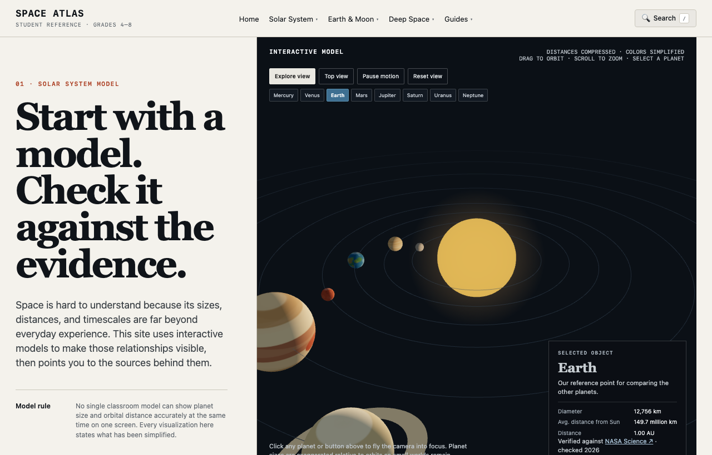

# Space Atlas: 3D 인터랙티브 우주 과학 아틀라스

  <strong>English Version:</strong> Looking for the English edition? Read <a href="/space-atlas-student-en/" style="color: #4da3ff; font-weight: 700; text-decoration: underline;">Space Atlas: 3D Interactive Astronomy Reference (English) →</a>

> **"교과서 삽화 속 태양계는 왜 실제 비율과 다를까?"**  
> **"지구에 사계절이 생기는 진짜 이유는 태양과의 거리 때문일까, 자전축 기울기 때문일까?"**

우주와 천문학을 배울 때 가장 큰 장벽은 **눈에 보이지 않는 거대한 스케일**과 **평면 교과서 다이어그램이 주는 오개념(Misconceptions)**입니다. 

[Space Atlas 바로가기](https://saramjh.github.io/space_atlas_student/)

이러한 물음에서 출발해 개발된 **Space Atlas (Student Reference)**는 단순한 읽을거리 웹페이지가 아니라, **학생이 직접 시뮬레이션의 변수를 조작하고 3D 뷰포트를 회전하며 인과관계를 체득할 수 있도록 설계된 인터랙티브 우주 과학 백과**입니다.

---

## 주요 기능 및 시각화 모듈

Space Atlas는 **총 27개 핵심 천문학 주제**를 4대 카테고리로 나누어 제공합니다.

### 1. 달의 위상(Phases) & 일식·월식 인터랙티브 랩

* **시스템 뷰(System View)와 지구 관측 뷰(Earth View) 동시 렌더링**:
  * 왼쪽 3D 뷰포트에서 달의 공전 궤도를 드래그하면, 오른쪽 2D 캔버스에서 지구에서 바라본 달의 차오름/기욺(보름달, 상현달, 초승달 등)이 실시간으로 동기화되어 렌더링됩니다.
  * 햇빛이 비추는 '실제 반구'와 지구 관측자가 보는 '겉보기 형태'의 기하학적 차이를 직관적으로 이해할 수 있습니다.

### 2. 뉴턴의 대포알(Newton's Cannonball) 궤도 시뮬레이터

* **2D 캔버스 실시간 물리 연산**:
  * "행성은 왜 태양으로 떨어지지 않을까?"라는 질문을 해결하기 위해 뉴턴의 유명한 사고실험을 물리 엔진으로 구현했습니다.
  * 발사 속도를 조절하면서 발사하면:
    * **속도가 너무 느릴 때**: 지구 표면으로 추락
    * **적정 속도(초속 약 7.9km)**: 완벽하고 안정적인 인공위성 원궤도 형성
    * **탈출 속도 초과**: 지구 중력권을 벗어나는 쌍곡선 궤도 탈출

### 3. 스케일 연구소 (Scale Lab & Distance Tool)
* 행성의 실제 지름 비율 비교 (목성 안에 지구가 몇 개 들어가는지)
* 실제 거리 비율(1 AU) vs 교과서의 압축 다이어그램 간의 차이를 인터랙티브 슬라이더로 직접 확인

### 4. 딥 스페이스 & 외계행성 탐사
* **외계행성 트랜싯(식현상) 광도 곡선 랩**: 행성이 항성 앞을 지나갈 때 빛이 어두워지는 그래프 시뮬레이션
* **별의 일생(Star Life Cycle)**: 항성의 질량에 따른 백색왜성 vs 초신성/블랙홀 분기점 인터랙티브 도표
* **우리은하(Milky Way) 내 지구 주소**: 국부은하군에서 오리온자리 나선팔까지 단계별 줌아웃

---

## Space Atlas만의 교육적 설계 원칙 (Epistemic Structure)

모든 페이지는 단순히 지식을 나열하지 않고, **미국 차세대 과학교육표준(NGSS) 기반의 7단계 학습 프레임워크**를 철저히 따릅니다:

1. **Question (핵심 질문)**: "금성은 왜 수성보다 더 뜨거울까?", "달은 왜 한쪽 면만 보일까?"와 같은 직관적 질문으로 시작
2. **Visual Model (상호작용 모델)**: 3D Three.js 씬 또는 2D 물리 캔버스를 직접 조작
3. **What's Simplified (단순화된 점 공개)**: *"이 모델은 시각적 가독성을 위해 지구-달 거리를 30배 축소했습니다"*와 같이 모델의 한계를 투명하게 공개하여 모델을 맹신하지 않도록 지도
4. **Measurable Fact (측정 가능한 데이터)**: 공전 주기, 표면 온도, 탈출 속도 등 정량적 수치 제공
5. **Misconception Check (오개념 퀴즈)**: 학생들이 가장 흔히 틀리는 상식을 짚어주는 인터랙티브 즉시 채점 퀴즈
6. **Evidence (공식 출처)**: NASA Science, JPL Education, ESA의 1차 검증 데이터 링크 제공
7. **Next Exploration (연속 탐험 루프)**: 배운 개념이 다음 연관 주제(예: 달의 위상 ➔ 일식 ➔ 조석 현상)로 꼬리를 물고 이어지는 연속 체류 구조

---

## 어떤 경우에 사용하면 가장 좋을까요?

* **초·중·고등학생 & 과학교사**:
  * "달의 위상", "사계절의 원인", "행성 크기 비교" 등 교과서 텍스트와 정지된 사진만으로는 설명하기 힘든 수업 시간에 전자칠판이나 태블릿 화면에 띄워 직접 조작해보는 시각화 교구로 활용할 때
* **천문학 입문자 & 청소년**:
  * 우주에 대한 막연한 호기심을 수식 없이 물리학적 직관(시뮬레이션 조작)으로 이해하고 싶을 때
* **프론트엔드 개발자 & 웹 3D 입문자**:
  * 무거운 프레임워크나 npm 패키지 의존성 없이, **순수 Three.js(ES Module) + Canvas API + 무의존성 정적 빌드 시스템**으로 가볍고 빠른 3D 웹앱을 어떻게 구성했는지 벤치마킹하고 싶을 때

---

## 기술적 특징

* **Zero-Dependency Architecture**: 빌드 도구로 무거운 번들러 대신 파이썬 표준 라이브러리 기반의 `build.py`를 사용해 CI/CD 파이프라인(GitHub Actions) 빌드 시간을 20초 이내로 단축
* **Instant Topic Finder**: 키보드 단축키 `/`를 누르면 언제 어디서든 27개 주제를 실시간으로 필터링하여 이동할 수 있는 인스턴트 검색 모달 탑재
* **모바일 완전 반응형**: 태블릿 및 스마트폰 터치 제스처에 최적화된 시뮬레이션 뷰포트 및 궤도 컨트롤

---

## 관련 링크

* **Space Atlas 웹사이트**: [https://saramjh.github.io/space_atlas_student/](https://saramjh.github.io/space_atlas_student/)
* **GitHub 저장소**: [https://github.com/saramjh/space_atlas_student](https://github.com/saramjh/space_atlas_student)
* **영문 포스팅 (English Edition)**: [Space Atlas: 3D Interactive Astronomy Reference](/space-atlas-student-en/)

