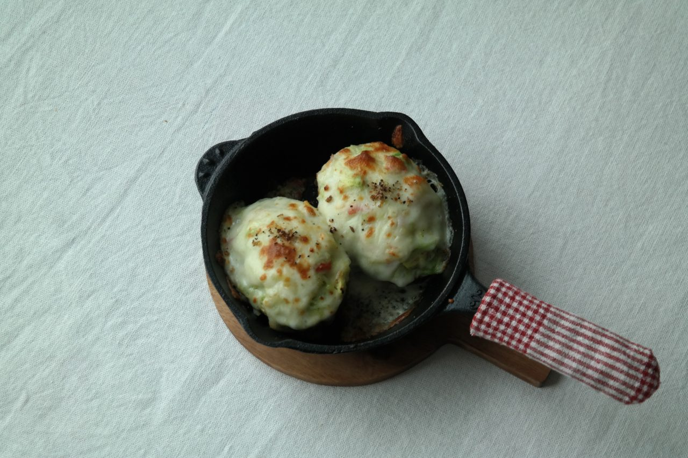
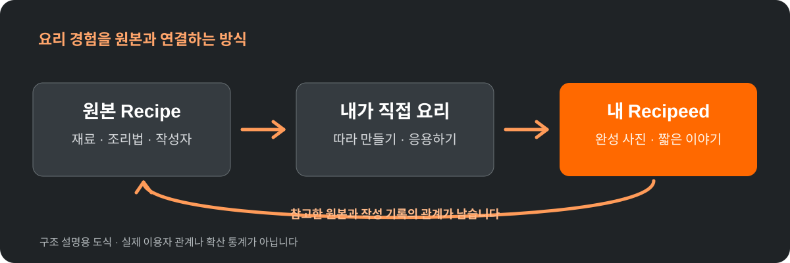

요리 SNS를 만든다고 하면 가장 먼저 떠오르는 기능은 레시피 검색, 재료량 계산, 조리 단계 안내일 겁니다. 저도 직접 만든 서비스인 [Spoonie](https://spoonie.kr/)를 설명하면서 그런 기능부터 앞세웠습니다.

그런데 실제로 사람이 글을 올리는 소셜미디어를 생각하면 질문이 달라집니다.

**"인분을 바꿀 수 있다"는 사실만으로 다음 주에도 돌아와서 요리 기록을 남길까요?**

그렇지는 않을 것 같습니다. 편리한 계산기와 계속 쓰고 싶은 커뮤니티는 다르기 때문입니다. 지금은 이 차이를 확인하려고 하고 있습니다.

## 한 번 본 레시피의 다음 이야기는 어디에 남을까

SNS에서 누군가의 요리 사진이나 레시피를 봅니다. 저장하고, 장을 보고, 주말에 직접 요리합니다. 원본과는 조금 다른 재료를 썼을 수도 있고, 사진을 한 장 찍었을 수도 있습니다.

그 결과는 대개 원본 글과 다른 곳에 남습니다. 원본을 만든 사람은 누가 실제로 따라 했는지 알기 어렵고, 따라 만든 사람은 그 경험을 이어서 보여줄 기회가 많지 않습니다.

Spoonie가 시도하는 것은 이 사이에 연결을 남기는 방식입니다. 요리를 만들어 본 사람이 자신의 글에서 참고한 원본을 기록하고, 원본 쪽에서도 관련 공개 기록을 찾아갈 수 있는 구조입니다.

<figure>
  
  <figcaption>실제 Spoonie 공개 Recipe 중 하나인 아보카도 게살 그라탕. 이 사진은 서비스에 공개된 원본을 보여주는 것이며, 다른 사용자가 재현했다는 증거는 아닙니다.</figcaption>
</figure>

<figure>
  
  <figcaption>연결 방식의 개념도. 서비스 이용자 수나 기존 요리 재현 사례를 시각화한 통계가 아닙니다.</figcaption>
</figure>

## 실제로 구현한 것은 무엇인가

Spoonie는 정식 레시피를 정리하는 **Recipe**와 일상의 요리·완성 사진·짧은 이야기를 남기는 **Recipeed**를 구분합니다.

공개된 Recipe에는 **'이 레시피로 만들었어요'**, **'만들어 본 기록'**, **'이어진 레시피'** 같은 연결 지점이 있습니다. 참고한 레시피를 지정해 Recipeed를 공개하면 그 원본과의 관계를 남길 수 있게 설계했습니다.

기능을 직접 확인하려면 [아보카도 게살 그라탕 Recipe](https://spoonie.kr/recipes/554ae9ef-15a1-4806-944e-170884d17a96)를 열어보면 됩니다. 공개 레시피의 내용은 로그인 없이 볼 수 있고, 글을 작성할 때는 로그인이 필요합니다.

다만 여기서 **없는 것을 있는 것처럼 말하고 싶지는 않습니다.** 크리에이터의 파급력이나 확산 경로를 정밀하게 분석하는 대시보드가 완성된 것은 아닙니다. 이미 많은 사용자가 서로 레시피를 이어 만들고 있다는 근거도 아직 없습니다.

지금은 그 관계가 실제 사용자에게 필요하다는 가설을 검증하는 초기 단계입니다.

## 어떤 사람이 써보면 좋을까

새로운 SNS에서 먼저 활동해 보고 싶은 분, 오늘 먹은 집밥을 짧게 남기는 분, 다른 사람의 레시피를 따라 만들어 보는 분 모두 대상입니다.

**거창한 레시피가 없어도 됩니다.** 오늘 만든 음식 사진 한 장과 "양파가 없어서 다른 채소로 바꿨다" 같은 짧은 기록부터 시작할 수 있습니다. 원본 Recipe를 참고했다면 그 출처도 이어볼 수 있습니다.

제가 알고 싶은 것은 설치·가입 숫자가 아닙니다. 실제로 첫 글을 쓰는지, 한 번 쓴 다음에도 또 요리 기록을 남기고 싶은지입니다. 어떤 버튼에서 막혔는지, 원본과의 연결이 도움이 되는지도 확인하고 싶습니다.

Spoonie가 지금 가장 먼저 찾는 것은 이런 **실제 초기 활동 사용자 20명**입니다. 20명만 가입시키겠다는 제한이나 조기 참여 보상을 약속하는 의미가 아닙니다. 작은 규모라도 반복해서 이용할 이유가 있는지 확인하려는 목표입니다.

## 첫 요리 기록을 남겨본다면

[**Spoonie의 첫 요리 기록 참여 안내**](https://spoonie.kr/early-cooks?utm_source=devtestudinidae_blog&utm_medium=owned_editorial&utm_campaign=sco_early_member_v2&utm_content=social_cooking_devlog)에서 첫 Recipeed 작성 경로와 현재 서비스가 어떤 단계인지 확인할 수 있습니다.

요리한 사진이 없더라도 [실제 Recipe](https://spoonie.kr/recipes/554ae9ef-15a1-4806-944e-170884d17a96)를 읽으며 어떤 경험을 기대하는지 판단할 수 있습니다. 서비스를 이용해보고 막힌 부분이 있다면 [업무용 메일](mailto:partners@spoonie.kr?subject=Spoonie%20%EC%B4%88%EA%B8%B0%20%EC%82%AC%EC%9A%A9%20%EC%9D%98%EA%B2%AC)로 글로 전달해 주셔도 됩니다. 통화나 인터뷰가 필요한 모집은 아닙니다.

누군가에게 레시피를 보여주는 일과, 그 레시피를 실제로 만들어 본 사람이 자신의 기록을 남기는 일. 저는 후자가 생기는 구조가 이 서비스의 핵심 가설이라고 생각합니다. **그 가설이 맞는지는 앞으로 들어오는 실제 요리 기록과 재방문으로 판단하겠습니다.**
