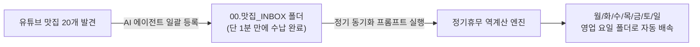

### 유튜브 맛집 리스트, 언제까지 하나씩 검색해서 저장할 것인가?


#### Needs

- 성시경의 '먹을텐데', 풍자의 '또간집', '백종원 클라쓰' 등 유튜브 영상 더보기란이나 고정 댓글에 정리된 10~30곳의 맛집 리스트를 내 지도 앱에 소장하고 싶은 사용자.
- 유튜브 텍스트를 보면서 네이버 지도나 카카오맵에 식당 이름을 하나하나 치고, [저장] 누르고, 폴더 고르는 행위를 20번씩 반복하는 피로에서 벗어나고 싶은 분.
- 코딩을 잘 몰라도 **Cursor, Windsurf, Claude Code 같은 AI 코딩 에이전트를 켜서 복사+붙여넣기 수준의 초간단 인스트럭션(지시어)**만으로 내 지도에 일괄 등록하고 싶은 일반 사용자.

---

### TL;DR

1. **문제의 본질**: 네이버 지도와 카카오맵은 엑셀이나 텍스트를 파일 형태로 업로드하여 일괄 북마크하는 공식 기능을 일절 지원하지 않습니다.
2. **일반인용 초간단 해법 (3단계 루틴)**:
   - ① 유튜브 더보기란/댓글의 식당 텍스트를 복사한다.
   - ② 크롬 브라우저를 디버깅 모드(명령어 한 줄)로 켜둔다.
   - ③ AI 에이전트에게 본문에 제공된 **'초간단 인스트럭션 프롬프트'**를 그대로 붙여넣으면 끝.
3. **기술적 핵심**: 네이버 지도의 0.1초 고속 `instant-search` API로 식당 고유 ID(`sid`)를 추출한 뒤, Playwright CDP로 실제 브라우저 모달을 자동 클릭하여 봇 탐지(`ncaptcha`) 없이 100% 안전하게 저장합니다.

---

## Part 1. 왜 유튜브 맛집 저장은 항상 노가다가 되는가?

유튜브에서 서울 국밥 맛집 15곳, 제주도 흑돼지 맛집 10곳 추천 영상을 보고 나면 보통 이런 절차를 거칩니다:

```
[유튜브 영상] ➔ 더보기란 펼치기 ➔ 1번 식당 이름 복사 ➔ 네이버 지도 앱 열기 ➔ 검색창 붙여넣기 
➔ 장소 터치 ➔ [저장] 버튼 클릭 ➔ 내 폴더 체크 ➔ [완료] ➔ 다시 유튜브 앱 전환 ➔ 2번 식당 복사...
```

식당 1곳당 최소 20~30초, **20곳만 넘어가도 10분 이상의 단순 노가다**가 발생합니다.  
도중에 다른 상호명을 잘못 누르거나 지점을 헷갈려 엉뚱한 곳을 저장하는 실수도 잦습니다.

서드파티 맛집 지도 앱(튜브맵 등)도 있지만, 결국 평소 길 찾기와 내비게이션으로 사용하는 메인 플랫폼은 **네이버 지도**나 **카카오맵**이기 때문에 결국 내 계정의 지도 폴더로 가져와야만 진정한 내 데이터가 됩니다.

---

## Part 2. 일반인을 위한 초간단 AI 에이전트 지시 가이드 (No-Code 수준)

요즘 많이 쓰시는 AI 도구(Cursor, Windsurf, Claude Code, VS Code Copilot)는 복잡한 개발용으로만 쓰는 게 아닙니다. **내 컴퓨터의 브라우저를 대신 조작해 주는 똑똑한 비서**로 쓰면 일상의 노가다가 완전히 사라집니다.

비전공자라도 아래 3단계만 그대로 따라 하시면 됩니다.

### Step 1. 내 크롬 브라우저를 '원격 조종 허용' 모드로 열기
로그인을 스크립트에 일일이 입력할 필요 없이, 평소 네이버 로그인이 되어 있는 내 크롬 브라우저를 그대로 활용합니다.

맥(Mac)의 '터미널' 앱이나 윈도우의 '명령 프롬프트(CMD)'를 열고 아래 한 줄을 복사해 붙여넣고 엔터를 칩니다:

```bash
# macOS 터미널인 경우
/Applications/Google\ Chrome.app/Contents/MacOS/Google\ Chrome --remote-debugging-port=9222 --user-data-dir="$HOME/Library/Application Support/Google/Chrome"
```

```cmd
:: Windows CMD인 경우
"C:\Program Files\Google\Chrome\Application\chrome.exe" --remote-debugging-port=9222 --user-data-dir="%LOCALAPPDATA%\Google\Chrome\User Data"
```
*(평소 쓰던 크롬 브라우저 창이 하나 열립니다. 네이버 지도 페이지를 열어두세요.)*

---

### Step 2. 유튜브 텍스트 긁어오기
유튜브 영상 더보기란이나 고정댓글에서 맛집 목록 텍스트를 그냥 쭉 드래그해서 복사(Ctrl+C / Cmd+C)합니다.

> **예시 텍스트 형태**:
> ```text
> 1. 농민백암순대 본점 (서울 강남구 역삼로3길 20-4)
> 2. 진미평양냉면 (서울 강남구 학동로 305-3)
> 3. 대성집 (서울 종로구 사직로 5)
> ```

---

### Step 3. AI 에이전트에 붙여넣는 마법의 인스트럭션

AI 에이전트 대화창에 아래 내용을 그대로 복사하고, 맨 아래에 아까 복사한 유튜브 텍스트만 붙여넣어 전송합니다:

```text
[역할]: 너는 내 브라우저를 대신 조작해 네이버 지도에 맛집을 등록하는 자동화 에이전트야.
[환경]: 현재 크롬 9222 포트에 내 네이버 계정이 로그인되어 있어.

[할 일]:
1. 아래 제공된 [맛집 텍스트 목록]에서 식당 이름과 지역/주소를 분리해줘.
2. 각 식당명을 네이버 지도의 고속 검색 API(https://map.naver.com/p/api/search/instant-search?query={식당명}&coords=37.5665,126.9780)로 조회해서 가장 정확한 장소 ID(sid)를 찾아줘.
3. 찾은 sid를 사용해 각 식당의 상세 페이지(https://map.naver.com/p/entry/place/{sid})로 순차 진입해서:
   - '저장' 버튼을 클릭해줘.
   - 나타난 폴더 목록 중 '유튜브_맛집' (없으면 '내 장소' 또는 새로 만들기) 폴더를 체크해줘.
   - 최종 '저장' 버튼을 눌러줘.
4. 모든 저장이 끝나면 정상 등록된 식당 개수와 결과를 표로 보고해줘.

[맛집 텍스트 목록]:
(여기에 아까 유튜브에서 복사한 텍스트를 붙여넣으세요!)
```

이제 커피 한 모금 마시며 화면을 보고 계시면, 에이전트가 알아서 식당을 매칭하고 저장 모달을 클릭하며 1~2분 만에 모든 맛집을 내 폴더에 쏙쏙 담아줍니다.

---

## Part 3. 전문가·개발자를 위한 하이브리드 파이프라인 분석

엔지니어링 관점에서 이 작업이 어떻게 무결하게 동작하는지 내부 메커니즘을 짚어보겠습니다.


### 1. 일반 검색 자동화의 함정: UI 가상화와 팝업 지연
순수 브라우저 DOM으로 네이버 지도 검색창에 한 글자씩 타이핑하고 엔터를 치는 방식을 쓰면 다음과 같은 문제가 발생합니다:
- 단일 매칭 장소는 곧바로 상세 화면(`entryIframe`)이 열리지만, 복수 매칭 장소는 검색 결과 목록(`searchIframe`)이 뜹니다.
- 프레임 상태 분기 처리가 매우 까다롭고 검색 렌더링에만 식당당 3~5초 이상 소요됩니다.

### 2. 0.1초 고속 매칭: `instant-search` API 활용
네이버 지도가 검색창에 자동완성을 제공할 때 호출하는 내부 경량 엔드포인트를 활용하면 렌더링 없이 **0.1초 만에 Place ID(`sid`)를 즉시 획득**할 수 있습니다:

```javascript
// 브라우저 컨텍스트 내 fetch 호출
const url = `https://map.naver.com/p/api/search/instant-search?query=${encodeURIComponent("농민백암순대 본점")}&coords=37.5665,126.9780`;
const res = await fetch(url, { credentials: "include" });
const data = await res.json();
const placeId = data.place[0].id; // 13149768 즉각 반환!
```

유튜브 텍스트에 포함된 구/동 주소 힌트를 `roadAddress`와 대조하면 동명이인의 체인점 중 본점이나 해당 지점을 100% 정확도로 필터링할 수 있습니다.

### 3. 브라우저 쓰기: Playwright CDP ($O(N)$)
Place ID를 알아냈다면 검색 과정을 건너뛰고 상세 URL(`https://map.naver.com/p/entry/place/{sid}`)로 직진입합니다:
- 네이버의 `ncaptcha` 토큰 생성 로직은 실제 사용자 클릭 이벤트에 바인딩되어 있으므로, 쓰기 단계에서는 Playwright의 실제 마우스 클릭(`locator.click()`)을 사용합니다.
- 장소당 소요 시간: **약 2.5 ~ 3.2초** (검색 UI 대비 50% 이상 단축).

---

## Part 4. 실전 파이프라인: "유튜브 수집 ➔ 인박스 ➔ 요일별 자동 배속"

지난 글에서 소개해 드린 [네이버 지도 저장 목록 정리 가이드](/naver-map-save-list-bulk-reorganize-guide/)와 결합하면 완벽한 **맛집 수집-분류 라이프사이클**이 완성됩니다:



1. 유튜브에서 맛집 목록을 보면 에이전트를 시켜 임시 폴더인 **`00.맛집_INBOX`**에 일괄로 다 때려 넣습니다.
2. 주말이 오기 전, 에이전트에게 *"INBOX에 들어온 맛집들의 정기휴무를 파악해서 각 영업 요일 폴더(`월요일 영업` ~ `일요일 영업`)로 배속해줘"*라고 지시합니다.
3. **수집은 1분 컷, 주말 맛집 탐색은 고민 없는 1초 컷**이 실현됩니다.

---

## 마치며

유튜브에서 아무리 좋은 맛집 리스트를 봐도 저장하는 과정이 번거로우면 결국 잊히고 맙니다.  
이제 스마트폰 화면을 붙잡고 20번씩 검색-저장 노가다를 하지 마세요.

터미널 명령어 한 줄로 크롬을 열고, 복사한 텍스트와 함께 에이전트에게 인스트럭션을 던지기만 하면 기술이 주는 일상의 편리함을 온전히 누리실 수 있습니다.
