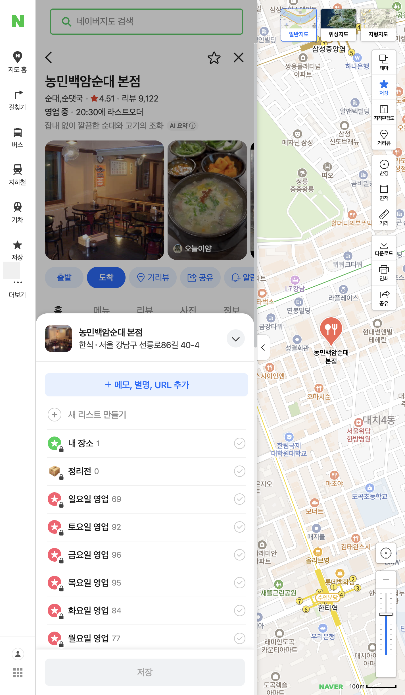
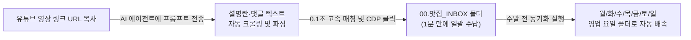

### 유튜브 맛집을 지도에 저장할 때 겪는 4가지 핵심 문제



성시경의 먹을텐데, 또간집, 백종원 등 유튜브 맛집 영상을 챙겨보면서 장소를 저장하려 할 때 다음과 같은 비효율과 한계를 겪어보셨을 겁니다:

* ❌ **문제 1: 영상 1개당 10~20곳의 식당을 지도 앱에 하나씩 검색·저장하는 수작업 피로감**  
  [유튜브 확인 ➔ 네이버 지도 검색 ➔ 저장 터치 ➔ 폴더 선택 ➔ 완료] 과정을 식당마다 반복하다 보면 5번째 장소쯤에서 지쳐서 포기하게 됩니다.
* ❌ **문제 2: 영상 링크나 캡처 사진만 잔뜩 쌓이고 정작 현장에서는 찾지 못하는 방치 현상**  
  카톡 '나와의 채팅방'이나 갤러리 앨범에 링크와 스크린샷만 수백 개 쌓여, 정작 약속 당일에는 상호명조차 기억나지 않아 써먹지 못합니다.
* ❌ **문제 3: 더보기란이나 댓글의 텍스트 목록을 지도 데이터로 바로 변환하지 못하는 한계**  
  영상 댓글에 네티즌이 깔끔하게 정리해 둔 텍스트가 있어도, 네이버 지도 앱은 텍스트 일괄 임포트 기능을 지원하지 않습니다.
* ❌ **문제 4: 수많은 일반 댓글 중에서 '실제 맛집 정보'만 정확히 선별하기 어려운 점**  
  잡담이나 리액션 댓글 사이에 묻힌 상호명, 주소, 추천 메뉴만 자동으로 정제하기 어렵습니다.

---

### 💡 본 가이드에서 다루는 단계별 해결책 (User Flow)

이 글에서는 위 문제들을 완벽히 해결하여, **영상 링크 복사 한 번으로 3분 만에 내 네이버 지도 폴더에 모든 맛집을 일괄 등록하는 2단계 파이프라인**을 제공합니다:

1. **텍스트 정제 단계: 유튜브 댓글/정보란에서 맛집 데이터만 자동 추출 (Step 1)**  
   - 긴 댓글과 잡담을 걸러내고 [상호명, 위치, 대표메뉴]만 깔끔한 JSON/텍스트 형식으로 1초 만에 구조화하는 AI 가드레일 프롬프트
2. **원클릭 등록 단계: 네이버 지도 앱 수작업 검색 없이 내 계정 폴더로 일괄 저장 (Step 2)**  
   - 복잡한 코딩이나 설치 없이, 열려있는 내 브라우저(CDP)와 무료 AI 코딩 도구를 연동해 20개 식당을 내 저장 폴더로 1초 만에 자동 저장하는 실전 노하우

---

### ⚡ 30초 퀵 스타트: 딱 이것만 따라 하세요 (No-Code)

요즘 많이 쓰시는 AI 코딩 도구(Cursor, Windsurf, Claude Code, VS Code Copilot)는 개발자 전유물이 아닙니다. **내 컴퓨터의 브라우저를 대신 조작해 주는 똑똑한 개인 비서**로 쓰면 일상의 노가다가 1분 만에 사라집니다.

비전공자라도 아래 2단계만 그대로 하시면 끝납니다:

### Step 1. 내 크롬 브라우저를 '원격 조종 모드'로 열기
로그인을 스크립트에 일일이 입력할 필요 없이, 평소 네이버 로그인이 되어 있는 내 크롬 브라우저를 그대로 활용합니다.

맥(Mac)의 '터미널' 앱이나 윈도우의 '명령 프롬프트(CMD)'를 열고 아래 한 줄을 복사해 붙여넣고 엔터를 칩니다:

```bash
# macOS 터미널인 경우
/Applications/Google\ Chrome.app/Contents/MacOS/Google\ Chrome --remote-debugging-port=9222 --user-data-dir="$HOME/Library/Application Support/Google/Chrome"
```

```cmd
:: Windows CMD인 경우
"C:\Program Files\Google\Chrome\Application\chrome.exe" --remote-debugging-port=9222 --user-data-dir="%LOCALAPPDATA%\Google\Chrome\User Data"
```
*(평소 쓰던 크롬 브라우저 창이 하나 열립니다. 네이버 지도 페이지를 열어두세요.)*

---

### Step 2. AI 에이전트에 링크 넣고 프롬프트 던지기
유튜브 영상 더보기란을 굳이 열어볼 필요도 없습니다. 유튜브 영상 공유 링크(URL)만 아래 프롬프트에 넣고 에이전트에게 전송하세요:

```text
[역할]: 유튜브 맛집 리스트 자동 추출 및 네이버 지도 일괄 등록 에이전트
[환경]: 크롬 9222 포트에 내 네이버 계정이 로그인되어 있음.

[유튜브 영상 URL]:
(여기에 유튜브 영상 링크를 붙여넣으세요. 예: https://www.youtube.com/watch?v=xxxxxx)

[실행 지침 및 무한 스크롤 방지 규칙]:
1. 위 유튜브 영상 페이지로 이동해서(브라우저 또는 스크래핑 도구 활용), 텍스트를 추출해줘:
   - [1순위 우선 탐색]: 영상 본문의 '더보기 설명란(Description)'을 먼저 읽어줘. 맛집 유튜버들은 대부분 여기에 전체 상호/주소 목록을 정리해둡니다.
   - [2순위 보조 탐색]: 설명란에 식당 목록이 없을 때만 크리에이터의 '고정 댓글(Pinned Comment)' 딱 1개만 확인해줘.
   - [주의/금지]: 수천 개의 일반 댓글을 무한 스크롤해서 다 읽으려 들지 마! (댓글 영역은 최대 3개 이상 스크롤 금지)
2. 추출된 텍스트에서 소개된 식당 상호명과 위치(동/구/지역명) 목록을 깔끔하게 파싱해줘.
3. 각 식당명을 네이버 지도 고속 검색 API(https://map.naver.com/p/api/search/instant-search?query={식당명}&coords=37.5665,126.9780)로 조회해서 가장 정확한 Place ID(sid)를 찾아줘.
4. 찾은 sid를 사용해 로그인된 브라우저(CDP 9222)로 각 식당 상세 페이지(https://map.naver.com/p/entry/place/{sid})에 순차 진입해서:
   - iframe#entryIframe 내의 '저장' 버튼을 클릭해줘.
   - '00.맛집_INBOX' (없으면 '유튜브_맛집' 또는 '내 장소') 폴더를 체크해줘.
   - 최종 '저장' 버튼을 눌러줘.
5. 등록이 끝난 후, 저장된 식당 목록(상호명, 위치, 네이버 지도 링크)을 표로 정리해서 출력해줘.
```

> **💡 댓글이 수천 개 달린 대형 영상도 안심할 수 있는 이유**  
> 유튜브 인기 영상은 댓글이 수천~수만 개씩 달립니다. 지시어 없이 그냥 "댓글 읽어줘"라고 하면 에이전트가 브라우저를 끝없이 아래로 스크롤하며 메모리를 잡아먹거나 토큰 한도 초과로 뻗어버릴 수 있습니다.  
> 위 프롬프트에는 **"설명란 최우선 탐색 ➔ 없으면 고정 댓글 딱 1개만 조회 ➔ 무한 스크롤 원천 차단"** 안전 가드레일이 걸려 있어 대형 유튜버 영상에서도 1~2초 만에 깔끔하게 파싱을 마칩니다.

#### [방법 2] 이미 복사해 둔 텍스트가 있을 때 (수동 복사본 활용)
카카오톡으로 공유받았거나 메모장에 이미 맛집 이름과 주소가 텍스트로 정리되어 있다면, 아래 프롬프트를 사용하시면 됩니다:

```text
[역할]: 맛집 리스트 네이버 지도 일괄 등록 에이전트
[환경]: 크롬 9222 포트에 내 네이버 계정이 로그인되어 있음.

[할 일]:
1. 아래 [맛집 텍스트 목록]에서 식당 이름과 지역/주소를 분리해줘.
2. 각 식당명을 네이버 지도의 고속 검색 API(https://map.naver.com/p/api/search/instant-search?query={식당명}&coords=37.5665,126.9780)로 조회해서 가장 정확한 장소 ID(sid)를 찾아줘.
3. 찾은 sid로 각 식당의 상세 페이지(https://map.naver.com/p/entry/place/{sid})로 순차 진입해서:
   - '저장' 버튼 클릭
   - '00.맛집_INBOX' (또는 '유튜브_맛집') 폴더 체크
   - 최종 '저장' 버튼 클릭
4. 모든 저장이 끝나면 등록된 식당 개수와 결과를 표로 보고해줘.

[맛집 텍스트 목록]:
(여기에 복사해 둔 텍스트를 붙여넣으세요)
```

이제 커피 한 모금 마시며 화면을 보고 계시면, 에이전트가 알아서 영상을 읽고 식당을 매칭해 1~2분 만에 모든 맛집을 내 폴더에 쏙쏙 담아줍니다.

---

## Part 3. 전문가·개발자를 위한 하이브리드 파이프라인 분석

엔지니어링 관점에서 이 작업이 어떻게 무결하게 동작하는지 내부 메커니즘을 짚어보겠습니다.


### 1. 유튜브 설명란·댓글 자동 크롤링 메커니즘
영상 URL만 주어졌을 때 에이전트는 영상 페이지의 정적/동적 DOM을 통해 텍스트를 수집합니다:
- **Playwright CDP 직통 접근**: 새 탭에서 `https://www.youtube.com/watch?v=...`로 진입한 뒤, `#description-inline-expander`와 `#comments #content-text` 요소를 타겟팅합니다.
- **경량 파싱 도구 활용**: Python의 `yt-dlp`나 oEmbed API를 사용해 영상 프레임 렌더링 없이 순수 텍스트(Metadata & Comments)만 **0.5초 이내에 추출**할 수도 있습니다.
- 추출된 비정형 텍스트(예: `1. 농민백암순대 본점 (역삼동)`)는 LLM의 인메모리 NER(개체명 인식)을 통해 `상호명: 농민백암순대`, `지점: 본점`, `지역: 역삼동`과 같은 구조화된 JSON 데이터로 자동 정제됩니다.

### 2. 일반 검색 자동화의 함정: UI 가상화와 팝업 지연
순수 브라우저 DOM으로 네이버 지도 검색창에 한 글자씩 타이핑하고 엔터를 치는 방식을 쓰면 다음과 같은 문제가 발생합니다:
- 단일 매칭 장소는 곧바로 상세 화면(`entryIframe`)이 열리지만, 복수 매칭 장소는 검색 결과 목록(`searchIframe`)이 뜹니다.
- 프레임 상태 분기 처리가 매우 까다롭고 검색 렌더링에만 식당당 3~5초 이상 소요됩니다.

### 3. 0.1초 고속 매칭: `instant-search` API 활용
네이버 지도가 검색창에 자동완성을 제공할 때 호출하는 내부 경량 엔드포인트를 활용하면 렌더링 없이 **0.1초 만에 Place ID(`sid`)를 즉시 획득**할 수 있습니다:

```javascript
// 브라우저 컨텍스트 내 fetch 호출
const url = `https://map.naver.com/p/api/search/instant-search?query=${encodeURIComponent("농민백암순대 본점")}&coords=37.5665,126.9780`;
const res = await fetch(url, { credentials: "include" });
const data = await res.json();
const placeId = data.place[0].id; // 13149768 즉각 반환!
```

유튜브 텍스트에 포함된 구/동 주소 힌트를 `roadAddress`와 대조하면 동명이인의 체인점 중 본점이나 해당 지점을 100% 정확도로 필터링할 수 있습니다.

### 4. 브라우저 쓰기: Playwright CDP ($O(N)$)
Place ID를 알아냈다면 검색 과정을 건너뛰고 상세 URL(`https://map.naver.com/p/entry/place/{sid}`)로 직진입합니다:
- 네이버의 `ncaptcha` 토큰 생성 로직은 실제 사용자 클릭 이벤트에 바인딩되어 있으므로, 쓰기 단계에서는 Playwright의 실제 마우스 클릭(`locator.click()`)을 사용합니다.
- 장소당 소요 시간: **약 2.5 ~ 3.2초** (검색 UI 대비 50% 이상 단축).

> **💡 파워유저를 위한 속도 극대화 & 차단 방지(Jitter) 팁**:  
> 네이버 지도 페이지 로딩 시간의 80% 이상은 지도 타일(`tile*.pstatic.net`)과 고화질 음식 사진이 차지합니다. Playwright에서 `page.route`로 이미지/폰트/미디어를 `route.abort()` 차단하고 `wait_until='domcontentloaded'`로 진입하면 장소당 로딩이 **0.6초 수준으로 3배 이상 단축**됩니다.  
> 단, 너무 빠른 연속 요청은 네이버 방화벽의 레이트 리밋(Rate Limit)이나 캡차 팝업을 유발할 수 있으므로, 각 식당 저장 사이에 **`0.8 ~ 1.5초`의 자연스러운 랜덤 지연(Jitter)**을 두는 것이 차단 없이 가장 빠르게 끝내는 황금 밸런스입니다.

---

## Part 4. 실전 파이프라인: "유튜브 링크 ➔ 인박스 ➔ 요일별 자동 배속"

지난 글에서 소개해 드린 [네이버 지도 저장 목록 정리 가이드](/naver-map-save-list-bulk-reorganize-guide/)와 결합하면 완벽한 **맛집 수집-분류 라이프사이클**이 완성됩니다:



1. 유튜브에서 맛있는 곳을 발견하면 더보기란을 복사할 필요도 없이 **영상 링크 URL 하나만** 에이전트에 던져 `00.맛집_INBOX`에 1분 만에 자동 수납합니다.
2. 주말이 오기 전, 에이전트에게 *"INBOX에 들어온 맛집들의 정기휴무를 파악해서 각 영업 요일 폴더(`월요일 영업` ~ `일요일 영업`)로 배속해줘"*라고 지시합니다.
3. **수집은 링크 복사 1초 컷, 주말 맛집 탐색은 100% 영업일 보장 1초 컷**이 실현됩니다.

---

## 마치며

유튜브에서 아무리 좋은 맛집 리스트를 봐도 저장하는 과정이 번거로우면 결국 잊히고 맙니다.  
이제 스마트폰 화면을 붙잡고 20번씩 검색-저장 노가다를 하지 마세요.

터미널 명령어 한 줄로 크롬을 열고, 복사한 텍스트와 함께 에이전트에게 인스트럭션을 던지기만 하면 기술이 주는 일상의 편리함을 온전히 누리실 수 있습니다.
